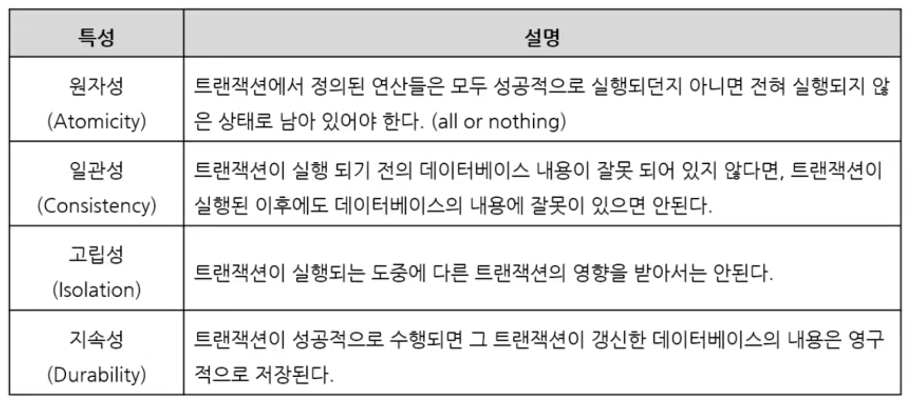

1. # 트랜잭션
   - 데이터베이스의 논리적 연산 단위   
      -의미적으로 분할할 수 없는 최소의 단위   
      -일반적으로 하나의 트랜잭션은 여러 sql문장을 포함함   
      -성공시 모든 연산을 반영, 취소시 모든 연산을 최소함 → All or Nothing   
    
   - 트랜잭션의 예   
      -도서 주문 : 재고 수량 감소, 주문 내역 생성, 결제, 포인트 적립   
      -계좌 이체 : 원 계좌의 잔액 감소, 다른 계좌의 잔액 증가   
      -교통카드 충전 : 잔액 증가, 결제   

1. # 트랜잭션의 특징(ACID 특성)
      

   *DBMS의 동시성 제어(Concurrency Control) 수행을 가능하게 하는 기술   
      -LOCK 기반, Timestamp 기반   
    
   동시성 제어: 동시에 여러 트랜잭션을 수행해도 다른 트랜잭션 작업에 관여하지 않고, 하나의 작업 단위가 끝날 때까지 온전히 트랜잭션을 수행하도록 제어하는 것   

1. # COMMIT 작업 상태
   - COMMIT 실행 전 상태에서는...   
      -변경된 내용은 메모리에 임시로 저장됨   
      -현재 사용자는 변경된 값을 읽을 수 있음   
      -다른 사용자는 변경전 값만 읽을 수 있음   
      -변경되는 값은 잠금(Locking)이 설정되어 다른 사용자는 값을 변경할 수 없음   

   - COMMIT 실행 후...
      -변경된 내용은 DB에 저장됨   
      -변경 내용을 모든 다른 사용자가 볼 수 있음   
      -이전 데이터는 모두 사라짐 (별도 로그 보관시 복구 가능)   
      -관련된 행에 대한 잠금이 해제되어 모든 사용자가 변경할 수 있음   

1. # 트랜잭션 제어 명령어
   - COMMIT : 변경된 내용을 DB에 영구적으로 반영   
   - ROLLBACK   
      -기본 : 변경된 내용을 버리고 변경 전 상태(마지막 COMMIT)로 복귄   
      -SAVEPOINT : SAVEPOINT에 지정한 저장점까지만 복귀   
      (→SAVEPOINT:부분 복귀를 위해 지정한 지정점)   

   *테이블 삭제는 ROLLBACK이 불가   
   
1. # SAVEPOINT
   - 미리 지정한 SAVEPOINT까지만 ROLLBACK   
      -특정 저장점까지 롤백하면 그 이후의 __명령__ 과 __저장점__ 은 모두 무효가 됨   
   - 일부 TOOL에서는 지원되지 않음   
   - 동일 이름으로 여러 저장점 정의시 __나중에 정의한 저장점이 유효__   

1. # COMMIT과 ROLLBACK 시점   
   - 트랜잭션은 __SQL문 실행시 자동 시작__ , COMMIT/ROLLBACK 실행시 종료   
   - 자동 커밋 / 자동 롤백   
      
      -DDL문장 수행시 DDL수행 전에 자동으로 커밋(auto commit)   
      :create, alter, drop등 DDL명령 수행 시 커밋을 합니다.   
      -DB를 정상적으로 접속 종료하면 자동 커밋 :정상 종료면 commit   
      -애플리케이션의 이상 종료로 DB와의 접속이 단절되었을 때 자동 롤백 :이상 종료면 rollback   
    
      
   트랜잭션 시작 - 프로그램 시작시 또는 COMMIT이나 ROLLBACK 실행 한 바로 다음 시점.  
   현재위치에서 ROLLBACK을 시켰을 때   
   ROLLBACK TO B이면 SAVEPOINT B 지점으로..   
   ROLLBACK TO A이면 SAVEPOINT A 지점으로..   
   ROLLBACK이면 트랜잭션 시작 위치로 이동합니다.   
