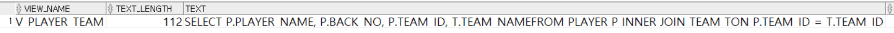
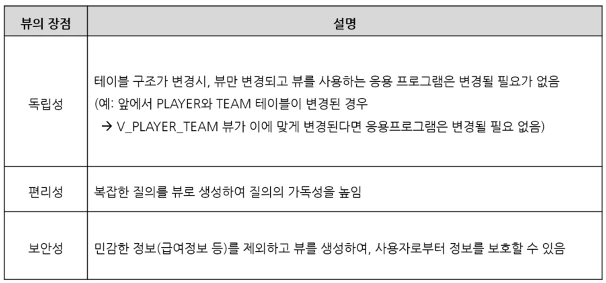
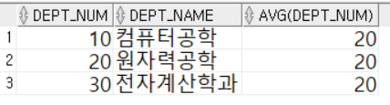
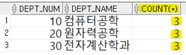
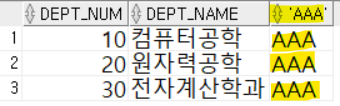

1. # 뷰(View)
   - 테이블은 실제로 데이터를 갖고 있지만, 뷰는 실제 데이터를 갖지 않음   
      -뷰 정의만 갖고 있음   
      -쿼리에서 뷰가 사용되면 DBMS 내부적으로 질의를 재작성   
   - 실제 데이터를 가지고 있지 않지만 테이블의 역할 수행   
      -가상 테이블이라고도 함  

1. # VIEW 생성
   ```sql
      CREATE VIEW V_PLAYER_TEAM AS
      SELECT P.PLAYER_NAME, P.BACK_NO, P.TEAM_ID, T.TEAM_NAME
      FROM PLAYER P INNER JOIN TEAM T
      ON P.TEAM_ID = T.TEAM_ID;   

      SELECT * FROM V_PLAYER_TEAM;  /*VIEW 사용하기*/
   ```   
   VIEW를 테이블처럼 생성하고 테이블처럼 사용하면 됩니다. 하지만 가상의 테이블입니다.   
   SELECT하게 되면 DBMS는 먼저 테이블 목록을 검색합니다. 테이블 목록에서 V_PLAYER_TEAM이란 테이블을 찾고 없으면 뷰 목록을 검색합니다. 뷰 목록에서 V_PLAYER_TEAM을 찾게되면 해당 데이터를 저장했다가 가져오는 것이 아니라 SELECT P.PLAYER_NAME, P.BACK_NO,.. FROM PLAYER.. ON P.TEAM_ID.. 란 쿼리문 텍스트 자체를 저장했다가 쿼리 실행 후 데이터를 출력하게 됩니다.   
   
1. # VIEW 목록 확인
   ```sql
      SEELCT * FROM USER_VIEWS;
   ```   
      
   TEXT컬럼에 쿼리문 자체가 입력되어 있는 것을 확인할 수 있습니다. 이것이 뷰입니다.   

1. # 명령어   
   뷰 타입 확인 : DESC V_PLAYER_TEAM;   
   뷰 가져오기 : SELECT * FROM V_PLAYER_TEAM;   
   뷰 삭제 : DROP VIEW V_PLAYER_TEAM;   

1. # 뷰 파싱   
   ```sql
      SELECT PLAYER_NAME, BACK_NO, TEAM_ID, TEAM_NAME
      FROM V_PLAYER_TEAM   /* ☜ 이 부분이*/
      WHERE PLAYER_NAME LIKE '이%';
   ```   
   실제 DBMS가 내부적으로 뷰 해당 부분을 SQL문으로 재작성   
   ```sql
      SELECT PLAYER_NAME, BACK_NO, TEAM_ID, TEAM_NAME
      FROM (SELECT P.PLAYER_NAME, P.BACK_NO, P.TEAM_ID, T.TEAM_NAME 
            FROM PLAYER P INNER JOIN TEAM T   /* ☜ 이 부분으로 변경 */
            ON P.TEAM_ID = T.TEAM_ID)
      WHERE PLAYER_NAME LIKE '이%';
   ```   
 
1. # 계층적 뷰 생성
   뷰를 생성할 때 기존의 뷰를 이용하여 새로운 뷰를 생성할 수 있습니다.   
   ```sql
      CREATE VIEW V_EMP_DEPT2 AS
      SELECT ENAME, DNAME
      FROM V_EMP_DEPT;
   ```   

1. # 뷰의 장점
      

1. # 인라인 뷰(Inline View)
   - FROM절에서 사용되는 서브쿼리   
   - 실행 순간에만 임시적으로 생성되며 DB에 저장되지 않음   
      -인라인 뷰(Inline View) = 동적 뷰(Dynamic View)   
      -일반 뷰 = 정적 뷰(Static View)   
   - 인라인 뷰의 SELECT문에서 정의된 컬럼은 메인 쿼리에서 사용 가능   
   - cf) 일반적으로 서브쿼리에서 정의된 컬럼은 메인 쿼리에서 사용 불가   
   ```sql
      SELECT EMPNO 
      FROM (SELECT EMPNO, ENAME FROM EMP ORDER BY MGR);  /* ☜ 인라인 뷰*/
   ```   
   FROM절에 사용된 (SELECT EMPNO, ENAME FROM EMP ORDER BY MGR) 이 쿼리는 현재 뷰로 저장된 것이 아니라 한번 쿼리가 되고 나면 지워집니다. FROM절에서 서브쿼리로 직접 사용되었고 뷰로 따로 저장되어 있지 않기 때문에 "인라인 뷰" 또는 "동적 뷰"라고합니다. 
   ```sql
      CREATE VIEW V_EMP AS /* ☜ CREATE VIEW를 통해 동적 뷰를 정적 뷰로 만듦 */
      SELECT EMPNO, ENAME
      FROM EMP ORDER BY MGR;
   ```   
   위에 쿼리를 이렇게 V_EMP란 이름의 뷰로 저장되어 있다면 더이상 한번의 쿼리 후 소멸되지 않기 때문에 "정적 뷰" 또는 "일반 뷰"라고 합니다.   
   ```sql
      SELECT MGR
      FROM (SELECT EMPNO, ENAME FROM EMP ORDER BY MGR);  /* ☜ ERROR! */
   ```   
   EMP테이블에는 MGR이란 컬럼이 있지만 서브쿼리의 SELECT문으로 가져온 컬럼이 아니기 때문에 ERROR발생   
   => 일반적으로 서브쿼리의 SELECT문에서 불러온 컬럼이라고해서 메인 쿼리에서 사용할 수 있는 건 아님   
   => FROM 절에 사용된 서브쿼리에서 SELECT문으로 불러온 컬럼이기 때문에 메인 쿼리에서도 서브쿼리 컬럼을 사용할 수 있음   
   => 이러한 특성 때문에 FROM절에서 사용된 서브쿼리를 특히 __인라인 뷰__ 라 하며 인라인 뷰의 SELECT문에서 정의된 컬럼만 메인 쿼리에서 사용 가능   
   ```sql
      SELECT MGR
      FROM (SELECT EMPNO, ENAME, MGR FROM EMP ORDER BY MGR);  /* ☜ MGR! 컬럼을 가져옴 */
   ```  

1. # 인라인 뷰의 결과로 집합 함수
   ```sql
      SELECT *
      FROM DEPARTMENT A, (SELECT AVG(DEPT_NUM) FROM DEPARTMENT) B; - ㉠

      SELECT *
      FROM DEPARTMENT A, (SELECT COUNT(*) FROM DEPARTMENT) B; - ㉡

      SELECT *
      FROM DEPARTMENT A, (SELECT 'AAA' FROM DUAL) B; - ㉢
   ```   
   ㉠ :   
      
   ㉡ :   
      
   ㉢ :   
      

   인라인 뷰의 결과로 집합 함수가 올 수 있고, 그외 단일행 결과가 올 수 있는데 이때 결과는 PRODUCT연산이 됩니다.   

1. # 인라인 뷰 문제
   Q) 급여가 2,000초과인 직원들에 대해 직원번호, 직원명, 급여, 부서명을 출력하고자 한다   
   ```sql
      SELECT E.EMPNO, E.ENAME, E.SAL, D.DNAME
      FROM (SELECT EMPNO, ENAME, SAL FROM EMP WHERE SAL> 2000) E, DEPT D
      WHERE E.DEPTNO = D.DEPTNO   /* ☜ ERROR!*/
   ```   
   위에 쿼리는 ERROR가 발생하는 잘못된 퀄리입니다. 위에 쿼리를 수정하면   

   ```sql
      SELECT E.EMPNO, E.ENAME, E.SAL, D.DNAME
      FROM (SELECT EMPNO, ENAME, SAL, DEPTNO FROM EMP WHERE SAL> 2000) E, DEPT D /* 여기! */
      WHERE E.DEPTNO = D.DEPTNO   
   ```   
   메인 쿼리의 WHERE절 E.DEPTNO를 사용할 수 있게 FROM절의 서브쿼리SELECT에서 DEPTNO 컬럼을 가져옵니다.   