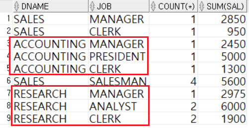

1. # 다중 행 함수(Multi-Row Function)
   - 여러 행의 그룹에 대해 적용되는 함수   
   - 다중 행 함수의 종류   
      1)그룹 함수(Group function)   
         -집계함수(Aggregate Function): COUNT, SUM, AVG, MAX, MIN 등   
         -고급 집계 함수: ROLLUP, CUBE, GROUPING SETS   
      2)윈도우 함수(Window Function)   

1. # 집계 함수
   - 여러 행의 그룹에 대한 연산을 통해 하나의 결과를 반환함   
   - SELECT, HAVING, ORDER BY 절에 사용 가능   
   - GROUP BY 절을 통해 그룹핑 기준 명시   
   - NULL을 제외하고 연산   
      -100명 중 10명의 성적이 NULL일 때, 전체 평균은 90명에 대한 평균   
      -입력행 전체가 NULL인 경우만 결과값이 NULL임   
      ex)A: 30점, B:40점, C:null 일 때  
      30+40/3 또는 30+40/2 또는 30+40+null=null 이렇게 3가지가 나올 수 있는데 집계함수는 null을 제외하고 계산하기 때문에 30+40/2가 됩니다.   
   - DISTINCT / ALL   
      -Default 옵션은 ALL   
      -DISTINCT : 같은 값을 갖는 여러 데이터를 한 건으로 간주   
        
   COUNT(*) : NULL포함 카운팅   
   COUNT(컬럼) : NULL제외 카운팅   
   ```sql
      SELECT COUNT (DISTINCT team_id) FROM player;  /* 괄호 안에 DISTINCT사용 */
   ```   

   *SELECT절에서 집계함수와 일반컬럼은 같이 사용 할 수 없습니다.   
   ```sql
      SELECT AGE, AVG(AGE) FROM PLAYER; /* ERROR발생 */
   ```   

1. # GROUP BY
   - 집계 함수는 일반적으로 GROUP BY절을 사용하여 그룹별 연산 수행   
      -소그룹별 집계시 GROUP BY  사용   

   - POSITION으로 그룹을 만들었을 때 예제   
      
   집계 함수는 NULL을 집계하지 않는데 '`*`' 연산자를 사용했기 때문에 COUNT(`*`)인 경우 NULL을 포함해 전체 컬럼 갯수를 카운팅.   
   COUNT(HEIGHT)는 HEIGHT컬럼에서 NULL을 제외하고 카운팅.   

   - GROUP BY절 생략 시
      
   그룹을 만들지 않고 집계 함수를 사용하면 __테이블 전체를 하나의 그룹__ 으로 인식
       
1. # GROUP BY ~ HAVING
   집계 함수에 조건을 부여하는 경우 WHERE절을 사용하면 ERROR! → WHERE절이 GROUP BY절보다 먼저 수행      
   WHERE절에선 집계 함수를 사용할 수 없습니다. 집계 함수는 GROUP BY와 함께 사용이 되는데 WHERE절은 GROUP BY보다 먼저 실행되기 때문에 그룹단위로 값을 구하는 집계함수를 사용할 수 없습니다. GROUP BY다음 실행되는 HAVING절에 조건을 입력합니다.   
   ```sql
      SELECT POSITION, ROUND(AVG(HEIGHT),2) 
      FROM PLAYER 
      WHERE AVG(HEIGHT) > 180;  /* (X) ERROR발생 */   
      ☞ WHERE HEIGHT > 180; /* (O) 그룹이 아니라 전체 테이블에 적용 */
   ```
   HAVING절 사용
   ```
      SELECT POSITION, ROUND(AVG(HEIGHT),2) 
      FROM PLAYER 
      GROUP BY POSITION
      HAVING AVG(HEIGHT) > 180;  /* POSITION별로 집계가 끝난 후 적용*/
   ```

1. # 그룹핑 기준이 2개인 경우 
   ```
      SELECT DNAME, JOB, COUNT(*)
      FROM EMP, DEPT
      WHERE EMP.DEPTNO = DEPT.DEPTNO
      GROUP BY DNAME, JOB;  /* 2개를 나열 */
   ```   
      
   DNAME에 따라 그룹을 묶고 다시 JOB에 따라 그룹을 묶습니다.   

   ...FROM EMP, DEPT... FROM절에 테이블을 나열하는 것은 나열 테이블들을 PRODUCT로 출력하게 됩니다.   
   예)tmp1테이블과 tmp2테이블을 생성 후 FROM절에서 나열합니다.   
   ```sql
      create table tmp1(
         A_NO varchar(5),
         A_title varchar(10)
      )

      insert into tmp1 values('1001','a_title1');
      insert into tmp1 values('1002','a_title2');

      create table tmp2(
         B_NO varchar(5),
         B_title varchar(10),
         A_NO varchar(5)
      )

      insert into tmp2 values('b1','b_title1','1002');
      insert into tmp2 values('b2','b_title2','1003');
   ```   

   tmp1테이블:   
      

   tmp2테이블:   
      

   SELECT * FROM tmp1, tmp2;   
      

   FROM절에서 테이블 나열은 단순 PRODUCT연산으로 출력하게 되는데 이때 WHERE절로 조건을 걸러내게됩니다.   
   "WHERE tmp1.a_no = tmp2.a_no;"   
      

1. # SELECT문의 구조 및 실행 순서
      
   Row(행,가로) 선택 - WHERE / Column(열, 세로) 선택 - SELECT   
   1. FROM - 테이블 선택   
   2. WHERE - 반환 대상이 아닌 데이터 제거 → 행 선택   
   3. GROUP BY - 선택한 행값들을 그룹으로 묶음   
   4. HAVING - 반환 대상이 아닌 그룹 제거      
   5. SELECT - 열 선택   
   6. ORDER BY - 선택된 결과를 정렬   

   Q)키가 큰 상위 3명을 뽑는 쿼리를 작성하시오.   
   ```sql
      SELECT PLAYER_NAME, HEIGHT, ROWNUM
      FROM PLAYER
      WHERE ROWNUM < 4
      ORDER BY HEIGHT;
   ```   
   키에따라 정렬시킨 후 ROWNUM이 4보다 작은 것(위에서 상위 3개)을 뽑아라.. 인데 위에 쿼리는 잘못된 쿼리입니다. ORDER BY절이 가장 마지막에 수행이 되므로 제대로 정렬이 되지 않은 상태에서 WHERE절이 실행됩니다. 위에 쿼리는 PLAYER테이블에 입력된 상위 3개를 먼저 선택 후 그 결과를 정렬하는 쿼리입니다.   
   
   수정한 쿼리:
   ```sql
      SELECT PLAYER_NAME, HEIGHT
      FROM (
           SELECT PLAYER_NAME, HEIGHT 
           FROM PLAYER
           WHERE HEIGHT IS NOT NULL
           ORDER BY HEIGHT DESC
          )
      WHERE ROWNUM < 4;
   ```   
   FROM절에서 NULL을 제거하고 이미 정렬을 한 상태의 테이블을 가져와서 ROWNUM으로 뽑습니다.

1. # 컬럼의 유효 범위
   - 관계형 데이터베이스는 데이터를 행 단위로 메모리에 복사함   
   - SELECT절에서 명시되지 않은 컬럼도 WHERE, ORDER BY절에서 사용 가능   
      
   - ORDER BY가 사용되는 경우
      ```sql
         SELECT PLAYER_NAME, HEIGHT
         FROM PLAYER
         WHERE POSITION = 'MF'
         ORDER BY TEAM_ID
      ```   
      FROM절에서 PLAYER테이블을 선택 → <span style="color:red">(1)WHERE절에서 POSITION이 MF인 행을 선택</span> → SELECT문에서 PLAYER_NAME과 HEIGHT 2개의 컬럼만 가져옴 → <span style="color:red">(2)SELECT하지 않은 TEAM_ID컬럼을 ORDER BY함</span>   

      (1):아직 SELECT하기 전이기 때문에 PLAYER테이블에서 POSITION컬럼을 사용할 수도 있다고 생각할 수 있음. 하지만 (2)의 경우      
      (2):SELECT에서 가져온 컬럼은 PLAYER_NAME과 HEIGHT 2개의 컬럼밖에 없는데 SELECT 이후에 실행되는 ORDER BY절에 TEAM_ID란 컬럼을 사용.. 이게 가능해?란 의문을 가질 수 있음   

      (1), (2)의 경우 SELECT하지 않은 컬럼도 사용할 수 있는 이유가 DBMS는 <span style="color:red">PLAYER테이블</span>에서 __행 단위로 전체 컬럼을 메모리에 저장__ 하기 때문입니다. WHERE절에서 POSITION이 MF인 값을 선택했을 때 PLAYER테이블에서 POSITION이 MF에 해당하는 모든 컬럼들을 메모리에 저장합니다.   
   
   - GROUP BY가 사용되는 경우   
      -SELECT절에서 명시되지 않은 집계 컬럼을 HAVING, ORDER BY절에서 사용 가능   
      ```sql
         SELECT TEAM_ID, COUNT(*)
         FROM PLAYER
         GROUP BY TEAM_ID
         HAVING AVG(HEIGHT) > 178
         ORDER BY AVG(HEIGHT);
      ```  
      마찬가지로 SELECT시 행 단위로 메모리에 저장을 하기 때문에 SELECT한 이외의 컬럼도 HAVING와 ORDER BY절에서 사용가능합니다.   

   - 인라인 뷰(Inline View)가 사용되는 경우   
      -새로운 테이블 구조가 생성된 것으로 이해해야 함   
      -인라인 뷰의 SELECT절에 명시되지 않은 컬럼은 메인 쿼리에서 사용 불가   
      
   ORDER BY절과 GROUP BY절에서 SELECT되지 않은 컬럼도 사용할 수 있는 이유는 해당 PLAYER테이블에서 행 단위로 컬럼을 저장하기 때문입니다. 하지만 인라인 뷰는 PLAYER같은 테이블이 아니라 텍스트 자체기 때문에 인라인 뷰 안에서 명시적으로 직접 컬럼을 가져와야 합니다. 인라인 뷰에서 SELECT과정을 거치면서 실제 PLAYER테이블이 아니라 SELECT한 PLAYER_NAME, HEGITH가 가상의 테이블 전체가 되기 때문입니다. ORDER BY절, GROUP BY절, HAVING절에서 사용하기 위해선 실제 값을 출력하지 않더라도 POSITION이란 컬럼을 명식적으로 SELECT해야 합니다.   