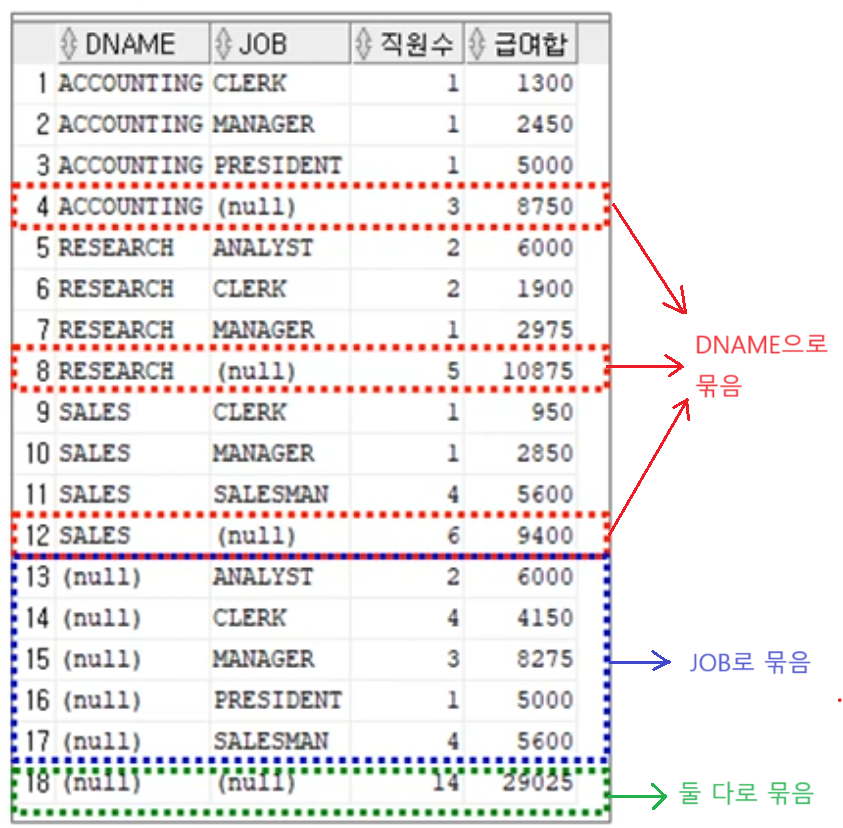

1. # 고급 집계함수
   - 고급 집계함수 - ROLLUP, CUBE, GROUPING SET ▷ GROUP BY절에 사용   

   - 고급 집계함수와 같이 사용되어 도와주는 함수 - GROUPING ▷ SELECT문에 사용   
   
   - 묶어서 집계하는 방법   
      
   ① : DNAME,JOB,MGR 3개의 컬럼을 묶어 DNAME,JOB,MGR 3개의 컬럼 값들과 비교했을 때 ACCOUNTING CLERK 7782과 일치하는 값은 자신 1개이기 때문에 직원수 1   
   ② : DNAME,JOB 2개의 컬럼을 묶어 DNAME,JOB 2개의 컬럼 값들과 비교했을 때 ACCOUNTING CLERK과 일치하는 값은 자신 1개이기 때문에 직원수 1   
   ③ : DNAME 1개의 컬럼을 묶어 DNAME 1개의 커럼 값들과 비교했을 때 ACCOUNTING과 일치하는 값은 3개기 때문에 직원수 3   

1. # ROLLUP 함수
   - 소그룹 별 소계 계산 추산   
   - 순서 중요!   
   - ROLLUP(A,B,C) : 
   2. A그룹별 B그룹별 C그룹에 해당하는 결과 출력   
   2. A그룹별 B그룹에 해당하는 결과 출력   
   2. A그룹에 해당하는 결과 출력   
   2. 전체 데이터 결과 출력(원본 테이블의 갯수)   
   → N개 열을 지정하면 N+1개의 조합이 출력   
   *A,B,C별 이란? A,B,C 컬럼 3개를 묶어 1개의 값으로 보고 비교   
      
   GROUP BY   
   ```sql
      SELECT DNAME, JOB, COUNT(*) 직원수, SUM(SAL) 급여함
      FROM EMP, DEPT
      WHERE DEPT.DEPTNO = EMP.DEPTNO
      GROUP BY (DNAME, JOB)
      ORDER BY DNAME,JOB
   ```   
      
   DNAME에 따라 그룹으로만 설정합니다.   
      
   ROLLUP 파라미터 2개   
   ```sql
      SELECT DNAME, JOB, COUNT(*) 직원수, SUM(SAL) 급여함
      FROM EMP, DEPT
      WHERE DEPT.DEPTNO = EMP.DEPTNO
      GROUP BY ROLLUP (DNAME, JOB)  /* ☜ 파라미터 2개*/
      ORDER BY DNAME,JOB
   ```      
      
   DNAME을 ACCOUNTING, REASEARCH, SALES에 따라 그룹을 지은 이후 JOB에 따라 다시 그룹을 지어주고 카운팅하게 됩니다.   
   *각 DNAME/JOB별 집계 → 각 DNAME별 집계 → 전체 집계   
   *ROLLUP은 순서가 중요!   
      
   ROLLUP 파라미터 3개   
   ```sql
      SELECT DNAME, JOB, MGR, COUNT(*) 직원수, SUM(SAL) 급여함
      FROM EMP, DEPT
      WHERE DEPT.DEPTNO = EMP.DEPTNO
      GROUP BY ROLLUP (DNAME, JOB, MGR)  /* ☜ 파라미터 3개*/
      ORDER BY DNAME,JOB
   ```   
      
   *각 DNAME/JOB/MGR별 집계 → 각 DNAME/JOB별 집계 → 각 DNAME별 집계 → 전체 집계     

1. # CUBE 함수
   - 다차원 소계 계산 추가   
   - ROLLUP과 유사하지만 순서가 무관합니다.   
   - CUBE(A,B,C) :   
   2. A그룹별 B그룹별 C그룹에 해당하는 결과 출력   
   2. A그룹별 B그룹의 결과 출력   
   2. B그룹별 C그룹의 결과 출력   
   2. A그룹별 C그룹의 결과 출력   
   2. A그룹 결과   
   2. B그룹 결과   
   2. C그룹 결과   
   2. 전체 데이터 결과   
   → N개의 열을 지정하면 2ⁿ개의 조합이 생성   
   
   ```sql
      SELECT DNAME, JOB, COUNT(*) 직원수, SUM(SAL) 급여함
      FROM EMP, DEPT
      WHERE DEPT.DEPTNO = EMP.DEPTNO
      GROUP BY CUBE (DNAME, JOB)  /* ☜ 이 부분만 CUBE로 바꿈*/
      ORDER BY DNAME,JOB
   ```   
      
   GROUP BY CUBE (DNAME, JOB) = GROUP BY CUBE (JOB, DNAME)   
   ROLLUP은 순서가 있기 때문에 ROLLUP(DNAME, JOB)와 ROLLUP(JOB, DNAME)이 다른 결과를 낳지만 CUBE는 모든 조합을 구하기 때문에 CUBE(DNAME, JOB) = CUBE(JOB, DNAME) 서로 같은 결과를 가져옵니다.   

   - ROLLUP으로 CUBE 구현하기   
   ```sql
      SELECT DNAME, JOB, COUNT(*) 직원수, SUM(SAL) 급여함
      FROM EMP, DEPT
      WHERE DEPT.DEPTNO = EMP.DEPTNO
      GROUP BY ROLLUP (DNAME, JOB)  /* ☜ DNAME, JOB */

      UNION

      SELECT DNAME, JOB, COUNT(*) 직원수, SUM(SAL) 급여함
      FROM EMP, DEPT
      WHERE DEPT.DEPTNO = EMP.DEPTNO
      GROUP BY ROLLUP (JOB, DNAME)  /* ☜ JOB, DNAME */
      ORDER BY DNAME,JOB
   ```   
   ROLLUP(DNAME, JOB)와 ROLLUP(JOB, DNAME) 2개를 UNION을 하게되면 CUBE와 같은 결과가 나옵니다.   

   - CUBE 3컬럼 예1)   
   ```sql
      SELECT A.A_ID,B.B_ID,B.B_NAME,COUNT(*)
      FROM SET_A A JOIN SET_B B
      ON (A.A_ID = B.A_ID)
      GROUP BY CUBE (A.A_ID, B.B_ID, B_NAME)
      ORDER BY A.A_ID, B.B_ID, B_NAME;
   ```   
      
   
   - CUBE 3컬럼 예2)   
   ```sql 
      SELECT A.A_ID,B.B_ID,b.b_name,b_sum, count(*)
      FROM SET_A A JOIN SET_B B
      ON (A.A_ID = B.A_ID)
      GROUP BY CUBE (A.A_ID, B.B_ID, (B.B_name,b_sum))   
   ```   
      

   - CUBE 3컬럼 예2)   
   ```sql
      SELECT A.A_ID,B.B_Id,COUNT(*)
      FROM SET_A A JOIN SET_B B
      ON (A.A_ID = B.A_ID)
      GROUP BY CUBE ((A.A_ID), (B.B_ID), (A.A_ID,B.B_ID));
   ```   
      


1. # GROUPING SETS
   - 컬럼 __각각__ 에 대해서만 그룹화   
   - GROUPING SETS(A,B) : A별 집계 → B별 집계   
   ```sql
      SELECT DNAME, JOB, COUNT(*) 직원수, SUM(SAL) 급여함
      FROM EMP, DEPT
      WHERE DEPT.DEPTNO = EMP.DEPTNO
      GROUP BY GROUPING SET(DNAME, JOB);
   ```   
      
   각각의 컬럼에 대해 그룹화합니다. DNAME에 대해서 그룹화, JOB에 대해서 그룹화합니다.   
   DNAME따로, JOB따로 집계한 결과만 표시합니다. 다른 데이터는 출력하지 않습니다.   

1. # DECODE  
   CASE 대신 사용할 수 있는 오라클에서 제공합는 연산자.   
   CASE - 표준   
   DECODE - 오라클   
   DECODE(A, B, 'C', 'D'); : A의 결과가 B이면 'C'출력, B가 아니면 'D'출력   
   ```sql
      SELECT
         DECODE(GROUPING(DNAME),1,'All Departments',DNAME) AS DNAME,
         DECODE(GROUPING(JOB),1,'All Jobs',JOB) AS JOB,
         COUNT(*) 직원수, SUM(SAL) 급여함
      FROM EMP, DEPT
      WHERE DEPT.DEPTNO = EMP.DEPTNO
      GROUP BY GROUPING SETS(DNAME, JOB);
   ```   
   DECODE(GROUPING(DNAME),1,'All Departments',DNAME) AS DNAME
   DNAME으로 그룹핑을 한거면 1 → 'All Departments' 출력, 아니면 0이 나와서 DNAME컬럼의 원래 레코드값 출력   
      
   DECODE(GROUPING(JOB),1,'All Jobs',JOB) AS JOB   
   JOB으로 그룹핑을 한거면 1 → 'All Jobs' 출력, 아니면 0이 나와서 JOB컬럼의 원래 레코드값 출력   
      

1. # GROUPING 함수
   집계가 이루어진 값인지 아닌지를 알려주는 함수.   
   ```sql
      SELECT DNAME, GROUPING(DNAME) JOB, GROUPING(JOB), COUNT(*) "Total Empl", SUM(SAL) "Total Sal"
      FROM EMP, DEPT
      WHERE DEPT.DEPTNO = EMP.DEPTNO
      GROUP BY ROLLUP (DNAME,JOB)
   ```   
      
   GROUPING(DNAME)은 DNAME을 집계한 경우 1, 그렇지 않으면 0   
   GROUPING(JOB)은 JOB를 집계한 경우 1, 그렇지 않으면 0   
   ```sql
      SELECT 
         CASE GROUPING(DNAME)
            WHEN 1 THEN 'ALL Department'
            ELSE DNAME
         END AS DNAME,

         CASE GROUPING(JOB)
            WHEN 1 THEN 'All Job'
            ELSE JOB
         END AS JOB,

         COUNT(*) "Total Empl", SUM(SAL) "Total Sal"

      FROM EMP, DEPT
      WHERE DEPT.DEPTNO = EMP.DEPTNO
      GROUP BY ROLLUP (DNAME,JOB)
   ```   
      

1. #  고급 집계 함수 비교
      

1. # 경우의 수
   - CUBE(A,B)
   (A1, B1)
   (A1, B2)
   (A2, B1)
   (A2, B2)

   - CUBE(A,B,C)  