1. # 윈도우 함수
   - 기존 관계형DB는 컬럼간 연산은 쉽지만 행간의 연산은 어려움   
   - 행 간의 관계 정의를 위해 윈도우 함수 고안   
      -예)각 직원이 속한 부서 내에서 급여 순위는?   
   - 중첩(Nested) 사용 불가   
   - 서브쿼리에서도 사용 가능   
   - 종류   
      -순위 : RANK, DENS_RANK, ROW_NUMBER   
      -집계 : SUM, MAX, MIN, AVG, COUNT   
      -행 순서 : FIRST_VALUE, LAST_VALUE, LAG, LEAD   
      -비율 : RATIO_TO_REPORT, PERCENT_RANK, NTILE   
      -통계 : CORR, STDDEV, VARIANCE 등   
   - 사용법   
   ```
      SELECT WINDOW_FUNCTION(ARGUMENTS) OVER  /* OVER가 나오면 윈도우 함수 */
            ( [PARTITION BY 컬럼][ORDER BY 절][WINDOWING 절])
      FROM 테이블 명;
   ```   
   2. WINDOW_FUNCTION : 기존 함수 or WINDOW함수로 추가된 함수   
   2. ARGUMENTS : WINDOWING절에 이용되는 컬럼으로 0~N개의 인수 지정   
   2. OVER : 단독으로 사용할 수 있으며 통계나 집계를 만들어주는 명령어
   2. PARTITION BY 절 : 전체 집합을 기준에 의해 소그룹으로 나눌 수 있음(그룹을 묶음:GROUP BY와 유사한 기능)   
   2. ORDER BY 절 : 순서를 지정할 기준 항목. ASC이면 낮은 점수가 1위, DESC이면 높은 점수가 1위. ORDER BY에 의해서 순위 결정      
   2. WINDOWING 절 : 함수의 대상이 되는 기준의 범위를 지정   

   ```sql
      /*BETWEEN ~ AND가 존재하는 경우*/
      ROWS | RANGE
         BETWEEN
      UNBOUNDED PRECEDING | CURRENT ROW | 상수 PRECEDING | 상수 FOLLOWING
         AND
      UNBOUNDED FOLLOWING | CURRENT ROW | 상수 PRECEDING | 상수 FOLLOWING   

      /*BETWEEN ~ AND가 없는 경우*/
      ROWS | RANGE
      UNBOUNDED PRECEDING | CURRENT ROW | 상수 PRECEDING
   ```   
   ROWS : 행의 수를 기준으로 한 범위   
   RANGE : 값을 기준으로 한 범위   
   UNBOUNDED PRECEDING : 가장 앞부분   
   UNBOUNDED FOLLOWING : 가장 뒷부분   
   CURRENT ROW : 현재 위치   
   상수 PRECEDING : 현재 위치보다 앞쪽의 상수값인 행이나 값   
   상수 FOLLOWING : 현재 위치보다 뒤쪽의 상수값인 행이나 값   

1. # WINDOWING 절의 사용 예
   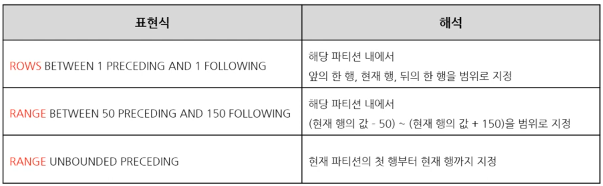   
   
   - ROWS BETWEEN 1 PRECEDING AND 1 FOLLOWING   
   1)ROWS : 행을 기준으로  
   2)3 PRECEDING : 현재 행에서 앞 3개 행   
   3)2 FOLLOWING : 현재 행에서 뒤 2개 행   

   - RANGE BETWEEN 90 PRECEDING AND 150 FOLLOWING   
   1)RANGE : 값을 기준으로   
   2)50 PRECEDING : 현재 행이 가진 값에서 빼기 50   
   3)150 FOLLOWING : 현재 행이 가진 값에서 더하기 150   

   - RANGE UNBOUNDED PRECEDING   
   1)값을 기준으로 첫 행부터 현재 행까지

1. # 순위 윈도우 함수 - RANK 함수
   - 동일한 값에는 동일한 순위 부여   
   - 동일한 순위를 여러 건으로 취급   
      -예)1등이 2명인 경우 → 1등, 1등, 3등   
   - 전체 급여 순위와 JOB내에서 급여 순위 출력 예제   
   ```
      SELECT JOB, ENAME, SAL,
         RANK() OVER (ORDER BY SAL DESC) AS ALL_RANK, /* RANK는 ORDER BY가 들어간다 */
         RANK() OVER (PARTITION BY JOB ORDER BY SAL DESC) AS JOB_RANK  /* RANK는 ORDER BY가 들어간다 */
      FROM EMP;
   ```   
   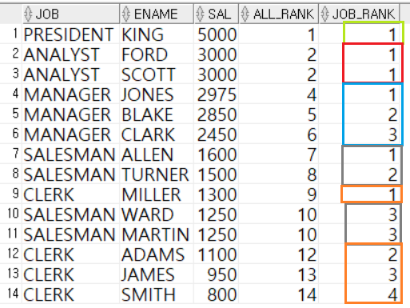   
   RANK() OVER (ORDER BY SAL DESC) AS ALL_RANK : 테이블 전체에 대한 SAL순위   
   RANK() OVER (PARTITION BY JOB ORDER BY SAL DESC) AS JOB_RANK : JOB컬럼에 대한 SAL순위   
   → PARTITION BY JOB : JOB으로 그룹을 묶고,   
   → ORDER BY SAL DESC : 묶인 그룹 안에서 SAL로 정렬 후 
   → RANK() : 순위를 매김   
   *ORDER BY를 DESC순이기 때문에 높은 숫자가 1위를 차지하지만 만약 ASC이면 낮은 숫자가 1위가 됨. ORDER BY에 의해서 RANK결정   

1. # RANK, DENSE_RANK, ROW_NUMBER 비교
   - RANK 함수   
      -동일 값에 동일 순위 부여   
      -동일 순위를 여러 건으로 취급(1등, 1등, 3등,...)   

   - DENSE_RANK 함수   
      -동일 값에 동일 순위 부여   
      -동일 순위를 한 건으로 취급(1등, 1등, 2등,...)   

   - ROW_NUMBER   
      -동일 값에 다른 순위 부여(1등, 2등, 3등) : 먼저 나오는 우선순위 대로   
   
   ```sql
      SELECT JOB, ENAME, SAL,
      RANK() OVER (ORDER BY SAL DESC) AS RANK,
      DENSE_RANK() OVER (ORDER BY SAL DESC) AS DENSE_RANK,
      ROW_NUMBER() OVER (ORDER BY SAL DESC) AS ROW_NUMBER
      FROM EMP
   ```   
   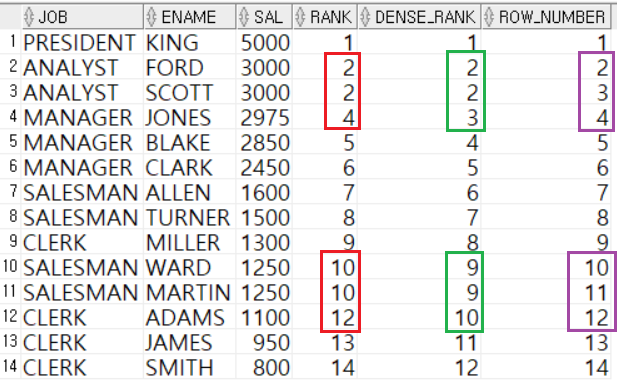   

1. # 집계 윈도우 함수 
   MAX, MIN, SUM, AVG, COUNT 해당 함수는 GROUP BY절에서도 사용할 수 있는데 WINDOW함수가 순위를 매기고 여러 기능에서 활용도가 높기 때문에 WINDOW함수에서도 집계 함수를 제공하도록 했습니다.   

1. # 집계 윈도우 함수 - MAX/MIN 함수
   예) 각 직원이 속한 직업 내에서 급여의 최대값을 함께 출력하기 위한 질의   
   - PARTITION BY   
   ```
      SELECT JOB, ENAME, SAL,
             MAX(SAL) OVER (PARTITION BY JOB) JOB_MAX
      FROM EMP
      ORDER BY JOB, ENAME;
   ```   
   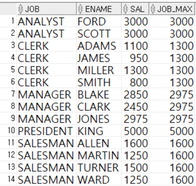   
   MAX(SAL)까지이면 테이블 전체에서 SAL최대 값이지만 "MAX(SAL) OVER (PARTITION BY JOB) JOB_MAX" PARTITION BY JOB에 의해 JOB컬럼이 기준이 됩니다.   

   - OVER ()   
   ```
      SELECT JOB, ENAME, SAL,
             MAX(SAL) OVER () JOB_MAX  /* OVER 안에 () */
      FROM EMP
      ORDER BY JOB, ENAME;
   ```   
   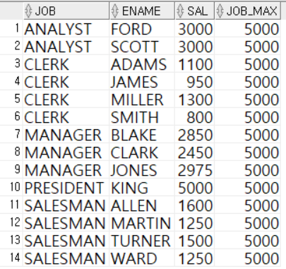   
   OVER ()안에 범위를 정하지 않으면 전체 테이블에서 최대값을 구하게 됩니다.   

1. # 집계 윈도우 함수 - SUM/AVG 함수

   예)각 직업 내에서, 본인보다 높은 급여를 받는 직원의 급여 총합(본인 포함)   

   - RANGE + UNBOUNDED PRECEDING 사용   
   첫 행부터 현재행까지 값을 __누적 합계__   
   ```
      SELECT JOB, ENAME, SAL,
            SUM(SAL) OVER (PARTITION BY JOB ORDER BY SAL DESC RANGE UNBOUNDED PRECEDING)
            AS JOB_SUM
      FROM EMP;
   ```   
   PARTITION BY JOB : JOB을 기준으로 그룹을 나누고,   
   ORDER BY SAL DESC : 나눈 그룹 안에서 SAL로 내림차순으로 정렬 하는데,   
   RANGE UNBOUNDED PRECEDING : 첫 행부터 현재행까지만,   
   SUM(SAL) : SAL을 다 더해라 란 명령어 입니다.   
   
   - RANGE + UNBOUNDED PRECEDING 없는 경우   
   SUM하는 컬럼을 OVER절의 ORDER BY절에 명시해주면 RANGE UNBOUNDED PRECEDING 구문이 없어도 누적합이 집계   
   ```
      SELECT JOB, ENAME, SAL,
            SUM(SAL) OVER (PARTITION BY JOB ORDER BY SAL DESC) /* ORDER BY절에 SAL입력 */
            AS JOB_SUM
      FROM EMP;
   ```    

   - 위의 예제 2개는 모두 같은 결과   
   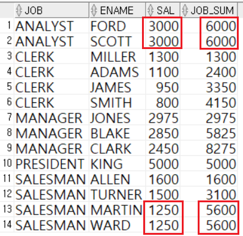   
   1)1번 FORD와 2번 SCOTT는 SAL이 3000으로 서로 같기 때문에 두 값을 더한 6000을 두개의 레코드에 모두 입력   
   2)3번 MILLER 1300 + 4번 ADAMS 1100을 더해서 2400..   
   2400에서 5번 JAMES 950을 더하면 3350..   
   3350에서 6번 SMITH 800을 더하면 4150.. 이렇게 계속 축적해서 값을 더해나값니다.   
   3)1번과 2번, 13번과 14번처럼 값이 동일한 경우 2개의 값을 더한 결과를 같은 값에 동시에 반영합니다.   
   :3000+3000 = 6000 이 후 1,2에 같은 순위를 매깁니다.   
   1250+1250 = 2500 이 후 3100에 2500을 한번에 더한 후 13, 14에 같은 순위를 매깁니다.   

   - ROWS + PRECEDING + FOLLOWING 사용   
   본인 바로 __위 + 본인 + 바로 아래__ 급여들의 합   
   ```
      SELECT JOB, ENAME, SAL,
            SUM(SAL) OVER (PARTITION BY JOB ORDER BY SAL ASC ROWS BETWEEN 1 PRECEDING AND 1 FOLLOWING)
            AS JOB_SUM
      FROM EMP;
   ```   
   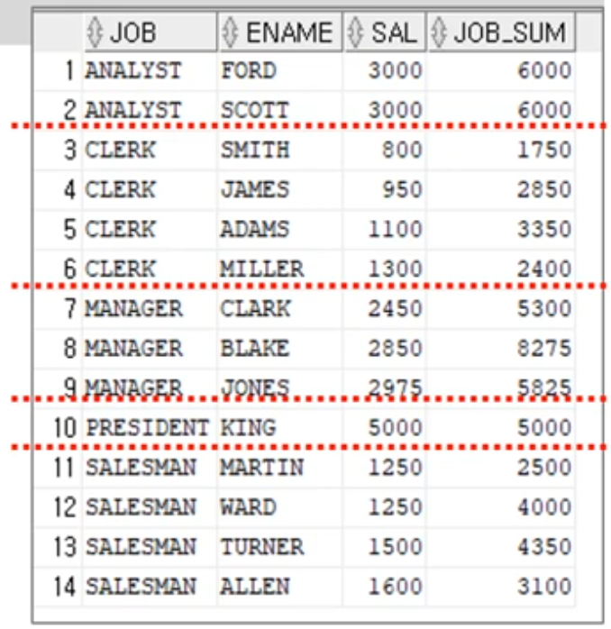   
   1번 본인 3000, 위 없음, 아래 3000 : 3000 + 0 +3000 = 6000   
   2번 본인 3000, 위 3000, 아래 없음 : 3000 + 3000 + 0 = 6000   
   3번 본인 800, 위 없음, 아래 950 : 800 + 0 + 950 = 1750   
   4번 본인 950, 위 800, 아래 1100 : 950 + 800 + 1100 = 2850   
   5번 본인 1100, 위 950, 아래 1300 : 1100 + 950 + 1300 = 3350   
   ...   
 
1. # 집계 윈도우 함수 - COUNT

   예)본인보다 급여가 100 적은 직원부터 200 많은 직원까지의 총 직원 수   

   - RANGE + PRECEDING + FOLLOWING   
   ```
      SELECT ENAME, SAL, 
            COUNT(*) OVER (ORDER BY SAL RANGE BETWEEN 100 PRECEDING AND 200 FOLLOWING) AS MOV_COUNT
      FROM EMP;
   ```   
   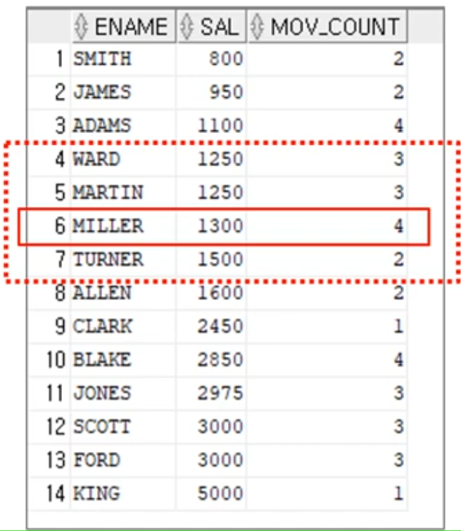   
   1)PARTITION BY가 없기 때문에 전체 테이블에 대해서 적용   
   2)ORDER BY __SAL__ RANGE BETWEEN ... : SAL를 기준으로 나보다 100작고 200 큰 값의 갯수를 출력   
   3)6번 MILLER를 예로 들면 본인 1300보다 100작은 값 1200, 200큰 값 1500 사이 1200 ~ 1500인 4번,5번,6번(자신포함),7번으로 4명이 출력   

1. # 행 순서 윈도우 함수
   FIRST_VALUE/LAST_VALUE, LAG/LEAD가 포함 됩니다.   
 
1. # 행 순서 윈도우 함수 - FIRST_VALUE/LAST_VALUE
   각 파티션에서 가장 먼저(또는 나중) 나온 값   
   정렬이 되어있다면 MAX/MIN과 유사한 기능   
   ```
      SELECT DEPTNO, ENAME, SAL, FIRST_VALUE(ENAME) OVER
            (PARTITION BY DEPTNO ORDER BY SAL DESC, ENAME ASC) AS RICH_EMP
      FROM EMP;
   ```   
   DEPTNO로 파티션을 나눈 호 SAL은 내림차순, ENAME은 오름차순으로 정렬을 시킵니다.   
   이때 DEPTNO 분류기준으로 가장 먼저 나온 ENAME을 RICH_EMP컬럼에 입력합니다.   
   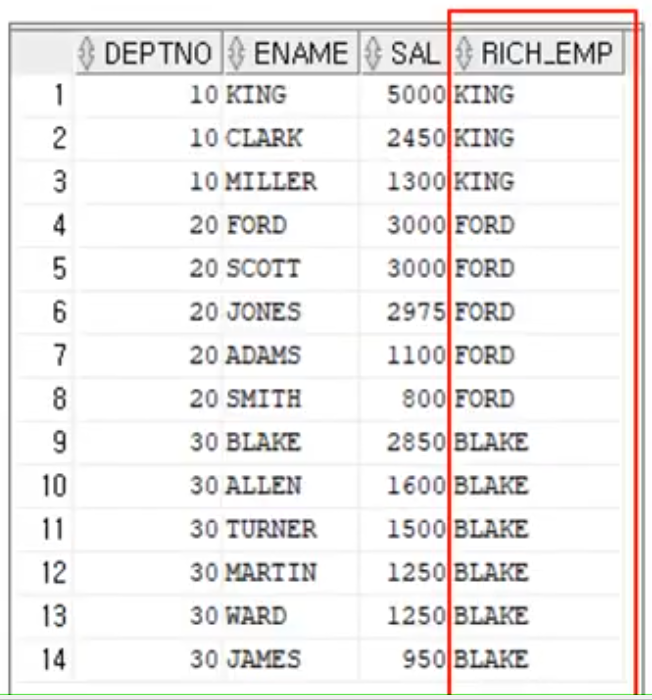   
   1번~3번까지 SAL이 가장 높은 KING출력   
   4번~8번까지 SAL이 가장 높은 FORD출력   
   ...

1. # 행 순서 윈도우 함수 - LAG(or LEAD) 함수
   각 파티션에서 해당 행의 몇 번째 이전(또는 이후) 행의 값을 가져옴   
   자기 자신 몇 번째 이전 - LAG   
   자기 자신 몇 번째 이후 - LEAD   
   
   LAG(SAL, 1) = LAG(SAL) : 본인보다 1개 이전의 SAL를 가져옴   
   LEAD(SAL, 1) = LEAD(SAL) : 본인보다 1개 이후의 SAL를 가져옴   
   *LAG(SAL)의 기본 값은 LAG(SAL, 1)로 "1"   
   *LEAD(SAL)의 기본 값은 LEAD(SAL, 1)로 "1"   
   *이전, 이후의 기준은 테이블 정렬 순서입니다.   
   테이블이   
   1600   
   1500   
   1250   
   순서라고 하면 1500을 기준으로 이전 LAG는 1600, 이후 LEAD는 1250   
   테이블 SAL이   
   1250   
   1500   
   1600   
   순서라고 하면 1500을 기준으로 이전 LAG는 1250, 이후 LEAD는 1600 입니다.   
   값의 크고 작음이 아니라 __정렬 순서상으로 이전, 이후가 결정__ 됩니다.   

   예)JOB="SALEMAN"인 모든 직원에 대해서, 급여 기준 본인 바로 윗 사람의 급여와 아랫 사람의 급여를 출력하는 질의   
   - LAG(SAL) / LEAD(SAL)
   ```
      SELECT ENAME, SAL,
      LAG(SAL) OVER (ORDER BY SAL ASC) AS HIGHER_SAL,
      LEAD(SAL) OVER (ORDER BY SAL ASC) AS LOWER_SAL
      FROM EMP
      WHERE JOB='SALESMAN';
   ```   
   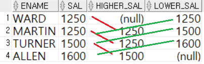   

   - LAG(SAL, 2, 0) / LEAD(SAL, 2, 0)   
   -2번째 앞의 행을 가져오고, 가져올 행이 없는 경우 두행의 값은 0으로 채움   
   -최초 NULL값고 최후 NULL값을 처리하기 위해 파라미터를 3개 사용   
   ```
      SELECT ENAME, SAL, 
         LAG(SAL,2,0) OVER (ORDER BY SAL DESC) AS HIGHER_SAL,
         LEAD(SAL,2,111) OVER (ORDER BY SAL DESC) AS LOWER_SAL
      FROM EMP
      WHERE JOB='SALESMAN';
   ```   
   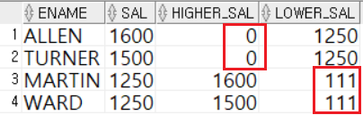   

1. # 비율 윈도우 함수
   RATIO_TO_REPORT, PERCENT_RANK, CUME_DIST, NTILE

1. # 비율 윈도우 함수 - RATIO_TO_REPORT 함수
   파티션 내 전체 SUM(컬럼) 값에 대한 행별 백분율   
   예)동일 JOB 내에서, 본인의 급여가 차지하는 비율 출력   
   ```
      SELECT JOB, ENAME, SAL,
            ROUND(RATIO_TO_REPORT(SAL) OVER (PARTITION BY JOB),2) AS R_R
      FROM EMP
      ORDER BY JOB;
   ```   
   3번 MILLER의 급여는 CLERK직업 내 급여 중 차지하는 비율이 0.31   
   4번 JAMES의 급여는 CLERK직업 내 급여 중 차지하는 비율이 0.23   
   5번 SMITH의 급여는 CLERK직업 내 급여 중 차지하는 비율이 0.19   
   ...   
   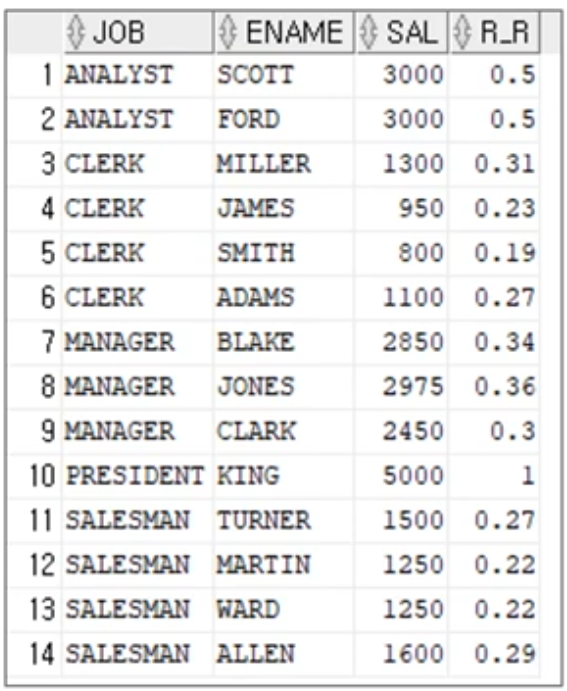   
   
1. # 비율 윈도우 함수 - PERCENT_RANK 함수
   행의 순서별 백분율을 구함 : 가장 먼저 나온 행 = 0, 가장 나중 나온 행 = 1
   *0을 포함   
   예)동일 JOB 내에서, 본인의 급여가 상위 몇 %에 있는지 출력   
   ```
      SELECT DEPTNO, ENAME, SAL,
            PERCENT_RANK() OVER (PARTITION BY DEPTNO ORDER BY SAL DESC) || '%' AS P_R
      FROM EMP;
   ```   
   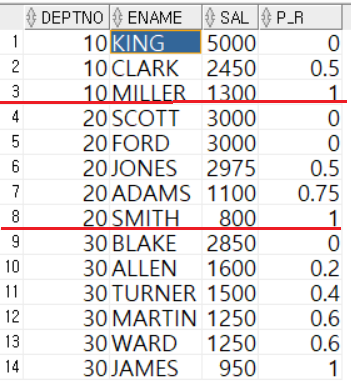   
   0부터 1까지 갯수만큼 균등 분할을 합니다.
   값이 2개면 : 0, 1   
   값이 3개면 : 0, 0.5, 1   
   값이 4갭면 : 0, 0.33333, 0.66666, 0.99999
   값이 5개면 : 0, 0.25, 0.5, 0.75, 1   
   → 동일 값은 작은 백분율을 중복 적용   

1. # 비율 윈도우 함수 - CUME_DIST 함수
   현재 행에 대해, 현재 행보다 작거나 같은 건수에 대한 누적 백분율 : 0초과, 1이하의 값을 가짐   
   *0을 포함하지 않음   
   예)동일 JOB내에서, 본인의 급여가 누적 순서 몇 %에 있는지 출력   
   ```
      SELECT DEPTNO, ENAME, SAL, 
            ROUND((CUME_DIST() OVER (PARTITION BY DEPTNO ORDER BY SAL DESC)),3) AS CUME
      FROM EMP;
   ```   
   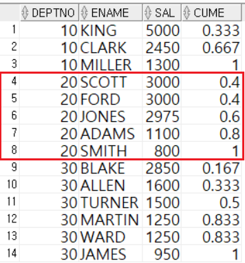   
   0을 빼고 바로 다음값부터 1까지 갯수만큼 균등 분할 적용을 합니다.   
   값이 2개면 : 0.5, 1   
   값이 3개면 : 0.33333, 0.66666, 0.99999   
   값이 4개면 : 0.25, 0.5, 0.75, 1   
   값이 5개면 : 0.2, 0.4, 0.6, 0.8, 1   
   → 동일 값은 큰 백분율을 중복 적용   

1. # 비율 윈도우 함수 - NTILE 함수
   파티션별 전체 __건수__ 를 N등분한 결화를 구함   
   예)전체 사원을 급여 순으로 정렬하고, 급여 기준 4개의 그룹으로 분리하는 질의   
   ```
      SELECT ENAME, SAL, 
            NTILE(4) OVER (ORDER BY SAL DESC) AS 급여구간
      FROM EMP;
   ```   
   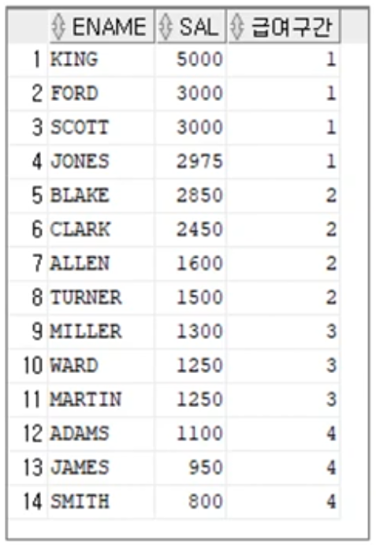   
   나누는 기준없이 정렬된 테이블을 4개의 구간으로 나누고, 내가 어느 구간에 포함되는지 알아보는 함수입니다.   