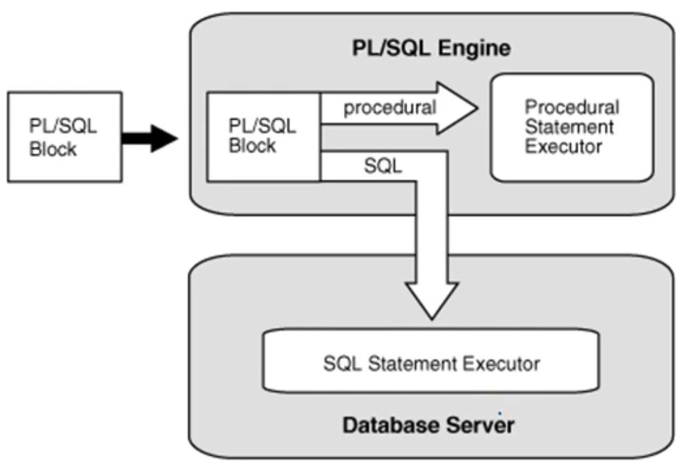
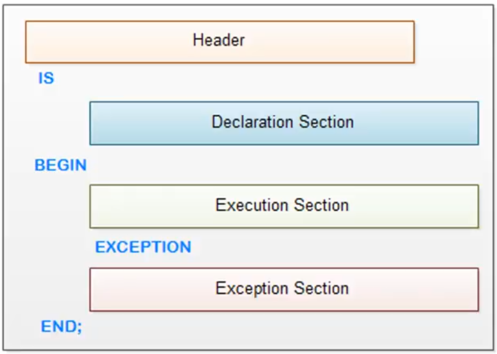
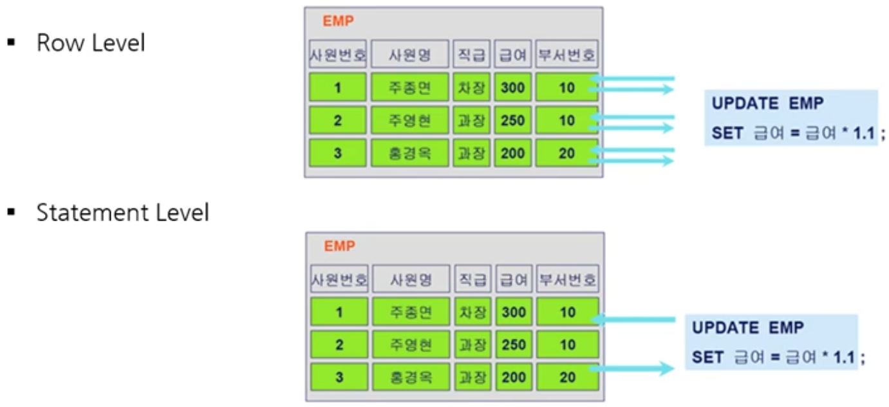
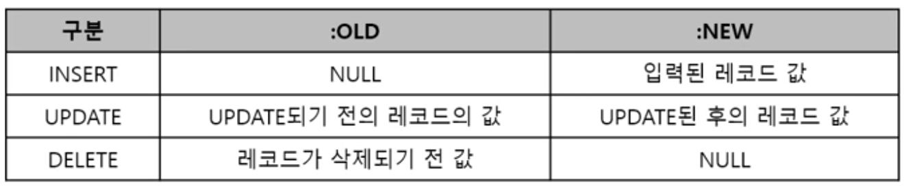

1. # PL(Procedural Language)/SQL 개념 및 특징
   - SQL에서도 절차적인 프로그래밍이 가능하도록 지원   
     -SQL문의 반복 실행, 조건에 따른 분기 등 가능   
   - Block 구조로 설계되어 각 기능별 모듈화 가능   
     -여러 SQL문장을 Block으로 묶어서 한 번에 서버로 보냄 → 통신량 감소   
   - 변수, 상수 등을 선언하여 SQL 문장 간 값 교환 가능   
   - DBMS 정의 에러, 사용자 정의 에러 사용 가능   

1. # PL/SQL 유형   
   - Procedure   
   - User Defined Function   
   - Trigger   

1. # PL/SQL 엔진(ORACLE)
   - PL/SQL Block 프로그램을 SQL문장과 프로그램문장으로 구분하여 처리함   
      -프로그램 문장은 PL/SQL 엔진의 Procedural Statement Executor가 처리   
      -SQL문장은 Oracle 서버의 SQL Statement Executor가 실행   
   
      

1. # PL/SQL Block 구조
      

1. # Procedure(프로시저)
   - CREATE Procedure   
      -CREATE OR REPLACE 사용시 동일 이름의 Procedure를 덮어씀   
      -삭제시 DROP Procedure   
   - Mode   
      -IN : 운영체제에서 프로시저로 전달되는 변수( __default__ )   
      -OUT : 프로시저에서 운영체제로 전달되는 변수   
      -INOUT : 거의 사용하지 않음   
   - /
      -프로시저 컴파일 시작   
         
   ```
      CREATE [OR REPLACE] Procedure [Prcedure_name]
      (argument1 [mode] data_type1, argument2 [mode] data_type2, ...)
      IS ...
      BEGIN  ...
         EXCEPTION  ...
      END;
      /
   ```

1. # Procedure 사용 예
   프로시저 생성   
   ```
      CREATE OR REPLACE PROCEDURE p_dept_insert(v_deptno IN NUMBER, v_dname IN VARCHAR2, v_loc IN VARCHAR2, v_result OUT VARCHAR2)
      IS
         cnt NUMBER := 0;
      BEGIN
         SELECT COUNT(*) INTO cnt
         FROM DEPT
         WHERE DEPTNO = v_deptno;
         
         if cnt > 0 then
            v_result := '이미 등록된 부서번호'
         else
            INSERT INTO DEPT(DEPTNO, DNAME, LOC) VALUES(v_deptno, v_dname, v_loc);
            COMMIT;
            v_result := '입력 완료';
      EXCEPTION
         WHEN OTHERS THEN
            ROLLBACK;
            v_result := 'ERROR 발생'
      END;
      /
   ```   

   실행 : 10번 부서를 등록   
   ```
      variable rslt varchar2(30);

      EXECUTE p_dept_insert(10,'dev','seoul',:rslt);
      print rslt;

      RSLT
      -----------------------
      이미 등록된 부서번호
      

      EXECUTE p_dept_insert(50,'dev','seoul',:rlslt);
      ptint rslt;

      RSLT
      -----------------------
      입력 완료
   ```   

1. # 사용자 정의 함수(User Defined Function)
   - Procedure처럼 절차형 SQL을 로직과 함께 저장한 명령문의 집합   
      -내장 함수(Built-in Function) : 벤더에 의해 정의된 함수   
   - Procedure와 달리 __반드시 수행 결과값을 Return__ 해야 함   
   *Procedure는 매개변수로 받아온 OUT으로 선언한 변수에 return값을 넘기는데, 사용자 정의 함수는 RETURN으로 반드시 결과 값을 리턴해야합니다.
   
   ```
      CREATE OR REPLACE FUNCTION util_abs(v_input IN NUMBER) RETURN NUMBER /* 프로시저는 OUT변수 사용, 사용자 정의 함수는 RETURN을 사용 */
      IS
         v_return NUMBER := 0;
      BEGIN
         IF v_input < 0 THEN
            v_return := v_input * (-1);
         ELSE
            v_return := v_input;
         END IF
      RETURN v_return;
      END;
      /
   ```   

1. # 트리거(Trigger)
   - DML문 수행 시, 이와 연결된 동작을 자동으로 수행하도록 작성된 프로그램   
   - 사용자가 명시적으로 호출하지 않으며, 조건이 맞으면 __자동으로 수행__ 됨    
      -Procedure는 Execute 명령어로 실행하고, Function는 함수 이름으로 실행하지만 Trigger는 생성된 후 DML에 의해 자동으로 실행됩니다.   
   - 주로 데이터 무결성 보장을 위해 FK처럼 동작하거나, 실시간 집계성 테이블 생성에 사용됨   
   - 보안 적용, 유해하지 않은 트랜잭션 예방, 업무 규칙 적용, 감사 제공 등에서 사용   
   - OLTP 시스템에서는 부하로 인해 성능이 저하될 수 있음   
   - ROLLBACK 시, 원 트랜잭션 뿐 아니라 Trigger에 의해 실행된 연산도 __모두 취소됨__   
      -Trigger는 INSERT, UPDATE, DELETE문과 연결된 하나의 트랜잭션 내에서 수행되는 작업으로 이해해야 함   
      -Procedure : Begin ~ End 사이에 COMMIT, ROLLBACK 사용 가능   
      -Trigger : Begin ~ End 사이에 COMMIT, ROLLBACK 사용 불가   
   - Row Trigger와 Statement Trigger로 구분   

1. # 트리거 주요 구문
   - FOR EACH ROW
      -Row Trigger / Statement Trigger의 지정을 위한 구문   
      -"FOR EACH ROW" 사용 → Row Level Trigger → SQL문장의 각 행마다 Trigger 발생   
      -"FOR EACH ROW" 생략 → Statement Level Trigger → SQL 한 문장에 한 번만 Trigger 발생   
      

   - AFTER / BEFORE   
      -Trigger 수행 시점 명시   
   - :NEW / :OLD   
      -:NEW는 문장 수행 후의 정보를 갖는 구조체   
      ex)o_prod := :NEW.product   
      -:OLD는 문장 수행 전의 정보를 갖는 구조체      
      
   - 변수 선언   
      -ORDER.order_date%TYPE;
      → ORDER테이블의 order_date컬럼과 동일한 타입으로 선언   

1. # 트리거 생성 예
   - 새로운 주문이 입력되면 판매 집계 테이블이 업데이트 되는 시나리오   
   :주문이 발생하면 판매 테이블도 정보가 업데이트 돼야 하는데 이때 판매 테이블 업데이트에 트리거를 거는 예제   

   → 주문 관리 테이블   
      -ORDER: ORDER_DATE, PRODUCT, QTY, AMOUNT   

   → 판매 실적 관리 테이블   
      -SALSES: SAL_DATE, PRODUCT, QTY, AMOUNT   

   → 새로운 주문 입력시   
      -ORDER 테이블에 새로운 주문 추가 => (SALES테이블 트리거 발생)   
      -SALES 테이블 갱신 또는 추가 => (트리거 수행)   
      :주문이 발생하면 최초 주문은 SALES테이블에 추가가 되고 이후 수량이 변경될 때마다 SALES테이블은 갱신이 됨   
      :SALES에 해당 주문일자, 해당 상품이 있으면 → 기존 수량/금액 업데이트   
      :예)(2020-01-01,"P01",5,250,000) → (2020-01-01,"P01",6,300,000)   
      :SALES에 해당 주문일자, 해당 상품이 없으면 → 새 레코드 추가   

   ```
      CREATE OR REPLACE TRIGGER summary_sales
         AFTER INSERT  /* 3)INSERT 이후에 트리거를 발생 시켜라 */
         ON ORDER  /* 1)ORDER 테이블에 대해서*/
         FOR EACH ROW  /* 2)문장 전체가 아니라 한행 한행 각각 마다 트리거 발생하는데  */

      DECLARE
         o_date ORDER.order_date%TYPE;  /* o_date변수를 선언하는데 ORDER테이블에 있는 order_date컬럼의 타입과 같은 타입으로 만듦*/
         o_prod ORDER.product%TYPE;  /* o_prod변수를 선언하는데 ORDER테이블에 있는 product컬럼의 타입과 같은 타입으로 만듦 */

      BEGIN
         o_date := :NEW.order_date; /* order_date에 새로운 값이 입력되면 o_date에 저장 */
         o_prod := :NEW.product;  /* product에 새로운 값이 입력되면 o_prod에 저장 */
         UPDATE SALES SET qty = qty + :NEW.qty, amount = amount + :NEW.amount
         /* qty(sales테이블의 qty) + :NEW.qty(ORDER테이블의 INSERT 후의 qty) */
         /* amount(sales테이블의 amount) + :NEW.amount(ORDER테이블의 INSERT 후의 amount) */
         WHERE sale_date = o_date AND product = o_prod;

         IF SQL%NOTFOUND THEN   
         /* update시 기존 데이터가 있어야 업데이트가 가능한데 기존 데이터가 없을 시 최초 한번은 입력을해야 함, 
         업데이트 할 기존 데이터가 없으면 실행 됨 */
            INSET INTO SALES VALUES(o_date, o_prod, :NEW.qty, :NEW.amount);
         END IF;
      END;  
      /
   ```
   프로시저와 함수는 생성 후 호출을 하지만 트리거는 생성만 하고 따로 호출하지 않고 자동실행됩니다.   
