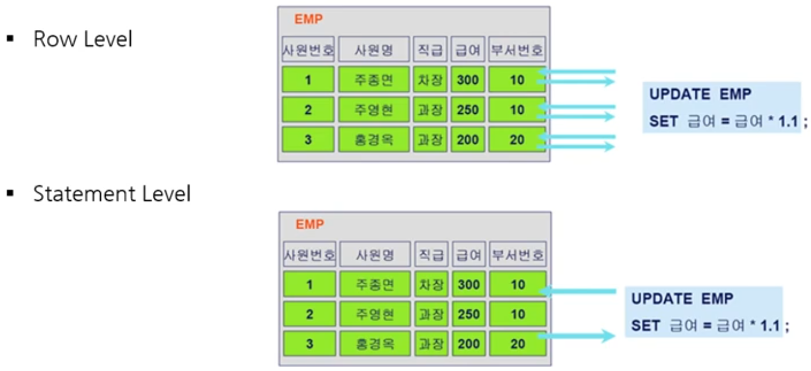

1. # 패키지
   패키지 사전적인 의미는 꾸러미입니다. 관련 있는 프로시저를 보다 효율적으로 관리하기 위해서 패키지 단위로 배포할 때 유용하게 사용됩니다. 패지키는 패키지 선언(명세부)과 패키지 몸체 선언(몸체부) 두 가지 모두를 정의해야 합니다.   

   문법   
   ```SQL
      CREATE OR REPLACE PACKAGE 패키지명
      IS
         함수나 프로시저 선언
      END;

      CREATE OR REPLACE PACKAGE BODY 패키지명
      IS
         함수나 프로시저 정의
      END;
   ```   

   ```SQL
      -- 패키지(PACKAGE):저장 프로시저와 저장 함수를 묶어 놓은 것.
      -- 패키지 = 패키지 헤드 + 패키지 바디

      -- 패키지 생성
      -- 1. 패키지 헤드 생성
      CREATE OR REPLACE PACKAGE EXAM_PACK
      IS
         FUNCTION CAL_BONUS(VEMPNO IN EMP.EMPNO%TYPE)    -- 저장함수
         RETURN NUMBER;
         PROCEDURE CURSOR_SAMPLE02;
      END;
      -- 2. 패키지 바디 생성
      CREATE OR REPLACE PACKAGE BODY EXAM_PACK
      IS 
         -- 저장함수 : CAL_BONUS
         function cal_bonus(vempno in emp.empno%type)
            return number                  -- 돌려줄 값의 자료형
         is
            vsal number(7,2);              -- 로컬변수
         begin
            select sal into vsal from emp where empno = vempno;
            return vsal * 2;              -- 200% 인상한 급여를 돌려준다. 
         end;
         
         -- 저장 프로시져 : CURSOR_SAMPLE02
         PROCEDURE CURSOR_SAMPLE02
         IS
            VDEPT DEPT%ROWTYPE; --로컬 변수생성 
            CURSOR C1
            IS 
            SELECT * FROM DEPT;
         BEGIN
            dbms_output.put_line('부서번호  /  부서명  /  지역명');
            dbms_output.put_line('---------------------------');
            FOR VDEPT IN C1 LOOP
                  EXIT WHEN C1%NOTFOUND;
                  dbms_output.put_line(vdept.deptno||'/'||vdept.dname||'/'||vdept.loc);        
            END LOOP;
         END;
      END;

      SELECT * FROM USER_SOURCE;

      -- 3.저장 프로시져
      EXECUTE EXAM_PACK.cursor_sample02;
         
      -- 4. 저장 함수 실행 : CAL_BONUS()
      -- 1)바인드 변수 생성
      VARIABLE VAR_RES NUMBER;

      -- 2)실행
      EXECUTE :VAR_RES := EXAM_PACK.CAL_BONUS(7788);

      PRINT VAR_RES;

      SELECT ENAME, EXAM_PACK.CAL_BONUS(7788) FROM EMP WHERE EMPNO=7900;
      SELECT ENAME, EXAM_PACK.CAL_BONUS(7788) FROM EMP WHERE EMPNO=7788;
   ```   


1. # 트리거(Trigger)
   - DML문 수행 시, 이와 연결된 동작을 자동으로 수행하도록 작성된 프로그램   
   - 사용자가 명시적으로 호출하지 않으며, 조건이 맞으면 __자동으로 수행__ 됨    
      -Procedure는 Execute 명령어로 실행하고, Function는 함수 이름으로 실행하지만 Trigger는 생성된 후 DML에 의해 자동으로 실행됩니다.   
   - 주로 데이터 무결성 보장을 위해 FK처럼 동작하거나, 실시간 집계성 테이블 생성에 사용됨   
   - 보안 적용, 유해하지 않은 트랜잭션 예방, 업무 규칙 적용, 감사 제공 등에서 사용   
   - OLTP 시스템에서는 부하로 인해 성능이 저하될 수 있음   
   - ROLLBACK 시, 원 트랜잭션 뿐 아니라 Trigger에 의해 실행된 연산도 __모두 취소됨__   
      -Trigger는 INSERT, UPDATE, DELETE문과 연결된 하나의 트랜잭션 내에서 수행되는 작업으로 이해해야 함   
      -Procedure : Begin ~ End 사이에 COMMIT, ROLLBACK 사용 가능   
      -Trigger : Begin ~ End 사이에 COMMIT, ROLLBACK 사용 불가   
   - Row Trigger와 Statement Trigger로 구분   

1. # 트리거 주요 구문
   - FOR EACH ROW
      -Row Trigger / Statement Trigger의 지정을 위한 구문   
      -"FOR EACH ROW" 사용 → Row Level Trigger → SQL문장의 각 행마다 Trigger 발생   
      -"FOR EACH ROW" 생략 → Statement Level Trigger → SQL 한 문장에 한 번만 Trigger 발생   
      

   - AFTER / BEFORE   
      -Trigger 수행 시점 명시   
   - :NEW / :OLD   
      -:NEW는 문장 수행 후의 정보를 갖는 구조체   
      ex)o_prod := :NEW.product   
      -:OLD는 문장 수행 전의 정보를 갖는 구조체      
      
   - 변수 선언   
      -ORDER.order_date%TYPE;
      → ORDER테이블의 order_date컬럼과 동일한 타입으로 선언   

1. # 트리거 생성 예
   - 새로운 주문이 입력되면 판매 집계 테이블이 업데이트 되는 시나리오   
   :주문이 발생하면 판매 테이블도 정보가 업데이트 돼야 하는데 이때 판매 테이블 업데이트에 트리거를 거는 예제   

   → 주문 관리 테이블   
      -ORDER: ORDER_DATE, PRODUCT, QTY, AMOUNT   

   → 판매 실적 관리 테이블   
      -SALSES: SAL_DATE, PRODUCT, QTY, AMOUNT   

   → 새로운 주문 입력시   
      -ORDER 테이블에 새로운 주문 추가 => (SALES테이블 트리거 발생)   
      -SALES 테이블 갱신 또는 추가 => (트리거 수행)   
      :주문이 발생하면 최초 주문은 SALES테이블에 추가가 되고 이후 수량이 변경될 때마다 SALES테이블은 갱신이 됨   
      :SALES에 해당 주문일자, 해당 상품이 있으면 → 기존 수량/금액 업데이트   
      :예)(2020-01-01,"P01",5,250,000) → (2020-01-01,"P01",6,300,000)   
      :SALES에 해당 주문일자, 해당 상품이 없으면 → 새 레코드 추가   

   ```
      CREATE OR REPLACE TRIGGER summary_sales
         AFTER INSERT  /* 3)INSERT 이후에 트리거를 발생 시켜라 */
         ON ORDER  /* 1)ORDER 테이블에 대해서*/
         FOR EACH ROW  /* 2)문장 전체가 아니라 한행 한행 각각 마다 트리거 발생하는데  */

      DECLARE
         o_date ORDER.order_date%TYPE;  /* o_date변수를 선언하는데 ORDER테이블에 있는 order_date컬럼의 타입과 같은 타입으로 만듦*/
         o_prod ORDER.product%TYPE;  /* o_prod변수를 선언하는데 ORDER테이블에 있는 product컬럼의 타입과 같은 타입으로 만듦 */

      BEGIN
         o_date := :NEW.order_date; /* order_date에 새로운 값이 입력되면 o_date에 저장 */
         o_prod := :NEW.product;  /* product에 새로운 값이 입력되면 o_prod에 저장 */
         UPDATE SALES SET qty = qty + :NEW.qty, amount = amount + :NEW.amount
         /* qty(sales테이블의 qty) + :NEW.qty(ORDER테이블의 INSERT 후의 qty) */
         /* amount(sales테이블의 amount) + :NEW.amount(ORDER테이블의 INSERT 후의 amount) */
         WHERE sale_date = o_date AND product = o_prod;

         IF SQL%NOTFOUND THEN   
         /* update시 기존 데이터가 있어야 업데이트가 가능한데 기존 데이터가 없을 시 최초 한번은 입력을해야 함, 
         업데이트 할 기존 데이터가 없으면 실행 됨 */
            INSET INTO SALES VALUES(o_date, o_prod, :NEW.qty, :NEW.amount);
         END IF;
      END;  
      /
   ```
   프로시저와 함수는 생성 후 호출을 하지만 트리거는 생성만 하고 따로 호출하지 않고 자동실행됩니다.   
