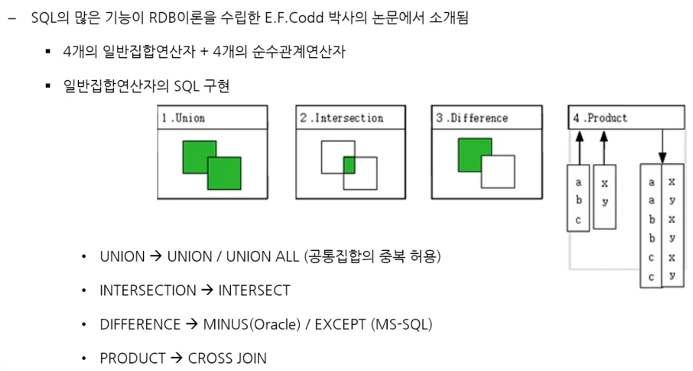
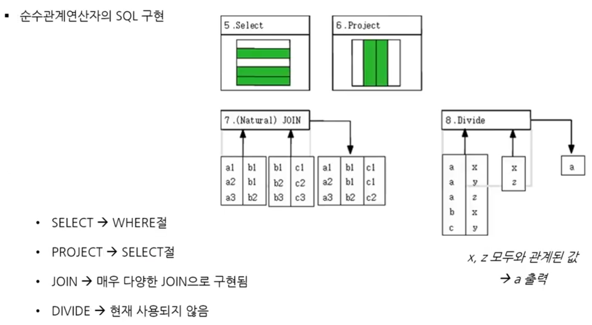
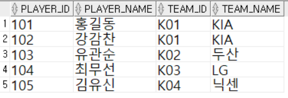
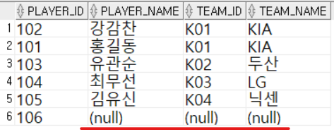
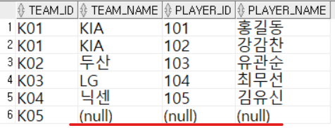

1. # E.F.CODD의 연산자

E.F.CODD박사가 제안한 RDB가 갖춰야할 가장 기본적인 기능   
집합 연산자 - 합집합, 교집합, 차집합, Product
관계 연산자 - SELECT, PROJECT, JOIN, DIVIDE   
가 있습니다.   

   1) 집합 연산자

   

   - UNION : 합집합의 용어 그대로 UNION 이란 명령어를 사용합니다.   

   2) 관계 연산자   

      

   - SELECT   
   2. 현재의 WHERE절로 가로 ROW값 지정   
   2. 선택 조건을 만족하는 튜플의 부분집합을 구하여 새로운 릴레이션을 만듦   
   2. 표기 형식 : σ<조건>   
   <span style="color:red;font-size:18px">*관계 연산자 SELECT는 쿼리 명령어 SELECT가 아니라 ROW값을 선택한다는 의미의 SELECT로 쿼리문 SELECT와 다른 용어입니다.</span>   

   - PROJECT   
   2. 현재의 SELECT절로 세로 컬럼값 지정   
   2. 속성 LIST에 제시된 Attribute만을 추출      
   2. 표기 형식 : π<속성 리스트>   

   - JOIN   
   2. 매우 다양한 JOIN으로 구현됨   
   2. 공통 속성을 중심으로 두 개의 릴레이션을 하나로 합쳐서 새로운 릴레이션을 만드는 연산   
   2. 표기 형식 : R ⋈r=s S(R,S는 릴레이션. r,s는 각각 R와 S의 속성)    
   *E.F.CODD박사가 가장 초기에 제안한 (Natural)JOIN은 이후 발전된 다양한 JOIN의 한 종류 포함되게 됩니다.   

   - DIVIDE   
   2. 현재 사용되지 않음   
   2.  R의 속성이 S의 속성값을 모두 가진 튜플에서 S가 가진 속성을 제외한 속성만을 구하는 연산   
   2. A(제수)를 B(피제수)로 나누는 개념으로 제수에 값이 모두 있는 피제수를 구하는 방식입니다. 예제의 x,z와 모두 연관된 a가 출력됩니다.   
   2. 표기 형식 : ÷   

1. # 정규화와 JOIN
    
   - 정규화   
   -이상현상(Anomaly) 발생을 피하기 위해 테이블을 분할   
   -학계/실무에서 주로 3NF(3차 정규형) 사용   

   - 반정규화   
   -테이블을 정규화하고 나서 성능상의 이유로 테이블, 컬럼, 관계를 조작하여 스키마의 변경이 발생   
   -테이블 자체의 변경이 발생   
      
   - JOIN   
   -데이터의 통합 조회를 위해 여러 테이블들을 연결   
   -테이블 자체의 변경은 일어나지 않음   
   -실제 JOIN연산은 두 개의  테이블에 대해서만 적용됨   
   -일반적인 경우 PK/FK의 연관에 의해 JOIN이 성립   
   *그 외에도 논리적인 값들의 연관성만으로 JOIN 성립 가능   

1. # JOIN의 유형
   - (1)Equi Join / Non-Equi Join   
   - (2)암시적 조인 / 명시적 조인   
   - (3)Inner Join / Outer Join / Cross join / Self Join

1. # JOIN
   ```sql
      select e.empno, e.ename, d.deptno, d.dname 
      from emp e, dept d
   ```   
   from절에 where조건 없이 테이블을 2개 작성하는 건 두 테이블에 product(cross join)를 수행하는 것과 같습니다.  

   ```sql
      select e.empno, e.ename, d.deptno, d.dname 
      from emp e, dept d
      where e.deptno = d.deptno
   ```   
   produt한 결과에서 조건을 걸어 join한 것과 같은 결과를 출력   
   ```sql
      select e.empno, e.ename, d.deptno, d.dname 
      from emp e join dept d
      on e.deptno = d.deptno;
   ```   

1. # ON
 
   2. ON 조건절   
   "테이블을 조인으로 결합하는데 ON이란 조건을 가지고 테이블을 결합해라"라는 의미로 ON에 조건을 입력할 수 있습니다.   
   ```sql
      SELECT A.고객번호, A.고객명, B.단말기ID, B.단말기명, C.OSID, C.OS명
      FROM 고객 A LEFT OUTER JOIN 단말기 B
      ON (A.고객번호 IN (11000,12000) AND A.단말기ID = B.단말기ID)
      LEFT OUTER JOIN OS C
      ON (B.OSID = C.OSID)
   ```   
   고객 테이블과 단말기 테이블을 연관짓는데 고객번호가 11000, 12000인 행만 가져와서 연관짓고, 단말기 테이블과 OS 테이블의 OSID가 일치하는 행만 결과로 가져옵니다.   

   2. ON과 WHERE절 비교   
   FROM → JOIN → WHERE 순으로 실행이 됩니다.   
   그렇기 때문에 ON조건으로 필터링 한 후 JOIN으로 테이블을 가져오는 경우와   
   JOIN으로 테이블을 가져온 후 WHERE조건으로 필터링을 하는 경우는 다릅니다.   

   예)MYTEAM테이블과 MYPLAYER테이블을 만들어서 OUTER JOIN에서 ON과 WHERE에 따른 NULL값의 유무   
   ```sql
      /*MYTEAM 생성*/
      CREATE TABLE MYTEAM(
          TEAM_ID VARCHAR(10) PRIMARY KEY,
          TEAM_NAME VARCHAR(20),
          ADDCOL VARCHAR(5)
      );

      INSERT INTO MYTEAM VALUES('K01','KIA',1);
      INSERT INTO MYTEAM VALUES('K02','두산',1);
      INSERT INTO MYTEAM VALUES('K03','LG',1);
      INSERT INTO MYTEAM VALUES('K04','닉센',1);
      INSERT INTO MYTEAM VALUES('K05', NULL, NULL);

      /*MYPLAYER 생성*/
      CREATE TABLE MYPLAYER(
          PLAYER_ID VARCHAR(10),
          PLAYER_NAME VARCHAR(20),
          TEAM_ID VARCHAR(10),
      );

      INSERT INTO MYPLAYER VALUES('101','홍길동','K01');
      INSERT INTO MYPLAYER VALUES('102','강감찬','K01');
      INSERT INTO MYPLAYER VALUES('103','유관순','K02');
      INSERT INTO MYPLAYER VALUES('104','최무선','K03');
      INSERT INTO MYPLAYER VALUES('105','김유신','K04');
      INSERT INTO MYPLAYER VALUES('106',NULL, NULL);

      /*INNER JOIN*/
      SELECT M1.PLAYER_ID, M1.PLAYER_NAME,  M2.TEAM_ID, M2.TEAM_NAME
      FROM MYPLAYER M1 JOIN MYTEAM M2
      ON M1.TEAM_ID = M2.TEAM_ID;

      /*FROM에서 테이블 나열*/
      SELECT M1.PLAYER_ID, M1.PLAYER_NAME,  M2.TEAM_ID, M2.TEAM_NAME
      FROM MYPLAYER M1, MYTEAM M2
      WHERE M1.TEAM_ID = M2.TEAM_ID;

      /*LEFT OUTER JOIN*/
      SELECT M1.PLAYER_ID, M1.PLAYER_NAME,  M2.TEAM_ID, M2.TEAM_NAME
      FROM MYPLAYER M1 LEFT OUTER JOIN MYTEAM M2
      ON M1.TEAM_ID = M2.TEAM_ID ;

      /*RIGHT OUTER JOIN*/
      SELECT M2.TEAM_ID, M2.TEAM_NAME, M1.PLAYER_ID, M1.PLAYER_NAME
      FROM MYPLAYER M1 RIGHT OUTER JOIN MYTEAM M2
      ON M1.TEAM_ID = M2.TEAM_ID ;
   ```   
   INNER JION과 FROM에서 테이블 나열 결과:   
      
   ON조건을 먼저 실행 후 테이블을 가져온 결과와 테이블을 가져와서 WHERE조건으로 필터링을 한 결과가 동일합니다.

   LEFT OUTER JION 결과:   
      
   ON조건을 먼저 실행한 후 MYPLAER테이블을 가져와서 테이블 값들을 전부 출력한 결과이기 때문에 앞서 보지 못한 NULL행이 포함되어 있습니다.   

   RIGHT OUTER JION 결과:   
      
   ON조건을 먼저 실행한 후 MYTEAM테이블을 가져와서 테이블 값들을 전부 출력한 결과이기 때문에 앞서 보지 못한 NULL행이 포함되어 있습니다.   


