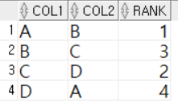

1. # 계층형 데이터
   - 동일 데이터에 계층적으로 상위와 하위 데이터가 포함된 데이터   
   - 엔터티가 순환관계 모델로 설계된 경우 발생   
   - 계층형 질의를 통해 접근 가능   

      
   (2)를 표로 나타낸 것이 (3)   
   A는 가장 위에 있어서 관리자가 없고, B위엔 A가, C위에도 A가, D와 E위에 C가 위치하고 있습니다.   

1. # 계층형 질의의 방향
      
   순방향 : 위에서 아래로   
   역방향 : 아래에서 위로   
    
1. # 계층형 질의의 구조

   - START WITH - 시작 조건 지정   
   -예) START WITH MGR IS NULL    
   -예) START WITH EMPNO ='D'   

   - CONNECT BY - 다음에 전개될 방향 지정   
   -순방향 : PRIOR 자식 = 부모   
   <span style="color:red">*PRIOR가 붙지않은 곳에서 붙은 곳으로 자식 ← 부모</span>   
   예)CONNECT BY PRIOR EMPNO = MGR   
   : EMPNO ← MGR   
   -역방향 : PRIOR 부모 = 자식   
   <span style="color:red">*PRIOR가 붙지않은 곳에서 붙은 곳으로 부모 ← 자식</span>   
   예)CONNECT BY PRIOR MGR = EMPNO   
   : MGR ← EMPNO   
   ```sql
      SELECT 컬럼명
      FROM 테이블명   
      WHERE 조건
      START WITH 시작 조건
      CONNECT BY PRIOR 방향
   ```   
   
   - 예제)   
   ```sql
      CREATE TABLE PRIOR_EX(
          COL1 VARCHAR(3),
          COL2 VARCHAR(3),
          RANK NUMBER
      );
      
      INSERT INTO PRIOR_EX VALUES('A','B',1);
      INSERT INTO PRIOR_EX VALUES('C','D',2);
      INSERT INTO PRIOR_EX VALUES('B','C',3);
      INSERT INTO PRIOR_EX VALUES('D','A',4);

      SELECT *
      FROM PRIOR_EX
   ```   
   PRIOR_EX테이블:   
      

   - PRIOR없는 방향에서 있는 방향으로 전개   
   ```sql
      SELECT *
      FROM PRIOR_EX
      START WITH COL1 = 'A'
      CONNECT BY NOCYCLE PRIOR COL1 = COL2; /*COL1 ← COL2 */

      SELECT *
      FROM PRIOR_EX
      START WITH COL1 = 'A'
      CONNECT BY NOCYCLE COL2= PRIOR COL1; /*COL2 → COL1 */
   ```   
   결과값:   
      
   PRIOR_EX테이블에서 순서 : COL2에서 COL1방향으로 전개   
      
      
   - PRIOR없는 방향에서 있는 방향으로 전개   
   ```sql
      SELECT *
      FROM PRIOR_EX
      START WITH COL1 = 'A'
      CONNECT BY NOCYCLE PRIOR COL2 = COL1; /*COL2 ← COL1 */

      SELECT *
      FROM PRIOR_EX
      START WITH COL1 = 'A'
      CONNECT BY NOCYCLE COL1 = PRIOR COL2; /*COL1 → COL2 */
   ```   
   결과값:   
      
   PRIOR_EX테이블에서 순서 : COL1에서 COL2방향으로 전개   
      

1. # 순방향 계층형 질의 예_1
      
   - START WITH에서 순환을 MGR값이 NULL이거에서부터 시작 - EMPNO가 7839부터 시작   
   - CONNECT BY PRIOR EMPNO = MGR; PRIOR 자식 = 부모이므로 순방향(위에서 아래로)으로 탐색   
   - SELECT에 LEVEL : 노드의 깊이 반영   
   7839 : 1   
   75666, 7698, 7882 : 2   
   7788, ... , 7934 : 3   
   7876, 7369 : 4   
   - CONNECT_BY_ISLEAF : 말단이면 1, 아니면 0   

1. # 순방향 계층형 질의 예_2
      
   - START WITH를 EMPNO가 7566, 7698, 7782인 3군데에서 시작   
   - CONNECT BY ROOT : 경로의 최초 부모 노드   
   - SYS_CONNECT_BY_PATH : 조상으로부터 현재까지 루트를 모두 표시   
   예) SYS_CONNECT_BY_PATH(EMPNO, '/') : 조상부터 현재까지의 경로를 EMPNO로 출력하고 그 사이는 '/'로 구분해라.   

1. # 역방향 계층형 질의 예_3
      
   - CONNECT BY PRIOR MGR = EMPNO : PRIOR 부모 = 자식 이니깐 역방향 질의   
   - 순방향일 때와 역방향일 때 노드 레벨이 다름   
   1) 순방향일 때 노드 레벨   
   7839 : 1   
   75666, 7698, 7882 :  2   
   7788, ... , 7934 : 3   
   7876, 7369 : 4   
   2) 역방향일 때 노드 레벨   
   7876, 7369 : 1   
   7788, ... , 7934 : 2   
   756, 7698, 7782 : 3   
   7839 : 4   
   3) 역방향일 때 7788에서 최초 시작   
   7788, 7902, ... , 7934 : 1   
   7566 7698 , 7782 : 2   
   7839 : 3   

   *노드의 깊이는 최초 시작점에 따라 변함   


