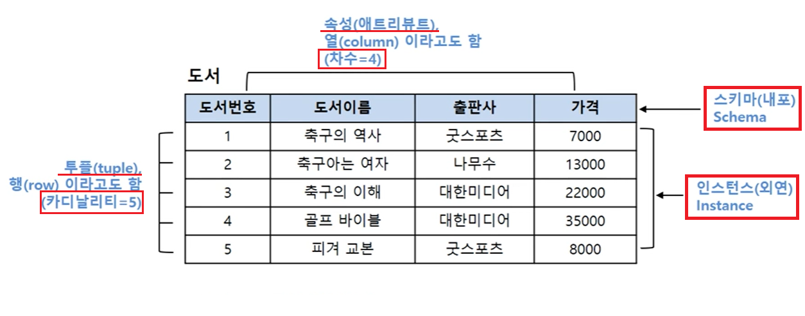

1. # 데이터 모델링
   개념적 데이터 모델링 : 추상화 수준이 높고, 업무 중심적이고 포괄적   
   논리적 데이터 모델링 : KEY, 속성, 관계 설정   
   물리적 데이터 모델링 : 실제 데이터베이스에 이식할 수 있도록 성능, 저장 등 물리적인 성격 고려   

1. # 엔터티
   유형(Tangible) 엔터티 - 유형     
   /- 교수, 강의실, 학생 등   
   개념(Conceptual) 엔터티 - 무형   
   /- 수업, 보험상품 등   
   사건(Event) 엔터티 - 무형   
   /- 수강신청, 주문, 입금 등   
   
   기본 엔터티 - 독립적으로 생성됨, 자식 엔터티를 가질 수 있음   
   예) 상품, 회원   
   중심 엔터티 - 기본 엔터티로부터 파생, 행위 엔터티 생성   
   예) 주문   
   행위 엔터티 - 2개 이상의 엔터티로부터 파생   
   예) 주문 내역, 이벤트 응모 이력   

1. # 스키마
   외부 스키마 : 사용자 관점   
   &nbsp;&nbsp;&nbsp;→(외부 스키마와 개념 스키마 사이)논리적 데이터 독립성   
   개념 스키마 : 통합적 관점   
   &nbsp;&nbsp;&nbsp;→(개념 스키마와 내부 스키마 사이)물리적 데이터 독립성   
   내부 스키마 : 물리적 구조   

1. # 용어
      

   *튜행카, 속애열차   

1. # 엔터티 관계
   관계명 - 관계의 이름   
   관계차수 - 1:M, 1:1   
   관계선택사양 - 필수관계, 선택관계   

1. # ERD작성 순서
   엔터티를 그린다 → 엔터티 배치 → 엔터티 관계 설정 → 관계명 기술 → 관계의 참여도 기술 → 관계의 필수여부   

1. # 엔터티, 인트턴스, 속성 관계
   1개의 엔터티는 2개 이상의 인스턴스   
   1개의 엔터티는 2개 이상의 속성   
   1개의 속성은 1개의 속성 값   

1. # ERD와 UML
   ERD : <u>존재에 의한 관계</u>와 <u>행위에 의한 관계</u>를 구분하는 표기법이 없다.   
   UML : <u>연관관계</u>와 <u>의존관계</u>를 구분하는 표기법이 있다.   

1. # 식별자 특징
   - 최소성 : 유일성을 만족하는 최소의 수   
   - 존재성 : NOT NULL   
   - 유일성 : 다른 인스턴스를 구별   
   - 불변성 : 자주 변하지 않아야 함.   

1. # 식별자 강한, 약한 관계
   식별자 관계 - 강한 관계 - 약한 엔터티   
   실선표현, 상속받은 주식별자 속성을 타엔터티에 이전 필요   
   비식별자 관계 - 약한 관계 - 강한 엔터티   
   점석 표현, 상속받은 주식별자 속성을 타엔터티에 차단 필요   

1. # 데이터 모델링 순서 
   정규화 → 용량산정 → 트랜잭션 유형 파악 → 반정규화 → PK/FK조정, 슈퍼타입/서브타입 조정 → 데이터 모델 검증

1. # 정규화
   비정규릴레이션 : 같은 값 반복   
   ↓도메인을 원자값으로 수정 : 1정규화   
   1NF(1정규형) : PK 2개   
   ↓부분 함수 종속 제거 : 2정규화   
   2NF(2정규형) : PK가 아닌 컬럼이 다른 컬럼 결정   
   ↓이행함수 종속 제거 : 3정규화   
   3NF(3정규형)   

1. # 반정규화
   - 컬럼반정규화    
   -중이파PK   
   - 테이블 반정규화    
   -테이블병합(1:1 / 1:M / 슈퍼,서브타입)   
   -테이블분할(수평분할, 수직분할)   
   -테이블추가(중이부통)   

1. # -------------------------------------------------------------

1. # NULL
   NULL검색은 IS NULL이나 IS NOT NULL로 검색이 가능합니다. .. IN (NULL), A>NULL 과 같은 연산자에서 NULL은 연산이 제외됩니다.   

1. # COUNT(*)
    SELECT NVL(COUNT(*), 9999) FROM TABLE WHERE 1 = 2   
    → COUNT함수는 조건이 거짓일 때 0을 반환   

1. # <> ANY
   ```sql
      SELECT DEPTNO FROM DEPT
      WHERE DEPTNO <> ANY (SELECT
      DEPTNO FROM EMP);
   ```   
   <> : 같지 않다.   
   ANY : 다수의 비교값 중 하나라도 만족하면 TRUE   

1. # 인덱스
   CREATE INDEX IDX2 ON ARTICLES(STARTPAGE, ENDPAGE);   

   SELECT TITLE FROM ARTICLES   
   WHERE ENDPAGE - STARTPAGE > 50; → 인덱스에 연산을 사용하면 변형되어 더이상 인덱스 역할을 못 함   

1. # 분산 데이터베이스

1. # ROWNUM
   0,1 제외하고 <. <= 일 때만 출력   
   1만 '='일 때 출력   
   ```sql
   SELECT * FROM MYPLAYER WHERE ROWNUM = 1;  --상위 1개 출력
   SELECT * FROM MYPLAYER WHERE ROWNUM > 1;  --0개 출력
   SELECT * FROM MYPLAYER WHERE ROWNUM >= 1;  --전부 출력
   SELECT * FROM MYPLAYER WHERE ROWNUM < 1;  --0개 출력
   SELECT * FROM MYPLAYER WHERE ROWNUM <= 1;  --상위 1개 출력

   SELECT * FROM MYPLAYER WHERE ROWNUM = 0;  --0개 출력
   SELECT * FROM MYPLAYER WHERE ROWNUM > 0;  --전부 출력
   SELECT * FROM MYPLAYER WHERE ROWNUM >= 0;  --전부 출력
   SELECT * FROM MYPLAYER WHERE ROWNUM < 0;  --0개 출력
   SELECT * FROM MYPLAYER WHERE ROWNUM <= 0;  --0개 출력

   SELECT * FROM MYPLAYER WHERE ROWNUM = 3;  --0개 출력
   SELECT * FROM MYPLAYER WHERE ROWNUM > 3;  --0개 출력
   SELECT * FROM MYPLAYER WHERE ROWNUM >= 3;  --0개 출력
   SELECT * FROM MYPLAYER WHERE ROWNUM < 3;  --상위 2개 출력
   SELECT * FROM MYPLAYER WHERE ROWNUM <= 3;  --상위 3개 출력
   ```   
   
1. # 연산자 우선순위
   1	산술 연산자(*, /, +, -)   
   2	연결 연산자 (||)   
   3	비교 연산자(<, >, <=, =>, <>, =)   
   4	IS NULL, LIKE, IN   
   5	BETWEEN   
   6	NOT 연산자   
   7	AND 연산자   
   8	OR 연산자   

1. # LIKE
   LIKE '%A' --A로 끝나는 문자   
   LIKE 'A%' --A로 시작하는 문자   
   LIKE '%A%' --A를 포함하는 문자   

1. NULL GROUP BY
   ```sql
      INSERT INTO TEST37 VALUES(NULL, 10);
      INSERT INTO TEST37 VALUES(12, NULL);
      INSERT INTO TEST37 VALUES(NULL, NULL);
      INSERT INTO TEST37 VALUES(10, 12);

      SELECT COL1, COUNT(*) FROM TEST37 GROUP BY COL1; 
      -- NULL(2개), 12(1개), 10(1개) : COUNT안에 *는 NULL 카운트한다.
      SELECT COL1, COUNT(COL1) FROM TEST37 GROUP BY COL1; 
      -- NULL(0개), 12(1개), 10(1개) : COUNT안에 컬럼명은 NULL 카운트 안한다.
   ```   
   COUNT(*) : *는 NULL포함   
   COUNT(컬럼명) : NULL 카운팅 안함   
   
1. # 함수
   - NVL2 함수 - NVL함수와 DECODE를 하나로 만든 것이다.   
   NVL2(MGR, 1, 0)은 MGR칼럼이 NULL이 아니면 1, NULL이면 0을 반환한다.   

   - DECODE(A, B, ‘C’, ‘D’); : A의 결과가 B이면 ‘C’출력, B가 아니면 ‘D’출력   

   - SELECT COALESCE(NULL, 2, 3) FROM DUAL; → 2 NULL이 아닌 최초수   

1. # ROLLBACK
   ```sql  
      DROP TABLE TEST20;
      CREATE TABLE TEST20( COL1 NUMBER(10));

      DELETE FROM TEST20;
      INSERT INTO TEST20 VALUES(1);
      INSERT INTO TEST20 VALUES(4);

      SAVEPOINT SV1;

      UPDATE TEST20 SET COL1=8 WHERE COL1=2;

      SAVEPOINT SV1; /*ROLLBACK시 여기로 이동*/

      DELETE TEST20 WHERE COL1 >= 2;

      ROLLBACK TO SV1;

      INSERT INTO TEST20 VALUES(3); /*ROLLBACK  후 여기서 다시 시작*/

      SELECT SUM(COL1) FROM TEST20; /*8*/
   ```

1. # -------------------------------------------------------------

1. # 순수 관계 연산자
   SELECT - where  
  
   PROJECT - select
 
   JOIN - natural join
  
   DIVISION
   
1. # UNION
   UNION은 섞고 중복제거   

1. # ORDER BY
   서브쿼리에서는 ORDER BY를 사용하지 못한다.   

1. # 최적화 - 조인
   NL조인 : 중첩 for문, 소규모 데이터에 사용되는 OLTP업무에 적합, 연결 조건 인덱스 및 드라이빙 테이블의 우선순위에 따라 성능 결정, 결과 행 수가 적은 테이블을 선행 테이블로 하는 것이 유리   
   Sort Merge : 정렬 후 조인, 인덱스를 사용하지 않음, Non-Equi Join가능   
   Hash Join :  Equi Join만 가능, 데이터가 많은 게 유리, 결과 행 수가 적은 테이블을 선행 테이블로 하는 것이 유리   

1. # ROLLUP과 GROUPING SETS
   SELECT B.GRADE, A.JOB, SUM(B.GRADE)   
   FROM TAB1 A, TAB2 B GROUP BY ROLLUP(B.GRADE, A.JOB);   
   → (B.GRADE), (B.GRADE, A.JOB), ()   

   SELECT B.GRADE, A.JOB, SUM(B.GRADE)   
   FROM TAB1 A, TAB2 B GROUP BY GROUPING SETS(B.GRADE,(B.GRADE, A.JOB));   
   → (B.GRADE), (B.GRADE, A.JOB)   

1. # SUM(NULL)
   SUM(NULL) : NULL   
   COUNT(NULL) : __0__   
   AVG(NULL) : NULL   
   MAX(NULL) : NULL   
   MIN(NULL) : NULL   

1. # 권한
   CREATE 사용자 IDENTIFIED BY 암호;   
   ALTER 사용자 IDENTIFIED BY 암호;   

   GRANT 권한 TO 사용자;   
   REVOKE 권한 FROM 사용자;   

   GRANT 권한 ON 테이블 TO 사용자;   
   REVOKE 권한 ON 테이블 FROM 사용자;   

1. # 뷰
   다른 테이블에서 파생된 테이블로, 물리적 데이터가 저장되는 것이 아닌 논리적으로 존재하는것을 무엇이라고 하는가?