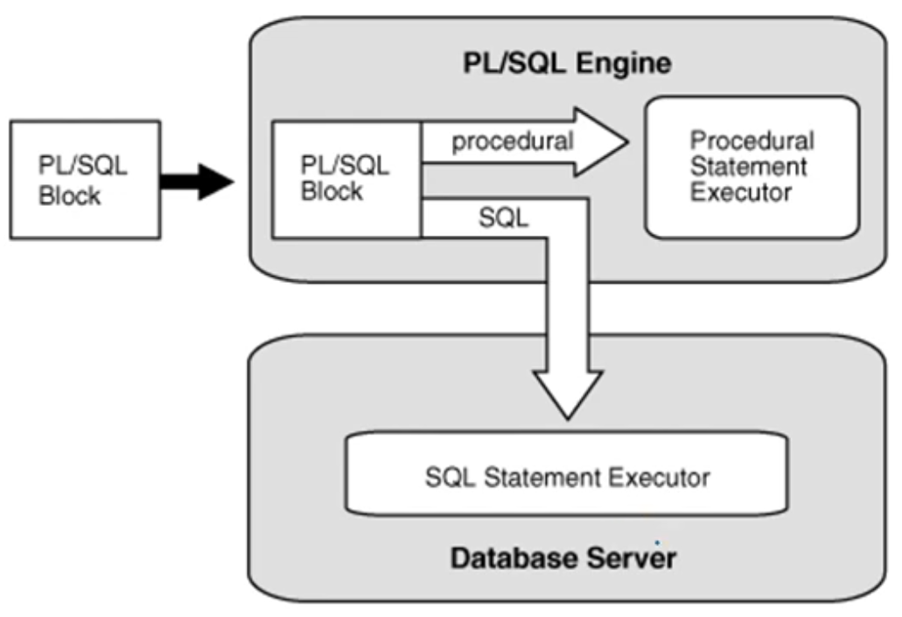

1. #  PL/SQL
   PL/SQL은 데이터베이스에서 프로그래밍을 할 수 있게 만든 방식으로 pascal과 유사한 구조로서 DECLEAR ~ BEGIN ~ EXCEPTION ~ END 순서를 갖습니다.   

   ```SQL
      DECLARE SECTION(선언부)

      EXECUTABLE SECTION(실행부)

      EXCEPTION SECTION(예외 처리부)
   ```   

   선언부   
   모든 변수나 상수를 선언하는 부분으로서 DECLARE로 시작합니다.   

   실행부   
   절차적 형식으로 SQL문을 실행할 수 있도록 절차적 언어의 요소인 제어문, 반복문, 함수 정의 등 로직을 기술할 수 있는 부분   

   예외처리   
   PL/SQL 문이 실행되는 중에 에러가 발생할 수 있는데 이를 해결하기 위한 문장을 기술할 수 있는 부분   

1. # 구조
   1)PL/SQL 블록 내에서는 한 문장이 종료될 때마다 세미콜론(;)을 사용합니다.   
   2)END 뒤에 ;을 사용하여 하나의 블록이 끝났다는 것을 명시합니다.   
   3)단일행 주석은 --이고 여러행 주석은 /* */ 입니다.   
   4)변수에 값 할당시 := 를 사용합니다.   
   5)쿼리문을 실행하기 위해서는 END; 뒤에 / 가 있으면 종결된 것으로 간주합니다.   
   6)DECLEAR 변수선언 BEGIN 실행부 END; / 구조를 이룹니다.   
   
1. # PL(Procedural Language)/SQL 개념 및 특징
   - SQL에서도 절차적인 프로그래밍이 가능하도록 지원   
     -SQL문의 반복 실행, 조건에 따른 분기 등 가능   
   - Block 구조로 설계되어 각 기능별 모듈화 가능   
     -여러 SQL문장을 Block으로 묶어서 한 번에 서버로 보냄 → 통신량 감소   
   - 변수, 상수 등을 선언하여 SQL 문장 간 값 교환 가능   
   - DBMS 정의 에러, 사용자 정의 에러 사용 가능   

1. # PL/SQL 유형   
   - Procedure   
   - User Defined Function   
   - Trigger   

1. # PL/SQL 엔진(ORACLE)
   - PL/SQL Block 프로그램을 SQL문장과 프로그램문장으로 구분하여 처리함   
      -프로그램 문장은 PL/SQL 엔진의 Procedural Statement Executor가 처리   
      -SQL문장은 Oracle 서버의 SQL Statement Executor가 실행   
   
      

1. # PL/SQL Block 구조
      

1. # SET SERVEROUTPUT ON
   오라클 환경 변수 SERVEROUTPUT는 오라클에서 제공해주는 프로시저를 사용하여 출력해 주는 내용을 화면에 보여주도록 설정하는 환경 변수인데 디폴트 값은 OFF이기 때문에 ON으로 변경해야 합니다.   

1. # 값 출력
   화면 출력을 위해서는 PUT_LINE이란 프로시저를 이용합니다. PUT_LINE은 오라클이 제공해주는 프로시저로 DBMS_OUTPUT 패키지에 묶여 있습니다.   
   ```SQL
      BEGIN
         DBMS_OUTPUT.PUT_LINE('hello world!');
      END;
      /
   ```   

   출력 값이 여러개인 경우   
   출력 값이 2개 이상이면 '||'로 묶어줘야 합니다.   
   ```SQL
       DBMS_OUTPUT.PUT_LINE(VEMPNO || '/' || VENAME);
   ```   

1. # SELECT ... INTO
   ```
      SELECT A, B INTO AA , BB FROM TABLE
   ```   
   TABLE에서 A의 결과를 AA에 대입하고, B의 결과를 BB에 대입합니다.   

1. # 스칼라 변수에 값 할당
   스칼라 변수 : SQL에서 사용하는 자료형으로 변수를 선언.   

   ```SQL
      SET SERVEROUTPUT ON
      DECLARE                  -- 선언부 시작
         VEMPNO NUMBER(4);     -- 변수 선언 : 스칼라 변수
         VENAME VARCHAR2(10);
      BEGIN                    -- 실행부 시작
         VEMPNO := 7788;
         VENAME := 'SCOTT';
         DBMS_OUTPUT.PUT_LINE(VEMPNO || '/' || VENAME);
      END;                     -- 실행부 끝
   ```

1. # 레퍼런스 변수에 값 할당
   레퍼런스 변수 : 이전에 선언된 다른 변수 또는 데이터베이스 컬럼에 맞추어 변수를 선언하기 위해 %TYPE속성을 사용.   

   ```SQL
      SET SERVEROUTPUT ON
      DECLARE
         VEMPNO NUMBER(4);
         VENAME VARCHAR2(20);
         VDEPTNO DEPT.DEPTNO%TYPE;
         VDNAME VARCHAR2(20) := NULL;
      BEGIN
         SELECT EMPNO,ENAME, DEPTNO INTO VEMPNO,VENAME, VDEPTNO FROM EMP
         WHERE ENAME = 'SCOTT';
         
         DBMS_OUTPUT.PUT_LINE('사번 / 이름 / 부서명');
         DBMS_OUTPUT.PUT_LINE('---------------');
         DBMS_OUTPUT.PUT_LINE(VDEPTNO || '/' || VENAME || '/' || VDNAME);
      END;
      /
   ```   
   VDEPTNO DEPT.DEPTNO%TYPE;   
   DEPT테이블에 DEPTNO컬럼의 타입을 가져와서 VDEPTNO에 입력합니다.   
   EMP테이블에 EMPNO를 VEMPNO에 입력   
   ENAME을 VENAME에 입력   
   DEPTNO를 VDEPTNO에 입력   
   순차적으로 입력이 됩니다.   

   -ROWTYPE : 앞에 컬럼의 모든 값을 받아옵니다.   
   ```SQL
      SET SERVEROUTPUT ON
      DECLARE                --%ROWTYPE : EMP테이블의 8개의 커럼의 자료형을 모두 참조한다.
         VEMP EMP%ROWTYPE;   --레퍼런스 변수
         ANNSAL NUMBER(7,2); --스칼라 변수
      BEGIN
         SELECT * INTO VEMP FROM EMP WHERE ENAME = 'SCOTT';
         
         IF VEMP.COMM IS NULL THEN
            VEMP.COMM := 0;
         END IF;
         
         ANNSAL := VEMP.SAL*12 + VEMP.COMM;
         DBMS_OUTPUT.PUT_LINE('사번 / 이름 / 연봉');
         DBMS_OUTPUT.PUT_LINE('----------------');
         DBMS_OUTPUT.PUT_LINE(VEMP.EMPNO || '/' || VEMP.ENAME || '/' || ANNSAL);
      END;
   ```    
   VEMP EMP%ROWTYPE는 `SELECT * INTO VEMP FROM EMP WHERE ENAME = 'SCOTT';` 모든 컬럼의 결과를 VEMP 변수에 할당합니다.

1. # IF문
   IF ~ THEN ~ END IF

   ```SQL
      SET SERVEROUTPUT ON
      DECLARE
         VEMPNO NUMBER(4);
         VENAME VARCHAR2(20);
         VDEPTNO DEPT.DEPTNO%TYPE;
         VDNAME VARCHAR2(20) := NULL;
      BEGIN
         SELECT EMPNO,ENAME, DEPTNO INTO VEMPNO,VENAME, VDEPTNO FROM EMP
         WHERE ENAME = 'SCOTT';
         
         IF VDEPTNO = 10 THEN
            VDNAME := 'ACCOUNTING';
         END IF;
         IF VDEPTNO = 20 THEN
            VDNAME := 'RESEARCH';
         END IF;
         IF VDEPTNO = 30 THEN
            VDNAME := 'SALES';
         END IF;
         IF VDEPTNO = 40 THEN
            VDNAME := 'OPERATIONS';
         END IF;
         
         DBMS_OUTPUT.PUT_LINE('사번 / 이름 / 부서명');
         DBMS_OUTPUT.PUT_LINE('---------------');
         DBMS_OUTPUT.PUT_LINE(VDEPTNO || '/' || VENAME || '/' || VDNAME);
      END;
      /
   ```   
   IF ~ THEN ~ END IF; 가 하나의 구문이되며 이 구문들이 묶여 조건문을 이루게됩니다.   

   IF ~ THEN ~ ELSE ~ END IF;
   ```SQL      
      SET SERVEROUTPUT ON
      DECLARE                --%ROWTYPE : EMP테이블의 8개의 커럼의 자료형을 모두 참조한다.
         VEMP EMP%ROWTYPE;   --레퍼런스 변수
         ANNSAL NUMBER(7,2); --스칼라 변수
      BEGIN
         SELECT * INTO VEMP FROM EMP WHERE ENAME = 'SCOTT';
         
         IF VEMP.COMM IS NULL THEN
            ANNSAL := VEMP.SAL*12;
         ELSE 
            ANNSAL := VEMP.SAL*12 + VEMP.COMM;
         END IF;
         
         DBMS_OUTPUT.PUT_LINE('사번 / 이름 / 연봉');
         DBMS_OUTPUT.PUT_LINE('----------------');
         DBMS_OUTPUT.PUT_LINE(VEMP.EMPNO || '/' || VEMP.ENAME || '/' || ANNSAL);
      END;
   ```   

   IF ~ THEN ~ ELSIF ~ END IF;   
   ELSEIF가 아니라 ELSIF입니다.   
   ```SQL
      DECLARE
         VEMP EMP%ROWTYPE;
         VDNAME VARCHAR2(14);
      BEGIN
         SELECT * INTO VEMP FROM EMP WHERE ENAME = 'SCOTT';
         
         IF VEMP.DEPTNO = 10 THEN
            VDNAME := 'ACCOUNTING';
         ELSIF VEMP.DEPTNO = 20 THEN
            VDNAME := 'RESEARCH';
         ELSIF VEMP.DEPTNO = 30 THEN
            VDNAME := 'SALES';
         ELSIF VEMP.DEPTNO = 40 THEN
            VDNAME := 'OPERATIONS';    
         END IF;
         
         DBMS_OUTPUT.PUT_LINE('사번 / 이름 / 부서명');
         DBMS_OUTPUT.PUT_LINE('------------------------');
         DBMS_OUTPUT.PUT_LINE(VEMP.EMPNO || '/' || VEMP.ENAME || '/' || VDNAME);
      END;
   ```   

1. # FOR문
   1.조건 없이 반복 작업을 제공하기 위한 BASIC LOOP문   
   2.COUNT를 기본으로 작업의 반복제어를 제공하는 FOR LOOP문   
   3.조건을 기본으로 작업의 반복 제어를 제공하는 WHILE LOOP문   
   4.LOOP를 종료하기 위한 EXIT문   

   1)BASIC LOOP

   LOOP ~ END LOOP;   

   ```SQL
      SET SERVEROUTPUT ON
      DECLARE
         N NUMBER := 1;
      BEGIN
         LOOP
            DBMS_OUTPUT.PUT_LINE(N);
            N := N+1;
            IF N > 5 THEN
                  EXIT;
            END IF;
         END LOOP;
      END;
   ```   

   2)FOR LOOP : DECLARE 선언문은 필요없습니다.   
   FOR ~ IN ~ LOOP ~ END LOOP;
   ```SQL
      BEGIN
         FOR N IN 1..5 LOOP
            DBMS_OUTPUT.PUT_LINE(N);
         END LOOP;
      END;
   ```   
   자동으로 1씩 증가됩니다.   
   IN 1..5 LOOP 에서 1..5만 가능하지 5..1은 불가능합니다. 그리고 N := N+1;처럼 N을 조작하는 것도 불가능합니다. 이처럼 FOR LOOP는 형식이 정형화 되어있기 때문에 형식에 맞춰 작성해야 합니다.   
   
   -큰 값부터 꺼꾸로 출력
   ```SQL
      BEGIN
         FOR N IN REVERSE 1..5 LOOP
            DBMS_OUTPUT.PUT_LINE(N);
         END LOOP;
      END;
   ```   
   REVERSE를 붙여주면 큰값부터 출력이 됩니다.   