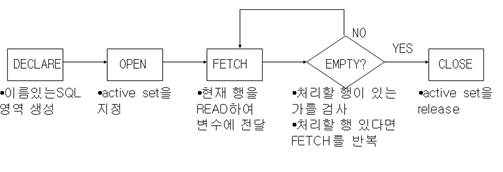

1. #  커서
   행 단위 처리를 하기 위해서 사용하는 메커니즘 입니다. 2개 이상의 데이터를 처리할 때 커서를 사용합니다.   

   ```sql
      DECLARE
   
         --커서 선언
         CURSOR cursor_name IS statement,       -- 1)

      BEGIN

         --커서 열기
         OPEN cursor_name;                      -- 2)

         --커서로부터 데이터를 읽어와 변수에 저장
         FETCH  cursor_name INTO variable_name; -- 3)

         --커서 닫기
         CLOSE cursor_name;                     -- 4)

      END;
   ```   

      

   1)
   ```
      CURSOR cursor_name IS statement;
   ```   
   cursor_name : PL/SQL 식별자   
   statement : INTO절이 없는 SELECT문장   

   2)
   ```
      OPEN cursor_name;   
   ```
   질의를 수행하고 검색 조건을 충족하는 모든 행으로 구성된 결과 셋을 생성하기 위해 CURSOR를 OPEN합니다. CURSOR는 이제 결과 셋에서 첫 번째 행을 가리킵니다.   
   ex)OPEN C1;   
   C1을 오픈하면 검색 조건에 만족하는 모든 행으로 구성된 결과 셋이 구해지고 __부서 테이블의 첫 번째 행을 가리키게 됩니다.__   
   
   3)
   ```
      FETCH cursor_name into {variable1[,variable2, ....]};
   ```
   FETCH 문은 결과 셋에서 로우 단위로 데이터를 읽어 들입니다. 각 인출(FETCH) 후에 CURSOR는 결과 셋에서 다음 행으로 이동합니다. FETCH 문장은 현재 행에 대한 정보를 얻어 와서 INTO 뒤에 기술한 변수에 저장한 후 다음 행으로 이동합니다. 얻어진 여러 개의 로우에 대한 결과값을 모두 처리하려면 반복문에 FETCH문을 기술해야 합니다.   
   ```
      LOOP
      FETCH CL INTO VDEPT.DEPTNO, VDEPT.DNAME, VDEPT.LOC;
      EXIT WHEN C1%NOTFOUND;
      END LOOP;
   ```    

   커서가 끝에 위치하게 되면 반목문을 탈출해야 합니다.   
   단순 LOOP는 내부에 EXIT WHEN문장을 포함하고 있다가 EXIT WHEN 다음에 기술한 조건에 만족하면 단순 LOOP를 탈출하게 됩니다.   
   반복문을 탈출할 조건으로 `C1%NOTFOUND`를 기술합니다.   
   NOTFOUND는 커서의 상태를 알려주는 속성 중에 하나인데 커서 영역의 자료가 모두 FETCH됐다면 TRUE를 반환합니다.   
   커서 C1영역의 자료가 모두 FETCH되면 반복문을 탈출하게 됩니다.   

   오라클은 NOTFOUND외에도 다양한 속성으로 커서의 상태를 알려줍니다.   

   |  속성       |                              의미               | 
   |:-----------:|:----------------------------------------------:|
   | %NOTFOUND  |    커서 영역의 자료가 모두 FETCH됐다면 TRUE반환    |
   | %FOUND     | 커서 영역의 FETCH 되지 않은 자료가 있다면 TRUE반환 |
   | %ISOPEN    |               커서가 OPEN된 상태이면 TRUE         |
   | %ROWCOUNT  |            커서가 얻어 온 레코드의 개수            |

   
   4)
   ```
      CLOSE cursor_name;
   ```   
   CLOSE문장은 CURSOR를 사용할 수 없게 하고 결과 셋의 정의를 해제합니다. SELECT문장이 다 처리된 완성 후에는 CURSOR를 닫습니다.

1. # 커서 예제
   ```SQL
      CREATE OR REPLACE PROCEDURE CURSOR_SAMPLE01
      IS
         VDEPT DEPT%ROWTYPE;         -- 로컬변수
         
         CURSOR C1                   -- 커서 선언
         IS
         SELECT * FROM DEPT;
      BEGIN
         DBMS_OUTPUT.PUT_LINE('부서번호  /  부서명  /  지역명');
         DBMS_OUTPUT.PUT_LINE('---------------------------');

         OPEN C1;        -- 커서 열기(첫번째 데이터를 가져온다.)
         LOOP    
            FETCH C1 INTO VDEPT.DEPTNO, VDEPT.DNAME, VDEPT.LOC; --인출
                  EXIT WHEN C1%NOTFOUND; --커서가 가져올 데이터가 없을때 true
            DBMS_OUTPUT.PUT_LINE(VDEPT.DEPTNO||'/'||VDEPT.DNAME||'/'||VDEPT.LOC);        
         END LOOP;
         CLOSE C1;       -- 커서 닫기    
      END;

      EXECUTE CURSOR_SAMPLE01;
   ```   

   OPEN ~ FETCH ~ CLOSE 없이 FOR LOOP로 처리    
   ```SQL
      -- Q2. 부서 테이블의 모든 데이터를 출력하는 PL/SQL문 작성
      -- FOR LOOP문으로 처리
      -- 1. OPEN ~ FETCH ~ CLOSE 없이 처리할 수 있다.
      -- 2. FOR LOOP문을 사용하게 되면, 각 반복문마다 CURSOR를 열고 
      -- 각 행을 인출(FETCH)하고, CURSOR를 닫는 작업을 자동으로 처리

      CREATE OR REPLACE PROCEDURE CURSOR_SAMPLE02
      IS
         VDEPT DEPT%ROWTYPE; --로컬 변수생성
         
         CURSOR C1
         IS 
         SELECT * FROM DEPT;
      BEGIN
         dbms_output.put_line('부서번호  /  부서명  /  지역명');
         dbms_output.put_line('---------------------------');

         FOR VDEPT IN C1 LOOP
            EXIT WHEN C1%NOTFOUND;
            dbms_output.put_line(vdept.deptno||'/'||vdept.dname||'/'||vdept.loc);        
         END LOOP;
      END;

      -- 2.저장 프로시저 목록 확인
      SELECT * FROM USER_SOURCE;

      -- 3.프로시저 실행
      EXECUTE CURSOR_SAMPLE02;
   ```   

   ```SQL
      -- Q3.사원테이블에서 부서번호를 전달하여 해당 부서에 소속된 사원의 정보를 출력하는 프로시저를 커서를 이용하여 처리하라
      -- 1.저장 프로시저 생성
      CREATE OR REPLACE PROCEDURE INFO_EMP(VDEPTNO IN EMP.DEPTNO%TYPE)
      IS
         VEMP EMP%ROWTYPE;
         
         CURSOR C1
         IS
         SELECT * FROM EMP WHERE DEPTNO = VDEPTNO;
      BEGIN
         dbms_output.put_line('부서번호 / 사원번호 / 사원명 / 직급 / 급여');
         dbms_output.put_line('----------------------------------------');
         
         FOR VEMP IN C1 LOOP
            EXIT WHEN C1%NOTFOUND;
            dbms_output.put_line(VEMP.DEPTNO ||'/'|| VEMP.EMPNO ||'/'|| VEMP.ENAME ||'/'|| VEMP.JOB || '/' || VEMP.SAL);
         END LOOP;
      END;

      -- 2.목록 확인
      SELECT * FROM USER_SOURCE;

      -- 3.프로시저 실행
      EXECUTE INFO_EMP(10);
      EXECUTE INFO_EMP(20);
      EXECUTE INFO_EMP(30);
   ```
