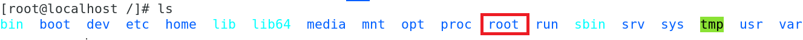

---
layout: single
title: 명령어(디렉토리,파일,텍스트)
categories: Ubuntu
tag: [명령어, 사용자, 그룹, user, group]
---        


1. 경로
   경로가 /로 시작하면 절대 경로   
   / 없이 시작하면 상대 경로   
   ```
      /etc/systemcong 절대 경로
      etc/systemcong 상대 경로
   ```
   <br>
  
   / : 최상위 디렉토리   
   root : root계정   
   /root : root계정의 홈 디렉토리   
      
   
   ```
      [root@localhost ~]#  '~ 홈 디렉토리'
      [root@localhost /]#  '/ 루트 디렉토리'
   ```

1. ## 디렉토리   
   2. ### pwd   
      현재 작업 중인 디렉토리의 위치를 출력   
   2. ### cd(change directory)   
      디렉토리를 이동할 때 사용   
      절대 경로의 시작은 /에서 시작   
      상대 경로는 현재 작업 중인 디렉토리를 기준으로 표시    

      |설정 경로 | 설명 |   
      |:------:|:----:|   
      | ~(틸트) | 현재 사용자의 홈 디렉토리로 이동 |   
      | .(점 하나) | 현재 디렉토리 |   
      | ..(점 둘) | 현재에서 한 단계 상위 디렉토리로 이동 |   
      | / | 루트 디렉토리로 이동 |   

   2. ### mkdir(make directory)
      새로운 디렉토리 생성    

      |옵션|설명|   
      |:---:|:---:|   
      |-m|권한 설정(디폴트는 755)|   
      |-p|하위 구조 생성|   
      |-v|디렉토리 생성 후 생성된 디렉토리의 메시지 출력  
   
      ```
      mkdir /test : /test라는 디렉토리 생성
      mkdir -p /test/test / : 하위 구조도 바로 생성
      mkdir  a  b  c  : a,b,c 3개 디렉토리를 한번에 만듦
      ```
      <br>

   2. ### rmdir(RedMove directory)
      디렉토리만 삭제하는 명령어로 <span style="color:red">안에 파일이 있는 경우 삭제가 안 됨</span>   
      디렉토리 안에 있는 디렉토리나 파일을 삭제 후 해당 디렉토리 삭제 가능

1. ## 파일 기본 명령어
   2. ### ls
   현재 위치한 디렉토리의 파일 목록들을 나타냄   

      |옵션|설명|   
      |:---:|:---:|   
      |-a|숨겨진 파일 포함 모든 파일과 디렉토리 표시|   
      |-l|자세한 정보 표시|   
      |-d|지정된 디렉토리의 정보 출력|
      |-r|알파벳 역순으로 출력|
      |-R|하위 경로와 그 안에 있는 파일 표시|

      <span style="color:red">.</span>bash_profile 파일 이름앞에 <span style="color:red">.</span>을 붙이면 숨겨진 파일이 된다.
      ```
         [nati@localhost ~]$ ls -al   '현재 디렉토리 전체 출력'
         total 15072
         drwx------. 16 nati nati     4096 Sep 15 00:09 .
         drwxr-xr-x.  3 root root       18 Aug  2 01:24 ..
         -rw-------.  1 nati nati     7952 Aug 21 22:15 .bash_history
         -rw-r--r--.  1 nati nati       18 Mar 31  2020 .bash_profile
         -rw-r--r--.  1 nati nati      231 Mar 31  2020 .bashrc
         ...

         [root@localhost /]# ls -al /home/a_1 'a_1 안에 파일 내용 출력'
         total 0
         drwxr-xr-x. 2 root root  6 Aug  8 00:11 .
         drwxr-xr-x. 5 root root 39 Aug  8 00:11 ..

         [nati@localhost ~]$ ls -ld /etc   'd옵션 디렉토리 자체'
         drwxr-xr-x. 144 root root 8192 Sep 15 00:04 /etc

         [nati@localhost ~]$ ls -R   '디렉토리 내용을 한번에 출력'
         .:
         Desktop    Downloads  Music  passwd    Public     tree
         Documents  file       myp    Pictures  Templates  Videos
         ./Desktop:
         org.gnome.Terminal.desktop
         ./Documents:
         ...   

      ```
   2. ### tree
   
      트리 구조로 파일이나 디렉토리 출력    
   <br>
      RHEL / CentOS / Fedora Linux    
      ```
         sudo yum install tree 
      ```   
   <br>
      Debian / Mint / Ubuntu Linux   
      ```
         sudo apt-get install tree       
      ```   
   <br>

      |옵션|설명|   
      |:---:|:---:|   
      |-d|List directories only.|   
      |-f|Prints the full path prefix for each file. |   
      |-p|Omits the specified directory from the tree.|
      |-t|Sort the output by last modification time instead of alphabetically.|
      |-L|Max display depth of the directory tree. |

   <br>
      ```
         [root@localhost myDirectory]# tree -L 2
         .
         ├── apple
         │   └── apple2
         ├── banana
         │   ├── banana2
         │   └── banana.txt
         ├── tomato
         └── xvf
      ```
   2. ### cp
      파일 또는 디렉토리를 복사하는 명령어   
      cp 옵션 [대상] [결과] : 파일 복사    
      cp -r [대상] [결과] : 디렉토리 복사    
   
      cp 옵션 a b : b란 디렉토리가 있으면 b안으로 a를 복사, 없으면 b란 이름으로 복사   
      <span style="color:red">b란 디렉토리가 있으면 경로가 된다</span>   
   
      cp 옵션 a b/c : c란 디렉토리가 있으면 c안으로 a를 복사, 없으면 c란 이름으로 a를 복사    
   
      |옵션|설명|   
      |:---:|:---:|   
      |-b|백업 파일을 만듦|   
      |-f|복사 대상 파일이 존재하면 강제로 지우고 복사|   
      |-i|복사 대상 파일이 존재하면 덮어쓸지 질의|   
      |-r|하위디렉토리와 파일 모두 복사|

      ```
         cp file.txt file2.txt  '파일은 옵션 없이도 가능'
         cp -r /test1 /test2  '디렉토리 복사 시 -r 옵션'      
      ```

   2. ### mv
      파일 또는 디렉토리를 이동하거나 파일명을 변경할 때 사용   
      mv 옵션 [대상] [결과] : 

      mv  a  b  :  b란 디렉토리가 있으면 이동, 없으면 b란 파일명 변경   
      <span style="color:red">b란 디렉토리가 있으면 경로가 된다</span>

      rm 옵션 a b/c : c란 디렉토리가 있으면 c안으로 a를 복사, 없으면 c란 이름으로 a를 복사   

      |옵션|설명|   
      |:---:|:---:|   
      |-b|백업 파일을 만듦|   
      |-f|묻지 않고 강제로 덮어쓰기|   
      |-v|파일이 옮겨지는 과정 표시|

      ```
         [root@localhost khj2]# ls -R   'a/a.txt b/b.txt c/c.txt 각각 들어있음'
         .:
         a  b  c

         ./a:
         a.txt

         ./b:
         b.txt

         ./c:
         c.txt
         [root@localhost khj2]# ls
         a  b  c
     
         [root@localhost khj2]# mv a temp  'temp란 디렉토리가 없기 때문에 이름변경이 됨'
         [root@localhost khj2]# ls
         temp b  c  

         [root@localhost khj2]# mv b c  'c란 디렉토리가 있기 때문에 b가 c로 이동'
         [root@localhost khj2]# ls -R
         .:
         c  temp

         ./c:
         b  c.txt   'b 디렉토리와 c.txt가 c 디렉토리안에 있음'

         ./c/b:
         b.txt

         ./temp:
         a.txt
      ```

   2. ### rm

      rm 옵션 [대상] : 파일 삭제   
      rm -r [대상] : 디렉토리 삭제   

      |옵션|설명|   
      |:---:|:---:|   
      |-f|질의 메세지 없이 파일이나 디렉토리 삭제|   
      |-i|사용자에게 질의|   
      |-r|하위 디렉토리를 포함하여 모든 디렉토리 삭제|

      ```
         [nati@localhost ~]$ rmdir test
         rmdir: failed to remove ‘test’: Directory not empty

         [nati@localhost ~]$ rm -rf test  '디렉토리 삭제 시 -r 옵션'

         [root@localhost nati]# rm -rf ./*  '현재 디렉토리 삭제'
         [root@localhost nati]# rm -rf /*   '루트 전체 삭제'
      ```
   2. ### cp,mv,rm 옵션

      <br>

      |명령어|옵션|
      |:----:|:----:|
      |cp | b, f, i, r |   
      |rm | f, i, r |  
      |mv | b, f, v |  

      <br>

      cp, mv 은 b 공통    
      cp, __r__ m - fi __r__   
      __v__ m - f __v__   
   2. ### touch
      파일 크기가 0바이트인 빈 파일 생성   
      서버의 현재 시간으로 파일의 사용시간과 수정 시간 등 타임 스탬프 변경   
   2. ### file
      파일의 종류 및 파일 속성값을 나타내는 명령어   
   

1. ## 파일 검색
   2. ### find
      *현재 디렉토리부터 하위 디렉토리까지* 파일을 찾아 경로를 표시   
      find [경로] [옵션1] [옵션값1] [옵션2] [옵션값2] [행동 {}\;] 

      경로 : 어디를 기준으로 검색할 것인지 정함. 하위 디렉토리까지 검색    
      옵션 : 검색 조건   
      행동 : 옵션 결과에서 취하는 행위. 생략 가능. 기본적인 명령어 ls, exec 등. 마지막엔 {}\;는 필수   
      <span style="color:red">*행동을 생략하면 기본값으로 print가 와서 값만 출력된다.</span>   

      |옵션|설명|
      |:----:|:----:|
      |-name | 이름으로 검색 |   
      |-user | 소유자로 검색 |  
      |-perm | 권한으로 검색 |  
      |-type | 파일의 타입으로 검색, 디렉토리:d, 파일:f |  
      |-size | 파일의 크기로 검색|
      |-atime | 파일의 마지막 접근 시간으로 검색 |  
      |-mtitme | 파일의 마지막 수정 시간으로 검색 |  
      |-ls | 자세한 결과 출력 |   
      |-exec | 옵션의 결과값에 명령어 실행 |   

      <br>

      ```
         '/(모든 파일 중)에서 passwd란 이름의 파일 검색'
         find / -name passwd 

         '파일이름이 passwd 중 파일인 것 검색'
         find / -name passwd -type f

         '파일이름이 passwd 중 소유자가 nati인 것 검색'
         find / -name passwd -user nati

         '파일이름이 passwd결과를 자세히 출력'
         find / -name passwd -ls

         '사이즈가 100M 이상인 파일 중 확장자가 rpm인 것 검색'
         find / -size +100M -name *.rpm

         './ 현재 디렉토리에서 test란 파일을 삭제하라'
         '뒤에 {} \; 까지 해줘야 됨'
         find ./ -name test -exec rm -rf {} \;
      ```
   2. ### locate
      파일의 위치를 찾는 명령어   
   2. ### grep
      특정한 패턴 또는 정규 표현식으로 나타낸 단어를 찾는 명령어  
      grep 옵션 [패턴] [파일] : 패턴을 파일 내용에서 검색

      |옵션|설명|   
      |:---:|:---:| 
      |-r|디렉토리 내의 모든 디렉토리와 파일들을 검색|   
      |-i|대소문자 무시|   
      |-n|라인 수 출력|   
      |-v|검색한 패턴을 포함하지 않은 줄만 표시|   
      |-w|단어 단위로 검색|   
      |-c|매칭된 결과의 라인 수 표시|   
      |-l|패턴이 포함된 __파일명__ 출력|     

      <br>

      ```
         'passwd파일에서 bash 검색'
         [nati@localhost ~]$ grep bash passwd   
         root:x:0:0:root:/root:/bin/bash
         nati:x:1000:1000:nati:/home/nati:/bin/bash
 
         'i옵션을 줘서 ftp의 대문자와 소문자를 같이 검색, n옵션으로 12번째 라인임을 앎'
         [nati@localhost ~]$ grep -in ftp passwd   
         12:ftp:x:14:50:FTP User:/var/ftp:/sbin/nologin

         'ft로 검색하면 ftp를 검색하는데 w옵션을 주면 ft를 한 단어로 검색하기 때문에 검색이 안 됨'
         [nati@localhost ~]$ grep ft passwd
         ftp:x:14:50:FTP User:/var/ftp:/sbin/nologin
         [nati@localhost ~]$ grep -w ft passwd
         [nati@localhost ~]$                <-- 검색 안 됨

         'bash를 검색하면 2줄의 결과가 나오는데 c 옵션을 붙이면 2줄의 결과가 있다는 것만 알려줌'
         [nati@localhost ~]$ grep bash passwd
         root:x:0:0:root:/root:/bin/bash
         nati:x:1000:1000:nati:/home/nati:/bin/bash
         [nati@localhost ~]$ grep -c bash passwd
         2      <-- '2'만 출력

         'v옵션을 사용해서 login을 포함는 단어를 제외시킴'
         [nati@localhost ~]$ grep -v login passwd
         root:x:0:0:root:/root:/bin/bash
         sync:x:5:0:sync:/sbin:/bin/sync
         shutdown:x:6:0:shutdown:/sbin:/sbin/shutdown
         halt:x:7:0:halt:/sbin:/sbin/halt
         ...

         'l옵션은 root란 단어가 있는 파일의 일명과 디렉토리를 검색'
         [nati@localhost ~]$ grep -l root /etc/*
         grep: /etc/abrt: Is a directory
         /etc/aliases
         /etc/aliases.db
         grep: /etc/alsa: Is a directory
         grep: /etc/alternatives: Is a directory
         grep: /etc/anacrontab: Permission denied
         grep: /etc/audisp: Permission denied
         ...
      ```
      ```
         'a-c까지, g-i까지 뽑고 바로 2부터 8까지 뽑음'
         [nati@localhost ~]$ grep [a-c,g-i]root[2-8] test
         broot2
         croot3
         groot7
         hroot8
         aroot22222

         'a-c까지, g-i까지 뽑고나서 그 결과에 2부터 8까지 뽐음, 위와 결과는 같음'
         [nati@localhost ~]$ grep [a-c,g-i]root ./test | grep root[2-8]
         broot2
         croot3
         groot7
         hroot8
         aroot22222

      ```

   2. ### wc
      파일의 라인 수, 단어 수, 알파벳 수를 알려주는 명령어   
   2. ### cut
      파일에서 특정 필드를 추출해 낸다. 필드는 구분자로 구분   
   2. ### split
      하나의 파일을 여러개의 작은 파일로 분할   
      파일의 내용을 라인 수로 분할 할 수 있고, 용량 단위로 분할 할 수 있습니다.   

1. ## 파일 비교
   2. ### diff
      두 개의 파일을 행단위로 비교하여 다른 부분을 출력하는 명령어   
      두 개의 파일명을 매개변수로 사용하여 화면에 차이점을 나열   
   2. ### cmp
       두 개의 파일을 바이트(문자) 단위로 비교하여 출력하는 명령어   
   2. ### comm
      두 개의 파일을 줄 단위로 비교하여 출력   
1. ## 텍스트 파일    
   2. ### cat
      파일의 내용을 출력하는 명령어   

      |옵션|설명|   
      |:---:|:---:|   
      |-n|비어있는 행 포함 각 문장 앞에 번호 표시|   
      |-b|비어있는 행 제외 각 문장 앞에 번호 표시|   
      |-A|텍스트 파일에 존재하는 개행 문자나 탭 문자 확인|

   2. ### head
      파일의 앞부분을 지정한 만큼 출력   

      |옵션|설명|   
      |:---:|:---:|   
      |-숫자 또는 -n 숫자|출력을 원하는 줄 수 지정|    

      *기본 출력값 10개

   2. ### tail
      파일의 마지막 행을 기준으로 지정한 행까지 출력   

      |옵션|설명|   
      |:---:|:---:| 
      |-f|지정된 파일에 추가되는 파일 내용을 실시간으로 출력|   
      |-숫자 또는 -n 숫자|출력을 원하는 줄 수 지정|   

      *기본 출력값 10개   
   
      ```       
      [root@localhost ~]# cat -n /etc/passwd | head   
      1	root:x:0:0:root:/root:/bin/bash
      2	bin:x:1:1:bin:/bin:/sbin/nologin
                ...
      10	operator:x:11:0:operator:/root:/sbin/nologin
      'head를 사용해서 1~10까지 출력'

      [root@localhost ~]# cat -n /etc/passwd | head -5 | tail -1  
      5	lp:x:4:7:lp:/var/spool/lpd:/sbin/nologin
      '|(파이프)와 head와 tail을 사용해서 5번 1출만 출력'
      ```
   2. ### more
      파일을 화면 단위롤 끊어서 출력   
      위에서 아래 방향으로 출력되기 때문에 지나간 내용은 다시 볼 수 없습니다.   
   2. ### less
      파일을 한 번에 한 화면씩 나타내는 명령어   
      기능적으로 more을 확장한 것으로 상하좌우로 이동가능   
<br>

[이기적 리눅스마스터 2급](https://www.aladin.co.kr/m/mproduct.aspx?ItemId=288584917) 