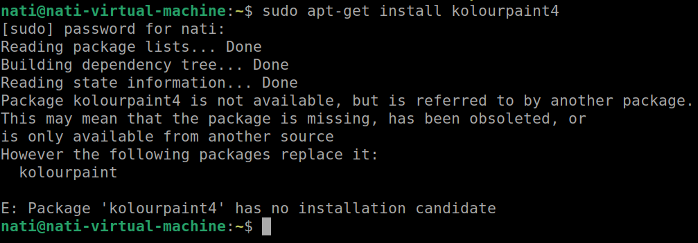
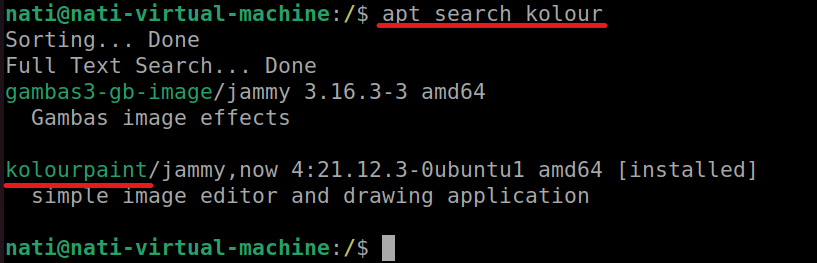
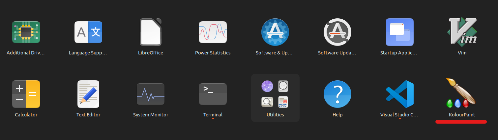

# kolourpaint란?   
   리눅스에서 가볍게 사용가능한 그림판입니다.    
    
   *검색을 하니 kolourpaint4가 있다고 해서 설치를 했는데 다음과 같이 에러가 났다   
      
    
   *apt search에는 kolourpaint만 있었다.   
      
    
   sudo apt install kolourpaint 를 입력합니다.   
      

