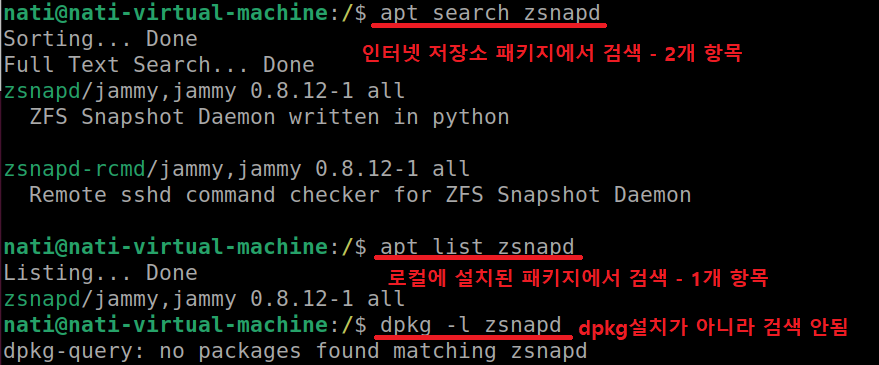

1. # apt와 apt-get   
   __apt-get__ 은 초기에 사용되었던 패키지 관리 도구로, 더 오래된 시스템과의 호환성을 위해 계속 사용되고 있습니다. apt-get은 패키지의 설치, 업데이트, 삭제, 의존성 해결 등을 처리하는 데에 사용됩니다. 명령어를 사용할 때 sudo를 사용하여 관리자 권한으로 실행해야 합니다.   

   __apt__ 는 apt-get 이후에 등장한 관리 도구로, apt-get보다 쉬운 인터페이스와 명령어를 제공합니다. apt는 apt-get의 기능과 사용성을 향상시키기 위해 개발되었습니다. apt는 몇 가지 추가적인 기능을 제공하며, 예를 들어 진행 상황 표시, 빠른 패키지 선택 기능 등이 있습니다. 또한 apt는 sudo 없이도 일부 명령을 실행할 수 있습니다.   
   일반적으로 새로운 우분투 버전에서는 apt를 사용하는 것이 권장되지만, 기존에 사용하던 스크립트나 명령어가 있는 경우 apt-get을 계속 사용할 수 있습니다. 두 명령어는 대부분의 상황에서 상호 호환적이므로, 대부분의 경우 apt와 apt-get 둘 다 동일한 결과를 제공합니다.   

1. # apt list 와 apt search 차이점
   2. __apt list:__ *시스템에 설치된* 패키지들의 목록을 보여줍니다. 기본적으로는 시스템에 설치된 모든 패키지를 보여주지만, 옵션을 사용하여 필요한 정보만 표시하거나 특정 패키지를 확인할 수도 있습니다. 이 명령어는 시스템에 설치된 패키지들을 관리하고 업데이트할 때 유용합니다.
   따라서, apt search는 패키지를 검색하고 찾는 데에 사용되며, apt list는 시스템에 설치된 패키지들을 확인하고 관리하는 데에 사용됩니다.   

   2. __apt search:__ *저장소* 에 등록된 패키지들을 검색하여 사용자가 입력한 키워드와 관련된 패키지를 찾아줍니다. 검색 결과로 패키지의 이름, 설명 등을 보여줍니다. 이 명령어는 패키지를 설치하기 전에 원하는 패키지를 찾는 데 사용됩니다.   

1. # apt list와 dpkg -l 차이점
   apt list와 dpkg -l은 모두 우분투에서 시스템에 설치된 패키지의 목록을 보여주는 명령어이지만 차이점이 있습니다.   

   2. __apt list:__ APT (Advanced Package Tool) 패키지 관리 시스템을 사용하여 패키지 목록을 보여줍니다. 이 명령어는 패키지 목록을 실시간으로 업데이트하고, 패키지의 상태, 버전, 설명 등을 표시합니다. 또한, 패키지 설치 여부, 업그레이드 가능 여부 등 다양한 옵션을 사용하여 원하는 정보를 필터링할 수 있습니다.   

   2. __dpkg -l:__ Debian 패키지 관리 시스템인 *dpkg를 사용하여 설치된 패키지 목록*을 보여줍니다. 이 명령어는 APT와 달리 저장소 정보를 실시간으로 업데이트하지 않고, 시스템에 직접 설치된 패키지들에 대한 정보만을 표시합니다. 패키지의 상태, 버전, 설명 등을 확인할 수 있으며, 패키지의 설치 여부와 상태를 알려줍니다.   
   따라서, apt list는 APT 패키지 관리 시스템을 사용하여 실시간으로 패키지 목록을 업데이트하고 필터링하는 반면, dpkg -l은 dpkg 패키지 관리 시스템을 사용하여 시스템에 직접 설치된 패키지들에 대한 정보를 표시합니다.   
   
1. # 예제
      

1. # apt 명령어
   apt list: 시스템에 설치된 모든 패키지 목록을 보여줍니다.   
   apt list --installed: 시스템에 설치된 패키지 목록만 보여줍니다.   
   apt list --upgradable: 업그레이드 가능한 패키지 목록을 보여줍니다.   
   apt list --installed packagename: packagename에 해당하는 패키지가 설치되었는지 확인합니다.   
   apt list --all-versions package-name: packagename에 해당하는 패키지의 모든 버전을 보여줍니다.   
   apt list --upgradable -a: 업그레이드 가능한 모든 패키지의 버전을 보여줍니다.   

1. # curl
   커맨드 라인을 통해 데이터를 전송하거나 받을 수 있는 도구입니다. 주로 HTTP, HTTPS, FTP, FTPS 등의 프로토콜을 사용하여 서버와 통신하는 데 사용됩니다. curl은 URL을 통해 데이터를 요청하고, 응답을 받아서 출력하거나 파일에 저장할 수 있습니다. 우분투에서 curl은 기본적으로 설치되어 있으며, 다양한 용도로 사용될 수 있습니다.   
   → 인터넷에서 직접 다운   

1. # curl 명령어 옵션
   -f 또는 --fail: HTTP 요청이 실패한 경우 에러를 표시합니다. 일반적으로 4xx 또는 5xx 상태 코드를 받았을 때 에러로 처리됩니다.   
   -s 또는 --silent: 진행 상황이나 메시지를 표시하지 않습니다.   
   -S 또는 --show-error: 에러 메시지를 표시합니다.   
   -L 또는 --location: 리다이렉션을 따라갑니다.   
   -X 또는 --request: HTTP 요청 메서드를 설정합니다. 예를 들어 -X GET은 GET 요청을 보내는 것을 의미합니다.   
   -H 또는 --header: HTTP 요청 헤더를 설정합니다. 예를 들어 -H "Content-Type: application/json"은 Content-Type 헤더를 설정하는 것입니다.   
   -d 또는 --data: POST 요청의 데이터를 설정합니다. 예를 들어 -d 'name=John&age=25'는 name과 age라는 파라미터를 가진 데이터를 POST 요청으로 보내는 것입니다.   
   -i 또는 --include: 응답 헤더를 출력합니다.   
   -o 또는 --output: 응답 결과를 파일로 저장합니다. 예를 들어 -o output.txt는 응답을 output.txt 파일에 저장하는 것입니다.   
   -u 또는 --user: 인증에 사용할 사용자 이름과 비밀번호를 설정합니다. 예를 들어 -u username:password는 username과 password를 사용하여 인증하는 것입니다.   
   -v 또는 --verbose: 자세한 출력을 표시합니다.   
   이 외에도 다양한 명령어 옵션들이 있으며, curl --help 명령어를 사용하여 전체 명령어 옵션 목록을 확인할 수 있습니다.   

   ```
      curl -fsSL
   ```    
   실패한 요청에 대해서는 에러를 표시하고, 진행 상황이나 메시지를 표시하지 않으며, 리다이렉션을 따라갑니다. 일반적으로 URL에서 파일을 다운로드할 때 사용됩니다.   

1. # curl과 apt   
   curl과 apt는 둘 다 우분투에서 사용되는 도구이지만, 각각 다른 목적과 기능을 가지고 있습니다.   
         
   curl: curl은 커맨드 라인을 통해 데이터를 전송하거나 받을 수 있는 도구입니다. 주로 HTTP, HTTPS, FTP 등의 프로토콜을 사용하여 서버와 통신하는 데 사용됩니다. curl은 주로 웹 API 호출이나 파일 다운로드 등에 사용됩니다.   
      
   apt: apt는 우분투의 패키지 관리 시스템인 Advanced Packaging Tool의 앞 글자입니다. apt는 패키지의 설치, 업데이트, 삭제 등을 관리하는 데 사용됩니다. apt는 우분투의 공식 저장소에서 패키지를 검색하고 설치하는 등의 작업을 수행합니다. 우분투에서 소프트웨어를 관리하고 업데이트하려는 경우에 주로 사용됩니다.   
      
   따라서, curl은 데이터 전송이나 파일 다운로드와 관련된 작업에 사용되고, apt는 우분투의 패키지 관리와 관련된 작업에 사용됩니다.   
