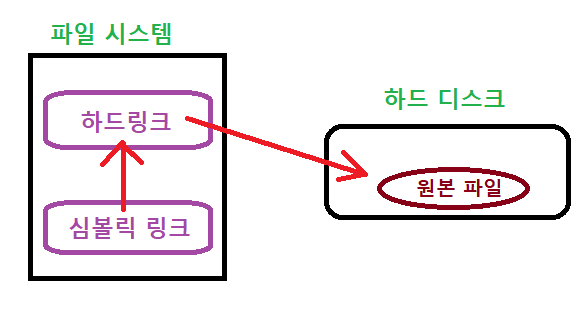

1. # 링크
   리눅스의 파일 시스템에서는 __파일__ 에 __별명을 붙이는 것__ 이 가능합니다. 파일 시스템이 물리적인 장치인 하드 디스크 상에 저장되어 있는 특정 파일의 위치를 가리키는 것입니다. 링크에는 하드 링크와 심볼릭 링크 두 종류가 있습니다.

1. # 하드 링크
   파일 시스템이 __물리적인 하드 디스크 상에 저장되어 있는 특정 파일__ 의 위치를 가리키는 것입니다. 하드 디스크 상에 실제 원본 파일을 가리키는 것이기 때문에 연결된 파일 모두가 원본 파일이 됩니다. 그렇기 때문에 한 개 원본 파일에 이름을 여러 개 붙이는 것이 가능합니다. ls로 보게 되는 일반적인 파일이 모두 하드 링크에 해당합니다.   
   ```s
      [nati@localhost myDirectory]$ ls -l
      -rw-rw-r--. 1 nati nati     0 Aug 16 01:31 origin
   ```   

   하드링크 생성
   ```s
      ln [옵션] [원본] [링크]
   ```   

   ln으로 하드링크를 생성하게 되면 권한 옆에 있는 숫자인 하드링크 수가 증가합니다.      
   ```s
      [nati@localhost myDirectory]$ ls -l
      -rw-rw-r--. 1 nati nati     0 Aug 16 01:31 origin   ☜ 권한 옆에 1

      [nati@localhost simbolic]$ ln origin origin_hl   ☜ 'origin의 하드링크 생성'

      [nati@localhost simbolic]$ ls -l
      total 0
      -rw-rw-r--. 2 nati nati 0 Aug 16 01:31 origin   ☜ 권한 옆에 2
      -rw-rw-r--. 2 nati nati 0 Aug 16 01:31 origin_hl
   ```   
   하드링크 수가 2로 변경 됨.   
   
   origin을 편집하면 origin_hl에도 똑같이 적용됩니다.   
   
   ls에 i옵션으로 inode값 출력   
   ```s
      [nati@localhost simbolic]$ ls -il
      total 8
      1544835 -rw-rw-r--. 2 nati nati 14 Aug 16 01:36 origin
      1544835 -rw-rw-r--. 2 nati nati 14 Aug 16 01:36 origin_hl
   ```
   origin과 origin_hl의 inode값이 1544835로 일치

   cp로 origin의 복사 파일 생성   
   ```s
      [nati@localhost simbolic]$ cp origin origin_cp
      [nati@localhost simbolic]$ ls -il
      total 12
      1544835 -rw-rw-r--. 2 nati nati 14 Aug 16 01:36 origin
      1544841 -rw-rw-r--. 1 nati nati 14 Aug 16 01:42 origin_cp
      1544835 -rw-rw-r--. 2 nati nati 14 Aug 16 01:36 origin_hl
   ```
   원본파일(origin)과 하드링크 파일(origin_hl)은 inode값이 1544835로 일치합니다. 복사본 파일(origin_cp)의 inode값은 1544841로 원본파일과 다릅니다. 즉 하드링크 파일은 원본파일과 같은 파일을 가리키지만 복사본 파일은 하드디스크상의 새로운 영역에 따로 파일을 생성한 것 입니다.

1. # 심볼릭 링크
   윈도우의 바로가기 개념과 비슷하며 실질적인 하드 디스크 상의 파일을 가리키는 것이 아니라 __파일 시스템 상의 특정 파일__ 을 가리키는 것입니다. 원본파일을 가리키는 파일을 가리키게 됩니다.   

   심볼릭 링크 생성   
   ```s
      ln [-s] [원본] [링크] : 하드링크의 옵션을 s로만 변경하면 심볼릭 링크   
   ```   
   
   예)origin_sl 이라는 심볼릭 링크 생성   
   ```s
      [nati@localhost simbolic]$ ln -s origin origin_sl    'origin의 심볼릭 링크 생성'

      [nati@localhost simbolic]$ ls -il
      total 12
      1544835 -rw-rw-r--. 2 nati nati 14 Aug 16 01:36 origin
      1544842 lrwxrwxrwx. 1 nati nati  6 Aug 16 01:49 origin_sl -> origin
   ```   
   원본파일과 심볼릭 링크 파일의 inode값이 다릅니다.   

   심볼릭 링크도 링크를 타고 원본 파일을 찾아 가는 것이기 때문에 원본 파일을 수정하면 심볼릭 링크 파일도 수정됩니다.   

   

   원본파일 삭제   
   ```s
      [nati@localhost simbolic]$ rm origin    'origin파일 삭제'
 
      [nati@localhost simbolic]$ cat origin_sl    '심볼릭 링크는 파일을 찾지 못 함'
      cat: origin_sl: No such file or directory

      [nati@localhost simbolic]$ cat origin_hl    '하드링크는 이상 없음'
      origin file
   ```   
   원본 파일을 삭제하면 심볼릭 링크만 파일을 찾지 못 하고 복사본 파일과 하드링크 파일은 정상 출력 됩니다.   

1. # 원본파일을 삭제해도 하드링크가 가능한 이유
   리눅스에서 원본 파일을 삭제해도 하드 링크가 여전히 정상적으로 작동하는 이유는 파일 삭제가 하드 디스크의 실제 물리적 데이터를 삭제하는 것이 아니라 __파일 시스템의 메타 데이터__ 를 삭제하기 때문입니다.   
   파일 시스템은 파일의 메타 데이터를 추적하고 관리합니다. 메타 데이터에는 파일의 이름, 위치, 크기 등의 정보가 포함됩니다. 하드 링크는 동일한 파일을 가리키는 다른 파일명이나 경로입니다. 따라서 원본 파일을 삭제하면 파일 시스템은 해당 파일의 메타 데이터를 삭제합니다. 그러나 실제 데이터는 삭제되지 않기 때문에 여전히 하드 링크를 통해 원본 파일에 접근할 수 있습니다.   
   파일 삭제 시 하드 링크가 정상 작동하는 것은 파일 시스템의 동작 원리에 기인합니다. 파일 시스템은 파일의 데이터를 저장하고 관리하는 방법을 결정하며, 메타 데이터를 사용하여 파일을 추적합니다. 파일 시스템은 삭제된 파일의 데이터 공간을 다른 파일에 할당할 수 있지만, 삭제된 파일의 데이터 자체를 실제로 제거하지는 않습니다. 따라서 하드 링크를 통해 해당 데이터에 여전히 접근할 수 있게 됩니다.   

1. # 심볼릭 링크의 상대 경로와 절대 경로

   ```s
      [nati@localhost nati]$ ln -s origin origin_sl   '심볼릭 링크의 상대경로'
      [nati@localhost nati]$ ln -s /home/nati/origin /home/nati/origin_sl2   '심볼릭 링크의 절대경로'

      [root@localhost nait]# mv origin* /   '심볼릭 sl과 sl2 파일을 /로 이동'

      [root@localhost /]# cat origin_sl   '상대 경로의 심볼릭 링크는 파일을 찾지 못 함'
      cat: origin_sl: No such file or directory
      [root@localhost /]# cat origin_sl2   '절대 경로의 심볼릭 링크는 파일을 찾음'
      origin file
      1
      2
   ``` 
   상대경로의 심볼릭 링크는 해당 경로를 벗어나면 파일을 찾지 못하는 반면 절대경로의 심볼링 링크는 해당 경로를 벗어나도 파일을 찾을 수 있었습니다.

