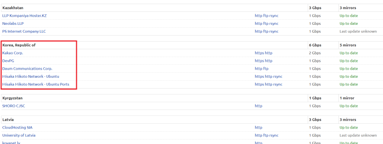
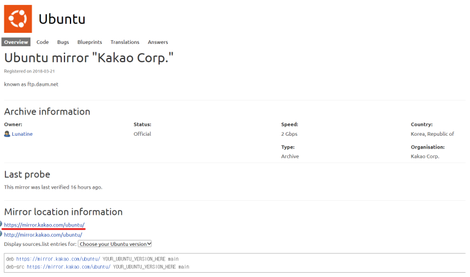
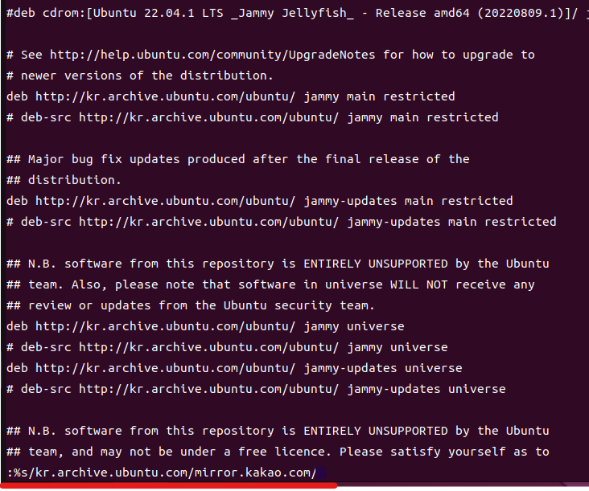

1. # 미러사이트 파일 
   ```
      /etc/apt/source.list 
   ```   

   기본 값(Ubuntu 22.04 LTS Jammy Jellyfish)   
   ```s
      root@ubuntudesk:/etc/apt# cat sources.list

      deb http://archive.ubuntu.com/ubuntu/ jammy main restricted universe multiverse
      # deb-src http://archive.ubuntu.com/ubuntu/ jammy main restricted universe multiverse

      deb http://archive.ubuntu.com/ubuntu/ jammy-updates main restricted universe multiverse
      # deb-src http://archive.ubuntu.com/ubuntu/ jammy-updates main restricted universe multiverse

      deb http://archive.ubuntu.com/ubuntu/ jammy-security main restricted universe multiverse
      # deb-src http://archive.ubuntu.com/ubuntu/ jammy-security main restricted universe multiverse

      deb http://archive.ubuntu.com/ubuntu/ jammy-backports main restricted universe multiverse
      # deb-src http://archive.ubuntu.com/ubuntu/ jammy-backports main restricted universe multiverse

      deb http://archive.canonical.com/ubuntu/ jammy partner
      # deb-src http://archive.canonical.com/ubuntu/ jammy partner

      deb http://security.ubuntu.com/ubuntu jammy-security main restricted
      deb http://security.ubuntu.com/ubuntu jammy-security universe
      deb http://security.ubuntu.com/ubuntu jammy-security multiverse
   ```   

   또는 한국어를 설치했으면 제일 앞에 kr이 옵니다.   
   ```
      http://kr.archive.ubuntu.com/ubuntu/ 
   ```

1. # 카카오로 사이트 변경
   우분투 공식 미러사이트   
   <a href="https://launchpad.net/ubuntu/+archivemirrors">https://launchpad.net/ubuntu/+archivemirrors</a>   

      

      

   https://mirror.kakao.com/ubuntu/ 이쪽으로 경로를 변경하겠습니다.   

   vi로 sources.list 파일을 열어 설정파일을 수정합니다.   

   ```s
      sudo vi /etc/apt/sources.list
   ```   
      

   %s/ke.archive.ubuntu.com/mirror.kakao.com/   
   :%s/[찾을 내용]/[바꿀 내용]   

   변경 후   
   ```s
      deb http://mirror.kakao.com/ubuntu/ jammy main restricted universe multiverse
      # deb-src http://mirror.kakao.com/ubuntu/ jammy main restricted universe multiverse

      deb http://mirror.kakao.com/ubuntu/ jammy-updates main restricted universe multiverse
      # deb-src http://mirror.kakao.com/ubuntu/ jammy-updates main restricted universe multiverse

      deb http://mirror.kakao.com/ubuntu/ jammy-security main restricted universe multiverse
      # deb-src http://mirror.kakao.com/ubuntu/ jammy-security main restricted universe multiverse

      deb http://mirror.kakao.com/ubuntu/ jammy-backports main restricted universe multiverse
      # deb-src http://mirror.kakao.com/ubuntu/ jammy-backports main restricted universe multiverse

      deb http://archive.canonical.com/ubuntu/ jammy partner
      # deb-src http://archive.canonical.com/ubuntu/ jammy partner

      deb http://security.ubuntu.com/ubuntu jammy-security main restricted
      deb http://security.ubuntu.com/ubuntu jammy-security universe
      deb http://security.ubuntu.com/ubuntu jammy-security multiverse
   ```   


