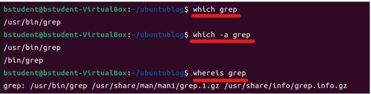

1. # find
   파일 및 디렉토리를 검색하는 데 사용됩니다. 특정 위치에서 파일이나 디렉토리를 찾거나, 이름이나 속성 등을 기준으로 검색할 수 있습니다. 주로 파일 시스템에서 특정 파일을 찾고자 할 때 사용됩니다.   

   ```s
      find <검색할 디렉토리 경로> <옵션> <찾을 조건> <옵션> <찾을 조건> ...
   ```   

   2. 옵션   
   - -name: 파일 이름으로 검색합니다. 와일드카드(*)를 사용하여 일부분만 일치시킬 수도 있습니다.   
   - -type: 파일의 타입으로 검색합니다. 주로 f(일반 파일) 또는 d(디렉토리)를 사용합니다.   
   - -size: 파일의 크기로 검색합니다. + 또는 - 기호와 함께 사용하여 특정 크기보다 크거나 작은 파일을 검색할 수 있습니다.   
   - -mtime: 파일의 변경 날짜로 검색합니다. -n(지정한 날짜 이전에 변경된 파일) 또는 +n(지정한 날짜 이후에 변경된 파일) 형식으로 사용합니다.   
   
   2. 조건   
   옵션에 따라 추가적인 조건을 지정할 수 있습니다. 예를 들어, -name 옵션을 사용할 경우에는 검색하고자 하는 파일의 이름을 지정해야 하고, -type인 경우 파일이면 f를 디렉토리면 d를 지정합니다.   

   ex)   
   ```s
      find . -name '*.yml'   #현재 디렉토리에서 yml 확장자 파일 찾기   
      find / -iname '*.yml'   #전체 디렉토리에서 대소문자 구분없이 yml 확장자 파일 찾기   
      find . -name "*.txt" -type f   #현재 디렉토리에서 확장자가 .txt인 파일
   ```
   - `*`를 사용할 때는 `''`나 `""`로 묶어 주어야 됩니다.      
   - name/iname   
   name : 대소문자 구분   
   iname : 대소문자 구분하지 않음   

   ```s
      #natist인 디렉토리 찾기
      ubuntu-desk@ubuntudesk:~$ sudo find / -iname 'natist' -type d
      
      #natist가 포함된 디렉토리 찾기
      ubuntu-desk@ubuntudesk:~$ sudo find / -iname 'natist*' -type d
      /home/ubuntu-desk/natista
      /home/ubuntu-desk/natista99.github.io
      /natista99

      #natist가 포함된 파일 찾기
      ubuntu-desk@ubuntudesk:~$ sudo find / -iname 'natist*' -type f
      /home/ubuntu-desk/natista/natista99.github.io.zip

      #natist가 포함된 파일과 디렉토리 찾기
      ubuntu-desk@ubuntudesk:~$ sudo find / -iname 'natist*' 
      /home/ubuntu-desk/natista
      /home/ubuntu-desk/natista/natista99.github.io.zip
      /home/ubuntu-desk/natista99.github.io
      /natista99
   ```
1. # whereis
   주어진 프로그램이나 명령어의 실행 파일, 소스 코드, 매뉴얼 페이지 등의 위치를 검색하는 데 사용됩니다. 주로 프로그램이나 명령어의 위치를 확인하고자 할 때 사용됩니다.   

   ```s
      whereis [프로그램 또는 명령어]

      whereis ls
      whereis ifconfig
   ```   

1. # which
   주어진 명령어의 실행 가능한 경로를 찾아줍니다. 주어진 명령어를 어떤 경로에서 실행할 수 있는지를 찾아주는 역할을 합니다. 즉, 명령어가 어떤 디렉토리에 위치해 있는지를 알려줍니다. which 명령어는 주로 시스템의 PATH 환경 변수에 등록된 디렉토리에서 명령어를 검색합니다. PATH 환경 변수는 시스템이 명령어를 실행할 때 참조하는 디렉토리 경로를 저장하는 변수입니다. 따라서 which 명령어는 주어진 명령어를 PATH 환경 변수에서 검색하고, 해당 명령어를 실행할 수 있는 경로를 출력합니다.   

   ```s
      which [명령어]

      which ls
   ```

   *기본값은 이름의 파일이 여러개 있으면 제일 먼저 발견된 것만 출력   
   -a가 있으면 같은 이름 전부 다 출력   

1. # 비교

   | 명령어 | 설명 |
   |:------:|:------:|
   | find |파일 시스템에서 파일 및 디렉토리를 검색|
   | whereis|프로그램이나 명령어의 위치를 검색|
   | which |명령어의 실행 가능한 경로|

      

   ```s
      #natista가 명령어가 아니라서 whereis는 찾는 것이 없음
      ubuntu-desk@ubuntudesk:~$ whereis natista
      natista:

      #natista가 명령어가 아니라서 which는 찾는 것이 없음
      ubuntu-desk@ubuntudesk:~$ which natista

      #find는 natista란 파일이나 디렉토리를 찾음
      ubuntu-desk@ubuntudesk:~$ sudo find / -iname 'natista'
      /home/ubuntu-desk/natista
   ```   

   ```s
      #ssh명령어의 실행파일, 소스코드, 위치등을 찾음
      ubuntu-desk@ubuntudesk:~$ whereis ssh
      ssh: /usr/bin/ssh /etc/ssh /usr/share/man/man1/ssh.1.gz

      #ssh명령어의 path환경변수에 등록된 디렉토리에서 찾음
      ubuntu-desk@ubuntudesk:~$ which ssh
      /usr/bin/ssh
   
      #PATH환경변수
      ubuntu-desk@ubuntudesk:~$ echo $PATH
      /home/ubuntu-desk/gems/bin:/usr/local/sbin:/usr/local/bin:/usr/sbin:/usr/bin:/sbin:/bin:/usr/games:/usr/local/games:/snap/bin:/snap/bin
   ```   