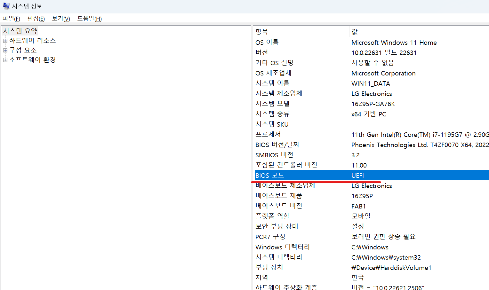
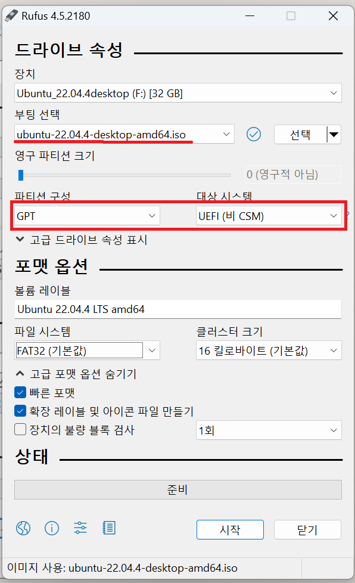

1. # UEFI VS 레거시BIOS

   |        비교        |                  UEFI                 |                    레거시BIOS            |
   |:-----------------:|:-------------------------------------:|:-----------------------------------------:|
   |     부팅 절차     |UEFI -> EFI 부트 로더 -> 커널 -> 운영 체제|BIOS -> MBR -> 부트로더 -> 커널 -> 운영 체제|
   | 디스크 장치 호환성 |	          GPT 디스크                  |                  MBR 디스크               |
   | 지원 드라이브 크기 |                 8ZB                    |                     TB                   |
   |      보안 부트    |                  예                    |                   아니요                  |
   | 지원되는 비트 모드 |            32비트 64비트            |                   16비트                  |
   |초기화 위치 및 시작 정보|   EFI 시스템 파티션의 .efi 파일에서  |                 펌웨어에서                |
   |    부팅 속도      |                더 빠르게               |                    느리게                 |

   확인 방법:
   win+R → msinfo32 
    

1. # 부팅디스크 만들기
   Windows11를 설치할 파티션 유형이 GPT이고, 리눅스를 설치할 드라이브도 GPT로 해야합니다.
    

   Rufus설정
   
   usb셋팅에 2~3 걸립니다.