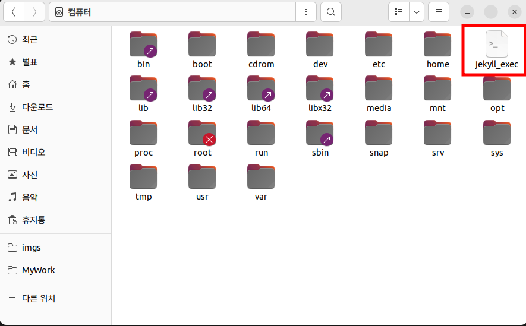
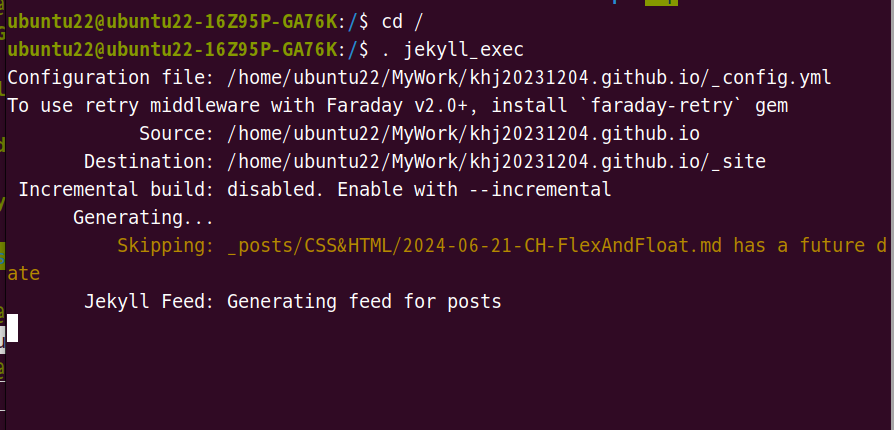

1. # 실행 파일

   루트 디렉토리에 파일을 만들고 밑에 명령을 입력합니다.   

   ```s
      ubuntu22@ubuntu22:/$ cd /   #루트 디렉토리로 이동
      ubuntu22@ubuntu22:/$ vi jekyll_exec   #실행할 명령어 이름으로 파일 만들기
   ```
   jekyll_exec란 이름으로 실행이 됩니다.   


   jeyll_exec파일의 vi편집기 안에서 밑에 내용을 입력합니다.   
   ```s
      #!/bin/bash

      cd /home/khj2023/WorkDir/khj20231204.github.io
      bundle exec jekyll serve
   ```   
   khj20231204.github.io 디렉토리로 이동 후 bundle exec jekyll serve란 명령어를 실행하는 내용입니다.   

       
   루트 디렉토리에 jekyll_exec란 파일이 만들어졌습니다.   

       
   ". 파일명"으로 실행하면 됩니다.   

   
