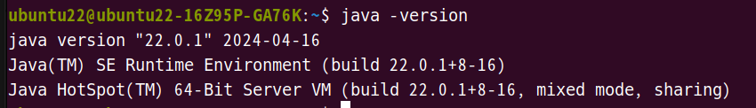
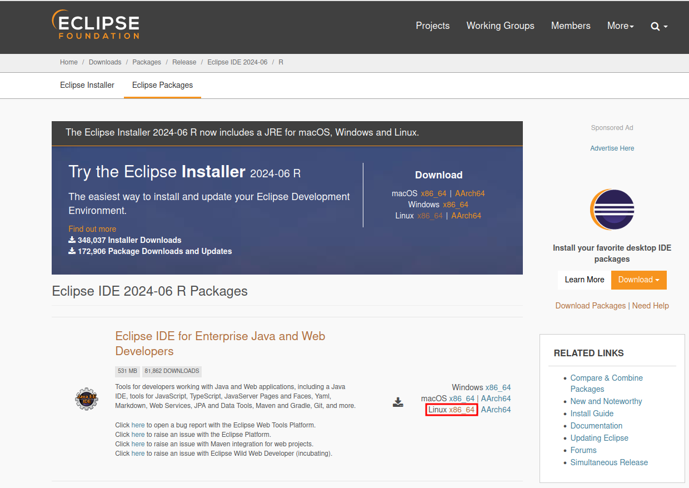
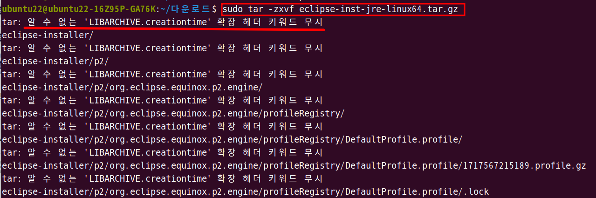
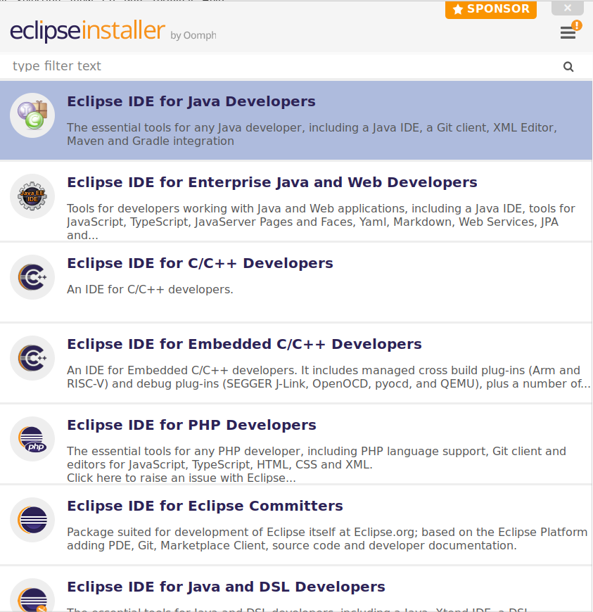
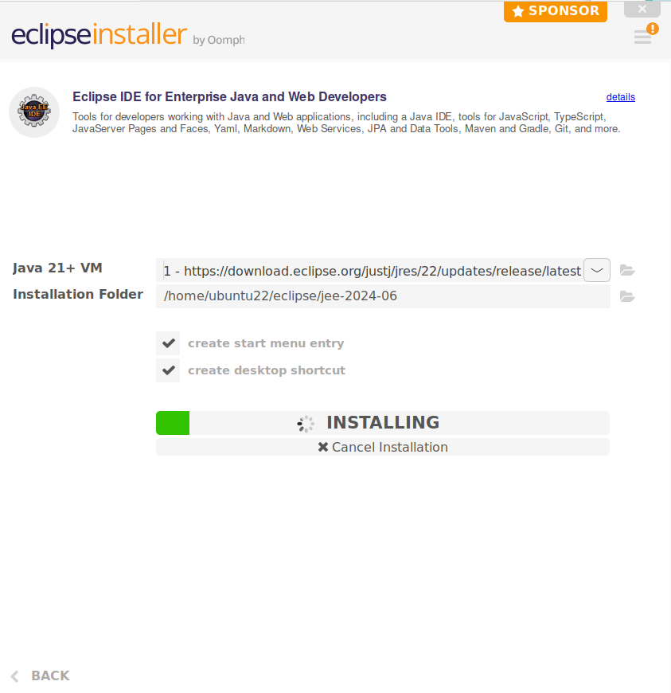

1. # JDK설치
   구글에서 JDK검색   
      

   자바 스프링 3버젼을 사용하기 위해서는 최소 JDK 17버젼 이상을 사용해야 합니다.   
   JDK 17을 선택하고 x64 Compressed Archive를 다운 받습니다.   
      

   일반적으로, 사용자 프로그램은 usr디렉토리에 저장하므로 usr디렉토리에 java라는 디렉토리를 만들어 다운받은 파일을 이동 후 압축을 해제합니다.   
   ```cs
      //java 디렉토리 만들기
      ubuntu22@ubuntu22-16Z95P-GA76K:~$ cd /usr/local
      ubuntu22@ubuntu22-16Z95P-GA76K:/usr/local$ sudo mkdir java
      
      //java 디렉토리로 다운받은 파일 이동
      ubuntu22@ubuntu22-16Z95P-GA76K:/home$ cd /home/ubuntu22/다운로드
      ubuntu22@ubuntu22-16Z95P-GA76K:~/다운로드$ sudo mv jdk-22_linux-x64_bin.tar.gz /usr/local/java
      
      //압축 해제
      buntu22@ubuntu22-16Z95P-GA76K:/usr/local/java$ sudo tar zxvf jdk-22_linux-x64_bin.tar.gz 
   ```   
   압축을 해지하고 나면   
   usr/local/java/jdk-22.0.1 파일이 생성됨   

   path경로를 설정합니다.   
   ```
      vi /etc/profile 
   ```   
   profile을 열어 밑에 내용을 입력합니다.

   ```CS
   JAVA_HOME=/usr/local/java/jdk-22.0.1
   JRE_HOME=/usr/local/java/jdk-22.0.1
   PATH=$PATH:$JRE_HOME/bin:$JAVA_HOME/bin

   export JAVA_HOME
   export JRE_HOME
   export PATH
   ```   
      
      
   
   수정한 profile 내용 적용
   ```
      source /etc/profile
   ```   

   jdk를 압축을 푼 후 path설정을 한 것만으로 java -version이 나오기 때문에 실질적인 설치는 끝났습니다.   
      
   
1. # 이클립스 설치
   리눅스에 해당하는 이클립스를 다운받습니다.   
      

   해당 디렉토리로 이동해서 압축을 해제합니다.   
   ```cs
      ubuntu22@ubuntu22:~/다운로드$ sudo tar -zxvf eclipse-inst-jre-linux64.tar.gz
   ```
      
   압축을 해제하면 "확장 헤더 키워드 무시"란 경고 메세지가 뜨는데 이건 맥에서 tar로 압축한 파일을 리눅스에서 압축 해제할 때 발생하는 것으로 무시하고 그냥 진행하시면 됩니다.   

   압축을 해제 후 eclipse-installer로 이동해서 ecilpse-inst를 실행하면 됩니다.   
   ```cs
      ubuntu22@ubuntu22:~/다운로드$ ls
      eclipse-inst-jre-linux64.tar.gz    jdk-22.0.1     rubyinstaller-devkit-3.3.2-1-x64.exe
      eclipse-installer //installer디렉토리가 생김
      google-chrome-stable_current_amd64.deb  normalize.css

      ubuntu22@ubuntu22:~/다운로드/eclipse-installer$ ls
      artifacts.xml  configuration  eclipse-inst //eclipse-inst실행
      eclipse-inst.ini  features  icon.xpm  p2  plugins  readme
   ```   
   
   ./eclipse-inst를 실행합니다.
   ```cs
      ubuntu22@ubuntu22:~/다운로드/eclipse-installer$./eclipse-inst
   ```  
      
   인스톨러가 실행됩니다.   
      
   JSP와 스프링을 사용하기 위해서 Eclipse IDE for Enterprise Java and Web Developers를 실행합니다   

   간단한 선택을 한 후 다음과 같이 설치를 시작합니다.   
      