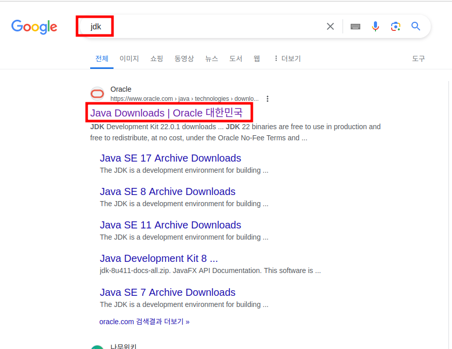
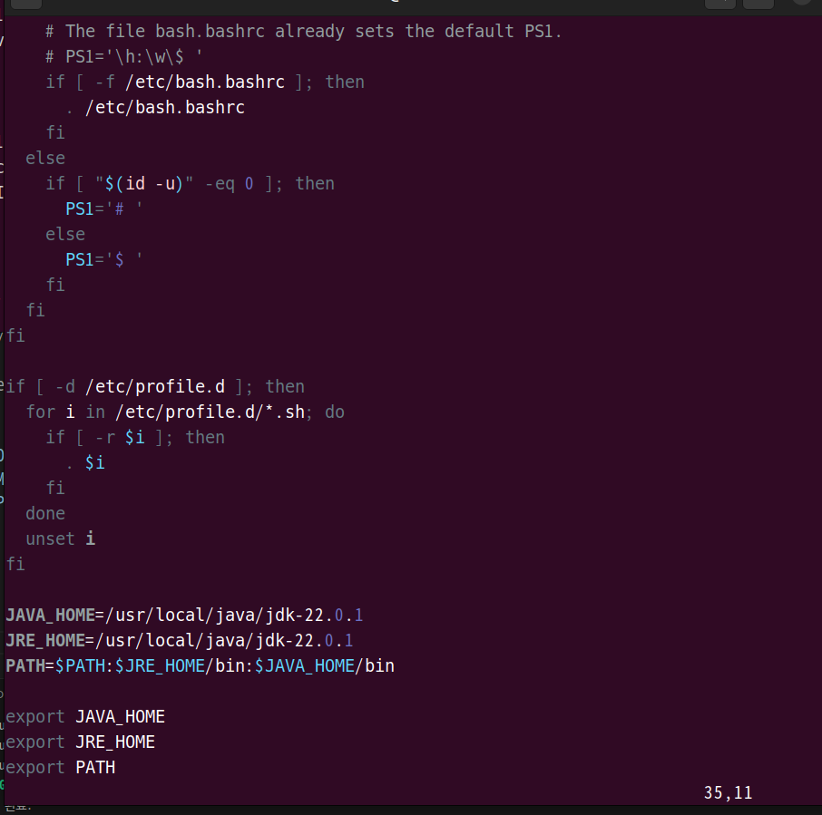

1. # JDK설치
   구글에서 JDK검색   
      

   자바 스프링 3버젼을 사용하기 위해서는 최소 JDK 17버젼 이상을 사용해야 합니다.   
   JDK 17을 선택하고 x64 Compressed Archive를 다운 받습니다.   
      

   일반적으로, 사용자 프로그램은 usr디렉토리에 저장하므로 usr디렉토리에 java라는 디렉토리를 만들어 다운받은 파일을 이동 후 압축을 해제합니다.   
   ```cs
      //java 디렉토리 만들기
      ubuntu22@ubuntu22-16Z95P-GA76K:~$ cd /usr/local
      ubuntu22@ubuntu22-16Z95P-GA76K:/usr/local$ sudo mkdir java
      
      //java 디렉토리로 다운받은 파일 이동
      ubuntu22@ubuntu22-16Z95P-GA76K:/home$ cd /home/ubuntu22/다운로드
      ubuntu22@ubuntu22-16Z95P-GA76K:~/다운로드$ sudo mv jdk-22_linux-x64_bin.tar.gz /usr/local/java
      
      //압축 해제
      buntu22@ubuntu22-16Z95P-GA76K:/usr/local/java$ sudo tar zxvf jdk-22_linux-x64_bin.tar.gz 
   ```   
   압축을 해지하고 나면   
   usr/local/java/jdk-22.0.1 파일이 생성됨   

   path경로를 설정합니다.   
   ```
      vi /etc/profile 
   ```   
   profile을 열어 밑에 내용을 입력합니다.

   ```CS
   JAVA_HOME=/usr/local/java/jdk-22.0.1
   JRE_HOME=/usr/local/java/jdk-22.0.1
   PATH=$PATH:$JRE_HOME/bin:$JAVA_HOME/bin

   export JAVA_HOME
   export JRE_HOME
   export PATH
   ```   
      
      
   
   수정한 profile 내용 적용
   ```
      source /etc/profile
   ```

   
