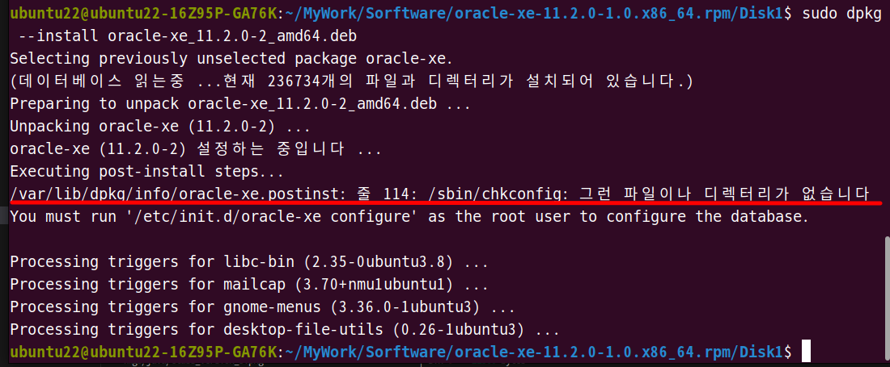
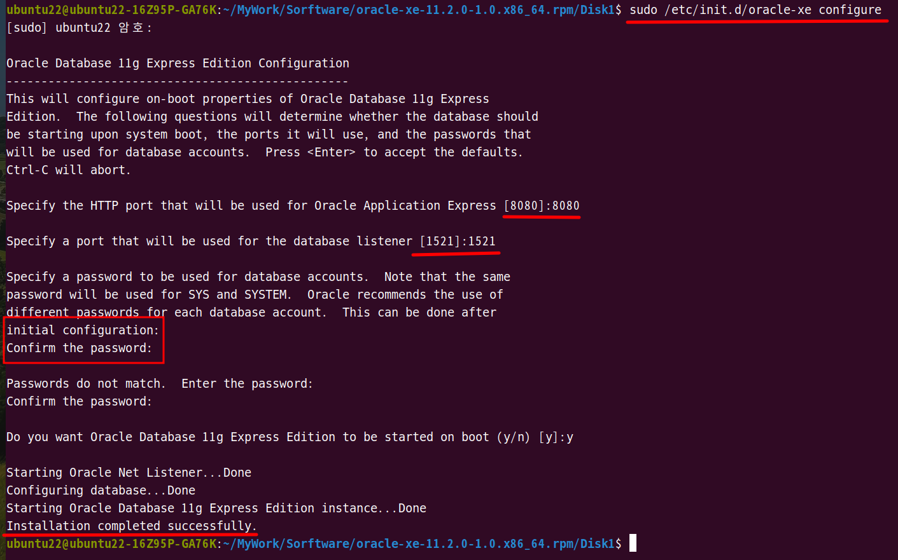
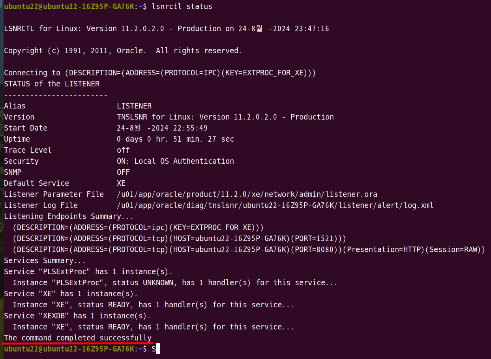

1. # 오라클 설치
   다운 받습니다.   
   <a href="https://www.oracle.com/database/technologies/xe-prior-release-downloads.html">https://www.oracle.com/database/technologies/xe-prior-release-downloads.html</a>

   다운 받은 파일을 압축 풉니다.   
   <span style="color:red;font-size:18px;font-weight:bold">*압축이 안풀리는 경우 윈도우의 zip파일과 오라클의 zip파일은 형식이 같기 때문에 윈도우에서 압축을 푼 후 rpm파일만 우분투로 가져오면 됩니다.</span>   

   필요한 rpm 파일
   ```cs   
      oracle-xe-11.2.0-1.0.x86_64.rpm
   ```   

   rpm파일이 있는데 우분투는 데비안 계열이기 때문에 deb로 확장자를 변경해야합니다. 확장자를 변경하기 위해서 alien이란 패키지를 설치합니다.
   ```cs
      sudo apt install alien
   ```   

   rpm파일을 deb파일로 변환합니다. 3~4분 소요
   ```cs
      sudo alien --scripts -d oracle-xe-11.2.0-1.0.x86_64.rpm
   ```   

   변환이 완료되면
   ```cs
      ubuntu22@ubuntu22:~/MyWork/Sorftware/oracle-xe-11.2.0-1.0.x86_64.rpm/Disk1$ sudo alien --scripts -d oracle-xe-11.2.0-1.0.x86_64.rpm
      oracle-xe_11.2.0-2_amd64.deb generated
   ```   
   oracle-xe_11.2.0-2_amd64.deb generated와 같이 generated가 뜹니다.   

   __설치하기 전 /sbin/chkconfig 파일 먼저 만들기__   

   debian계열의 ubuntu이면 chkconfig 환경 파일을 만들어줘야 합니다. 레드햇 계열이면 기본적으로 /sbin/chkconfig 파일이 있지만 debian계열은 없기 때문입니다. 

   *만약 chkconfig 파일이 없다면 다음과 같은 에러가 발생합니다.   
      

   로컬에 sbin디렉토리 안에 chkconfig파일 생성
   ```cs
      ubuntu22~:/sbin$ sudo touch chkconfig
   ```   

   chkconfig 안에 밑에 내용 붙혀넣기
   ```cs
      #!/bin/bash
      # Oracle 11gR2 XE installer chkconfig hack for Ubuntu
         file=/etc/init.d/oracle-xe  
         if [[ ! `tail -n1 $file | grep INIT` ]]; then  
         echo >> $file  
         echo '### BEGIN INIT INFO' >> $file  
         echo '# Provides: OracleXE' >> $file  
         echo '# Required-Start: $remote_fs $syslog' >> $file  
         echo '# Required-Stop: $remote_fs $syslog' >> $file  
         echo '# Default-Start: 2 3 4 5' >> $file  
         echo '# Default-Stop: 0 1 6' >> $file  
         echo '# Short-Description: Oracle 11g Express Edition' >> $file  
         echo '### END INIT INFO' >> $file  
         fi  
         update-rc.d oracle-xe defaults 80 01  
      #EOF
   ```   

   chkconfig 파일을 외부에서 실행할 수 있도록 권한 설정
   ```cs   
      ubuntu22:/sbin$ sudo chmod 755 /sbin/chkconfig
   ```

   deb파일을 설치합니다.
   ```cs
      sudo dpkg --install oracle-xe_11.2.0-2_amd64.deb
   ```

   oracle configure 명령어로 오라클 환경 설정
   ```cs
      sudo /etc/init.d/oracle-xe configure
   ```   
   포트와 서버 리스너 넘버를 설정해 주고 비밀번호를 입력합니다.   
      

   설치한 오라클을 모든 경로에서 실행할 수 있게 환경변수를 설정
   ```cs
      vi ~/.bashrc  //bash파일 열기
   ```

   bashrc에 밑에 내용 붙혀넣기
   ```cs
      export ORACLE_HOME=/u01/app/oracle/product/11.2.0/xe  
      export ORACLE_SID=XE  
      export NLS_LANG=`$ORACLE_HOME/bin/nls_lang.sh`  
      export ORACLE_BASE=/u01/app/oracle  
      export LD_LIBRARY_PATH=$ORACLE_HOME/lib:$LD_LIBRARY_PATH  
      export PATH=$ORACLE_HOME/bin:$PATH  
   ```   
   path 경로 - 오라클 11.2.0 버전   

   path가 추가된 bash파일 적용
   ```cs
      source ~/.bashrc //수정한 bash파일 적용   
   ```   

   __터미널을 종료 후 다시 실행__   

   오라클 서버 리스너가 동작 중인 확인
   ```
      lsnrctl status
   ```   
      

   오라클 로그인 후 테이블 가져오기
   ```
      sqlpuls system
      비밀번호 입력

      select * from tab;
   ```
