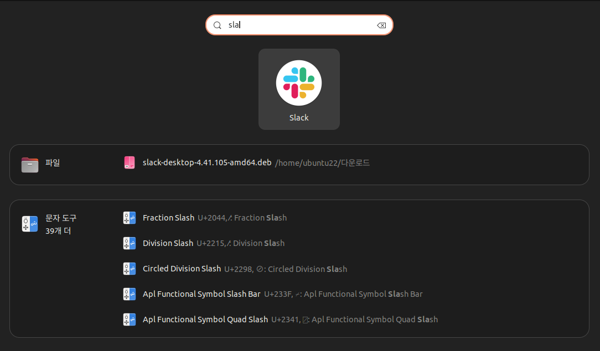

1. # Slack 설치
   <a href="https://slack.com/intl/ko-kr/downloads/linux">https://slack.com/intl/ko-kr/downloads/linux</a>   
   다운받기   

   DEB 앱 다운받기   

   설치   
   ```cs
      cd 다운로드  # 다운로드 디렉토리로 이동
      ubuntu22@ubuntu22-16Z95P-GA76K:~/다운로드$ sudo apt-get install ./slack-desktop-4.41.105-amd64.deb  # 설치
   ```   

      