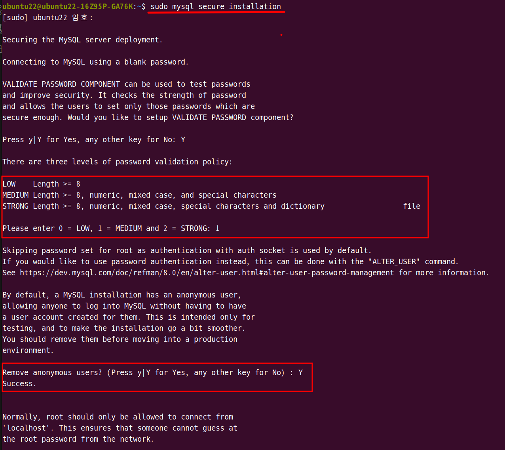
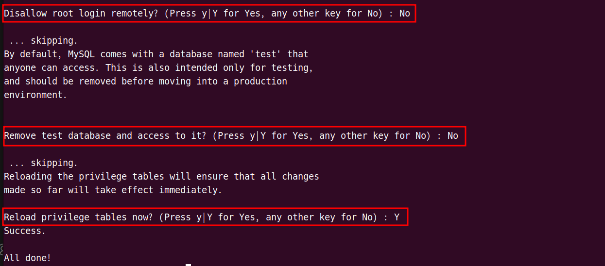
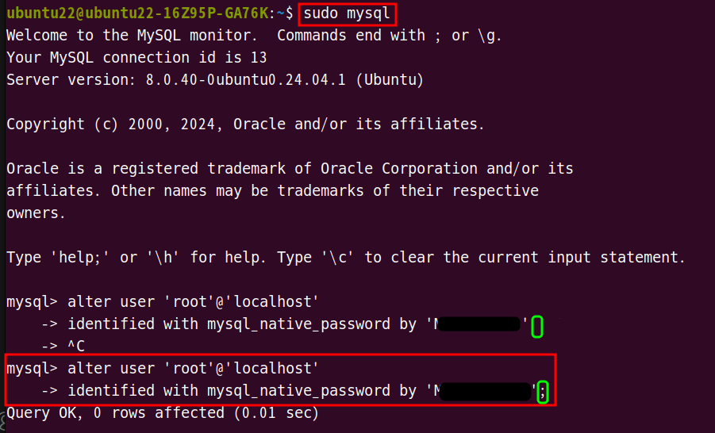
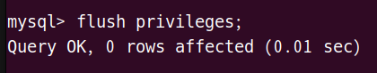
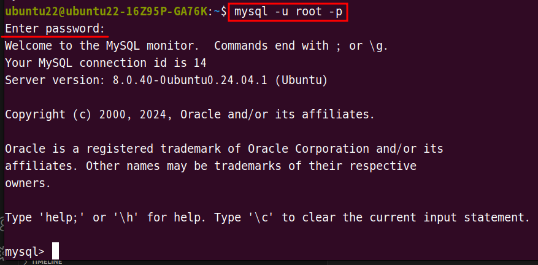
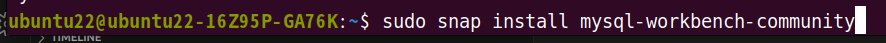
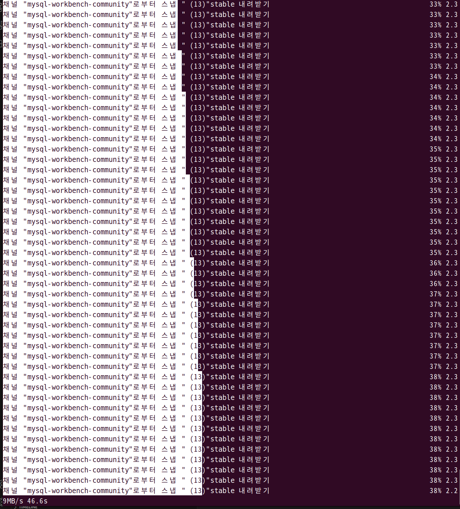
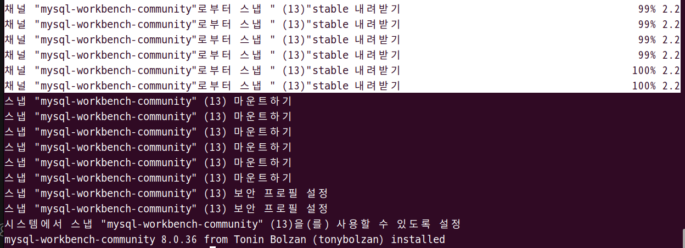
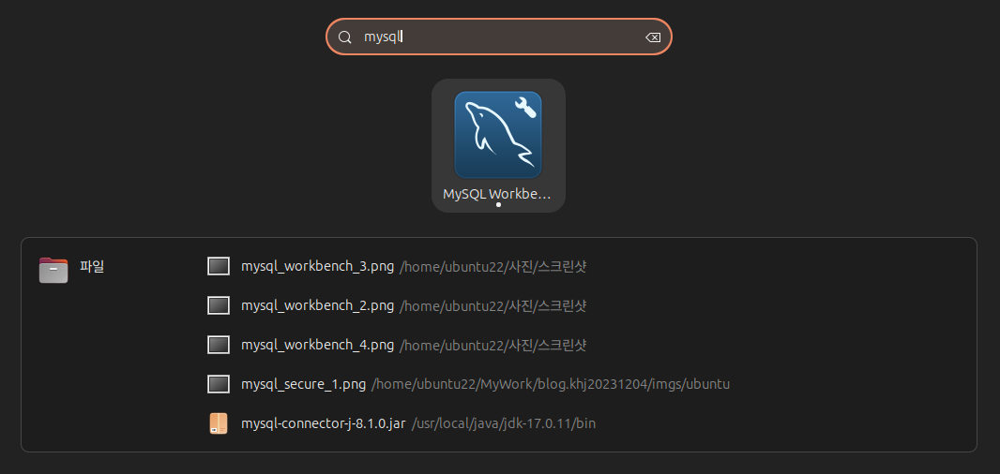
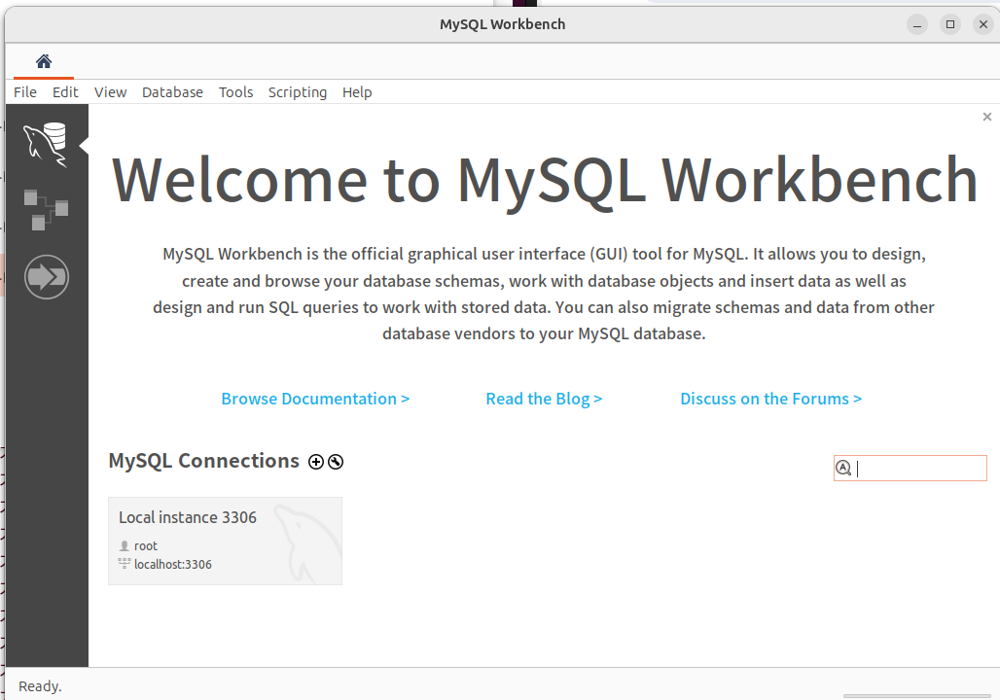

1. # 우분투에서 mysql 설치

   apt를 update 후 설치합니다.   
   ```yml
      sudo apt update

      sudo apt install mysql-server

      sudo systemctl status mysql  # 서비스 상태 확인
   
      mysql --version  # 버전 확인
   ```

   root비밀번호 설정과 그외 설정을 합니다   
   ```yml
      sudo mysql_secure_installation  # MySQL 서버의 보안 및 초기 설정을 조정
   ```   
      
   ```yml   
      LOW    Length >= 8    # 8자리 이상으로만 루트 암호를 설정
      MEDIUM Length >= 8, numeric, mixed case, and special characters  #  숫자, 대소문자, 특수 문자를 포함하는 8자리 이상
      STRONG Length >= 8, numeric, mixed case, special characters and dictionary  #  숫자, 대소문자, 특수 문자를 포함하는 8자리 이상이면서 쉽게 추측가능한(password, 1234, 123123) 비밀번호는 피한다

      Remove anonymous users? (Press y|Y for Yes, any other key for No) : Y
      # 익명 사용자 계정을 삭제할 것인가? 보안상 Y
   ```   

      
   ```yml
      Disallow root login remotely? (Press y|Y for Yes, any other key for No) : No
      # 원격에서 root 계정 login을 허락하지 않는다? Y : 허락하지 않는다, No : 허락한다
      # 다른 컴퓨터에서 접속할 경우가 있을 거 같아서 No

      Remove test database and access to it? (Press y|Y for Yes, any other key for No) : No
      # 기본으로 제공되는 테스트 데이터베이스를 제거 할 것인가? 
      # 예제를 사용할 수도 있기 때문에 No

      Reload privilege tables now? (Press y|Y for Yes, any other key for No) : Y
      # 위에 설정 사항을 즉시 적용할 것인가? Yes
   ```   

   root 암호 설정   
   ```yml
      sudo mysql

      mysql> alter user 'root'@'localhost'
      -> identified with mysql_native_password by 'M__________';  # 끝에 ; (세미콜론) 중요
      Query OK, 0 rows affected (0.01 sec)
   ```   
   MEDIUM에 맞게 대소문자를 넣고 특수 문자를 넣어서 설정합니다.   
      

   바로 적용   
   ```
      mysql> flush privileges;
   ```   
      

   mysql을 root 계정으로 접속   
   ```
      mysql -u root -p
   ```
      

1. # 비밀번호 정책 변경 및 재설정   
   
   현재 정책 확인하기   
   ```cs
      show variables like 'validate_password%';
   ```

   정책 변경   
   ```cs
      SET GLOBAL validate_password.policy=LOW;  // LOW로 변경
      SET GLOBAL validate_password.length=4;  // 길이를 4자 이상으로 변경
   ```   
      

   비밀번호를 변경   
   ```cs
      ALTER USER 'root'@'localhost' IDENTIFIED BY '새로운 비밀번호';
   ```   
      


1. # Workbench 설치

   worckbench 설치   
   ```   
       sudo snap install mysql-workbench-community
   ```   
      

   설치과정이 좀 이상함..   
      

   100%가 되면 설치 완료   
      

   애플리케이션에서 mysql검색   
      

   Workbench 실행 화면   
      

