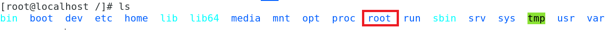

$$$ 1.들여쓰기 주의 $$$
1. # &#39;(빽틱)을 사용한 블럭 코드는 들여쓰기 주의
&#39; &#39; &#39; java   
   system.out.println("hello");&#45;&#45;&#45;㉠   
   
   system.out.println("world");&#45;&#45;&#45;㉡   
&#39; &#39; &#39;  
블럭 코드 안에 소스들은 &#39;보다 들여쓰기를 해야 한다 
㉠과 ㉡ 사이에 공백을 두고 공백 &#39;(빽틱)이 그대로 화면에 나오고 태그가 적용되지 않는다.  
빈칸 한 줄을 없앤 화면
```java
   system.out.println("hello");&#45;&#45;&#45;㉠   

   system.out.println("world");&#45;&#45;&#45;㉡   
``` 

$$$ 2. 순서1. 사용주의 $$$
1. # 제목1
1. # 제목2
   1. ## 소제목1
   1. ## 소제목2
1. # 제목3
위와 같이 작성한 경우 toc에서 제대로 값을 못 가져온다
제목1과 제목2는 제대로 나오는데 소제목1까지만 제대로 인식하고 그 밑으로 소제목2와 제목3은 제대로 인식을 못 한다. 최상위 순서 제목1, 제목2, 제목3만 "1. #" 이런 태그를 사용하고 소제목부터는 직접 html태그를 쓴다
1. # 제목1
1. # 제목2
   <h3>1. 소제목</h3>
   <h3>2. 소제목</h3>
1. # 제목3
toc이 제대로 인식하는 건 제일 앞 1. 뿐이고 하위제목의 1.밑으론 제대로 인식 못한다

$$$ 3.한 줄 띄어쓰기 주의 $$$
1. # 제목1
   제목1은 여기 작성
   (빈칸)
   제목1은 여기 작성
1. # 제목2
위에처럼 1. # 와 밑에 1. # 사이에 빈칸줄이 들어가면 제대로 1.을 인식 못 한다.


마크다운 문법 연습

# 제목 1 <h1>
## 제목 2 <h2>
### 제목 3 <h3>
~ 
###### 제목 6 <h6>

앞에 숫자는 # 적용 못 한다.
1. ## equals(Object obj)
   1. ### a
      1. #### b
      1. c
   1. d
   1. e
1. ## toString


제목4
=====

제목5
-----

*이탤릭*
__강조__
<u>밑줄</u>

1. t
1. t
    - ss
    - dd
1. 4
    1. 43
    1. 54
1. 5

- 순서가 없는 경우
    - 대쉬
    + 더하기
    * 별표

[naver](https://naver.com "링크 설명은 따옴표로") 


    
`인라인 코드 강조`는 빽틱 한개

```
블럭 코드 강조
```
는 빽틱 세개


>인용문1
>>인용문2
>>>인용문3


수평선
<hr/>
---
--- -3개
***
*** *3개
___
___ _3개
다 같다

&#39; &#39; &#39; java   
   system.out.println("hello");&#45;&#45;&#45;㉠   
   
   system.out.println("world");&#45;&#45;&#45;㉡   
&#39; &#39; &#39;
```java
   system.out.println("hello");---㉠   
   
   system.out.println("world");---㉡   
````

※ ★ ☆ ○ ● ◎ ◇ ◆ □ ■ △ ▲ ▽ ▼ 
← ↑ → ↓ ↔ ◁ ◀ ♠ ☞ ☜ ▷ ▶

≒ ⁿ ² ³ 

㉠ ㉡ ㉢ ㉣ ㉤ ㉥ ㉦ ㉧ ㉨

ⓐ ⓑ ⓒ ⓓ ⓓ ⓔ ⓕ ⓖ ⓗ

① ② ③ ④ ⑤ ⑥ ⑦ ⑨ ⑧ 

⒜ ⒝ ⒞ ⒟ ⒠ ⒡ ⒢

`[``]`(대괄호)

```java {1-21} showLineNumbers

```jsx title="/src/components/HelloCodeTitle.js"

들여쓰기
&nbsp;

12$`\`-`\`$25

---
layout: default
comments: true
# other options
---

테이블은 빈칸 중요 아래 위로 한줄 빈칸!
|제목|내용|설명|
|------|---|---|
|테스트1|테스트2|테스트3|
|테스트1|테스트2|테스트3|
|테스트1|테스트2|테스트3|

여기서부터 괄호 안이 전각 (　　　　　)

    

 each package is individually signed.
 각 패키지는 개별적으로 서명되기 때문에 


 <!-- 


 -->


