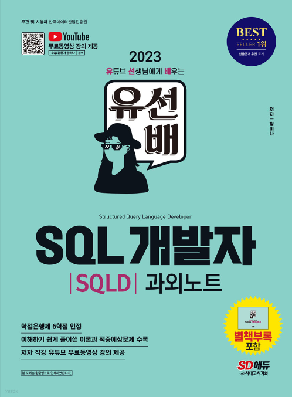
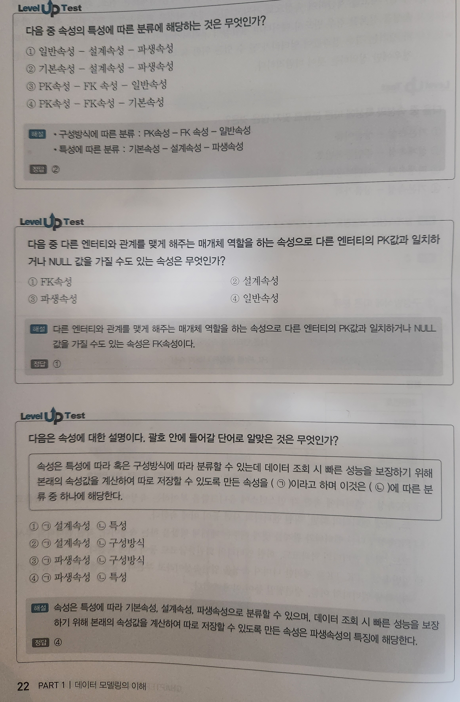
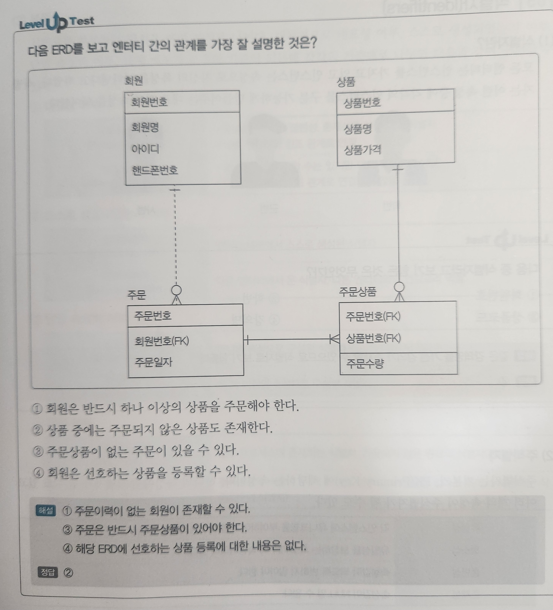
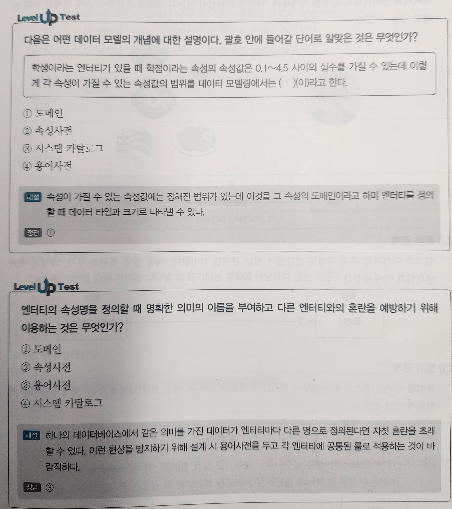

   

[유선배 SQL개발자](https://www.yes24.com/Product/Goods/114913864)

1. # 데이터 모델링의 이해   

   1)다음 중 모델링을 설명한 표현으로 가장 옳은 것은?   
   ① 현실 세계와는 별도로 데이터베이스의 자체적인 관계에 의한 모델을 표현한 것이다.   
   ② 모델 간의 관계는 복잡하고 상세할수록 좋다.   
   ③ 현실 세계를 반영한 모델을 단순화하여 표현한 것이다.   
   ④ 관리가 필요없는 모델이라 하더라도 정의하는 것이 좋다.   
      
   모델링이 갖춰야 할 조건   
   .현실세계를 반영해야 한다.   
   .단순화하여 표현해야 한다.   
   .관리하고자 하는 데이터를 모델로 설계한다.   
   정답: ③   

   2)모델링의 특징이 아닌 것은?   
   ① 단순화   
   ② 추상화   
   ③ 명확화   
   ④ 상세화   
   :   
   정답: ④   

   3)데이터 모델링의 세 가지 관점이 아닌 것은?   
   ① 프로세스 관점   
   ② 히스토리 관점   
   ③ 데이터와 프로세스 관점   
   ④ 데이터 관점   
   :   
   정답: ②   
   
   4)데이터 모델링 절차이다. 괄호 안에 들어갈 단어는?   
   모델리의 첫 번째 단계는 (㉠) 데이터 모델리으로 업무 프로세스를 포괄적으로 모델링하는 단계이다. 추상화 레벨이 높고 전사적 데이터 모델링 수행 시 행해진다. 모델링의 두 번째 단계는 (㉡) 데이터 모델링으로 데이터 모델에 대한 key, 속성, 관계 등을 표현하며 재사용성이 가장 높다. 모델링의 세 번째 단계는 (㉢) 데이터 모델링으로 데이터베이스에 실제로 구현하기 위해 성능이나 가용성 등을 고려하여 설계하는 모델링 단계이다.   
   :   
   정답:   
   ㉠ 개념적 데이터 모델링   
   ㉡ 논리적 데이터 모델링   
   ㉢ 물리적 데이터 모델링   

   5)ANSI-SPARC에서 정의한 3단계 스키마 구조에 대한 설명으로 옳은 것은?   
   ① 외부 스키마는 모든 사용자 관점을 통합한 조직 전체 관점의 통합적인 표현이다.   
   ② 개념 스키마는 물리적인 저장 구조를 나타낸다.   
   ③ 외부 스키마는 DB의 각 사용자나 응용 프로그래머가 접근하는 DB의 정의이다.   
   ④ 내부 스키마는 View 단계로 여러 개의 사용자 관점으로 구성된다.   

1. # 엔터티
   1)다음 중 엔터티명으로 가장 적합한 것은?   
   ① 집계   
   ② 월매출내역들   
   ③ 회원탈퇴   
   ④ 주문한 회원   
   :   
   ① 무엇을 집계했는지 불문명   
   ② 단수로 명명해야 함   
   ④ 띄어쓰기 불가   
   정답: ③   

① ② ③ ④
1. # 속성
   1)다음 중 엔터티의 속성이 될 수 없는 것은?   
   ① 회원 엔터티 - 주소   
   ② 상품 엔터티 - 가격변경 이력   
   ③ 강사 엔터티 - 강사번호   
   ④ 수강 엔터티 - 수강신청일자   
   :   
   가격변경 이력은 속성이 아니라 별도의 엔터티가 되어야 한다.   
   정답: ②   

   2)다음 중 속성에 대한 설명으로 옳은 것은?   
   ① 하나의 엔터티는 하나 이상의 속성을 갖는다.   
   ② 하나의 속성은 두 개 이상의 속성값을 갖는다.   
   ③ 속성을 의미상으로 쪼개는 것을 정규화라고 한다.   
   ④ 엔터티에 대한 구체적이고 명확한 정보를 나타낸다.   
   :   
   ① 하나의 엔터티는 두 개 이상의 속성을 갖는다.   
   ② 하나의 속성은 하나의 속성값을 갖는다.   
   ③ 속성은 의미상 더 이상 쪼개지지 않는 레벨이다.  
   정답: ④   

   3)다음 중 속성의 특성에 따른 분류로 맞지 않은 것은?
   ① 기본속성 - 상품이름   
   ② 설계속성 - 주민등록번호   
   ③ 파생속성 - 이벤트 응모건수   
   ④ 기본속성 - 상품가격   
   :   
   설계속성은 모델링을 위해 인위적으로 만들어서 정의한 속성으로 일련번호와 같이 유니크한 식별자를 부여하기 위한 것이 목적이다.
   정답: ②   

   4):   
      

   5):
      

1. # 관계
   1)다음 중 엔터티 간의 관계를 나타낼 때 표기하는 항목에 해당하지 않는 것은?   
   ① 관계명   
   ② 관계차수   
   ③ 관계타입   
   ④ 관계선택사양   
   :   
   관계의 표기법에는    
   관계명 - 연관성이 있다, 주문한다,..   
   관계차수 - 1:1, 1:N, N:N   
   관계선택사양 - 필수적 관계, 선택적 관계   
   정답: ③   

   2)
      

   3)
      

1. # 식별자
   1)식별자 관계에 대한 설명이 아닌 것은?   
   ① 자식 엔터티의 데이터가 부모 엔터티에 반드시 존재해야 한다.   
   ② 부모 엔터티의 주식별자가 자식 엔터티의 주식별자가 되는 관계이다.   
   ③ 부모 엔터티와 자식 엔터티는 1:1이나 M:1 관계가 형성된다.   
   ④ 자식 엔터티는 단일식별자를 갖거나 복합식별자를 가실 수 있다.   
   :   
   부모 엔터티와 자식 엔터티는 1:1또는 1:M 관계이다.   
   부모의 PK를 자식의 PK로 가져왔기 때문에 자식 엔터티의 데이터가 부모 엔터티에 반드시 존재해야 한다.   
   정답: ③   
① ② ③ ④
