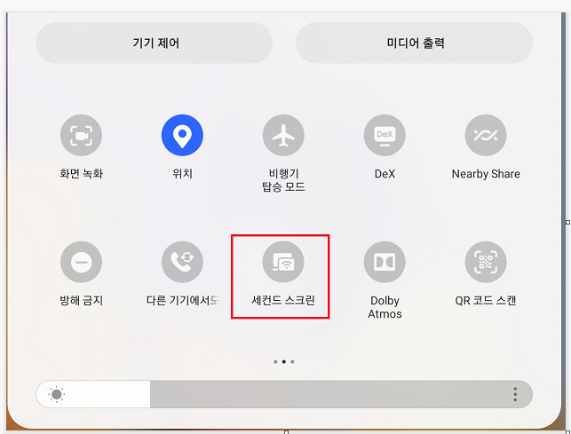
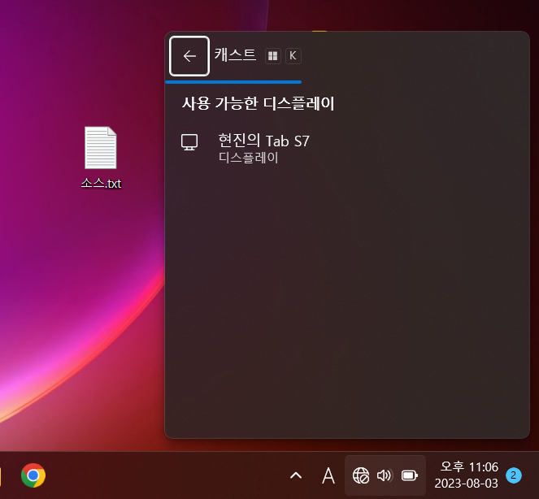
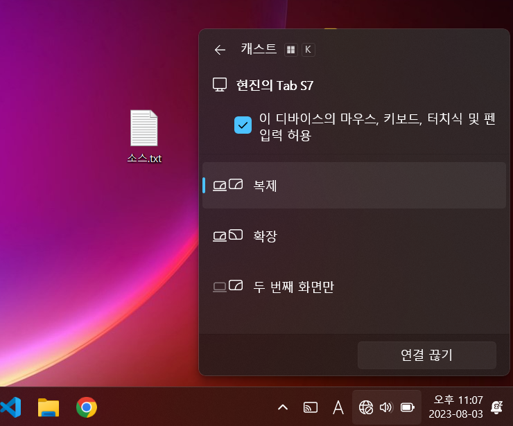
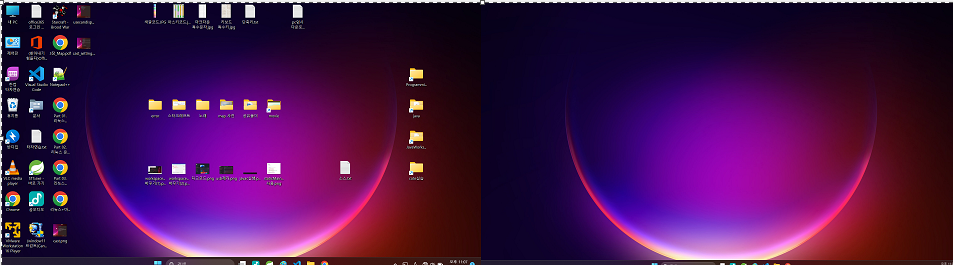

1. # 세컨드 스크린?
   컴퓨터와 갤럭시 탭을 연결해서 모니터 화면을 탭에서도 볼 수 있는 기능입니다.   
   *갤럭시 탭에 세컨드 스크린기능이 있어야합니다.
1. # 블루투스 연결
   컴퓨터와 갤럭시 탭을 블루투스로 먼저 연결합니다.   
1. # 세컨드 스크린 실행   
   탭에서 세컨드 스크린을 실행합니다.
    
      
    
1. # 윈도우키 + k
   키보드에서 윈도우키와 k를 누릅니다.
    
      
    
1. # 옵션 선택   
      
    
1. # 완료 화면
      