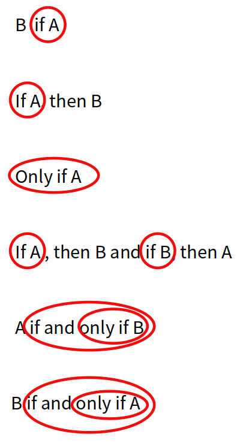

1. # 명제
   참 거짓을 판별할 수 있는 조건문을 명제라고 합니다.  
   2는 4의 약수이다. (참)   
   8은 2의 배수이다. (참)

   반면, 
   그녀는 아름답다. (모름)   
   하늘이 높다. (우주 정거장에서 보는 경우 해당 안 됨)   
   x가 5이다. (x는 미지수)   
   x는 9의 약수이다. (x는 미지수)   
   는 모두 명제가 아닙니다.   

1. # 조건으로 이루어진 명제
   x란 매개변수가 들어가서 두 개의 조건문을 가지게 되면 참,거짓을 판별할 수 있는 명제가 될 수 있습니다.   

   x는 5이다. - ①   
   x는 9의 약수이다. - ②   

   x가 5이면 x는 9의 약수이다 : 조건으로 이루어진 명제

   이 조건문은 하나로 만들 수 있습니다.   
    
   ▶ 5는 9의 약수이다.

   마찬가지로,   

   ▶ √3은 무리수이다.   
   x는 √3 이다. - ①   
   x는 무리수이다. - ②   
   
   하나의 명제를 2개의 조건으로 나타낼 수 있습니다.

1. # 포함관계   
   주산을 오래한 사람은 주판을 머릿속으로 그리며 계산하면 빠르고 정확하듯 무엇인가를 카테고리별로 범위를 나눌 때 머릿속으로 집합을 그리면 편합니다. 수학에서 범위를 다룰 때 집합으로 생각을 많이합니다. 집합은 포함관계를 나타내면 포함관계는 대소비교를 할 수 있기 때문입니다.   

   4는 8의 약수이다. ▷ x가 4이면 x는 8의 약수이다.   

   를 집합으로 나타낼 수 있습니다.   

   x = 4   
   x = 1,2,4,8 (8의 약수)    

   x=4 ⊂ x=1,2,4,8   
   : &nbsp;&nbsp;&nbsp;p  →  q   
   : &nbsp;&nbsp;&nbsp;p  ⊂  q   

   로 나타낼 수 있습니다.   

   이때 x=4는 x=1,2,4,8에 포함되고 있습니다. 이때, 포함되는 조건를 __충분조건__ 이라고 합니다.   

   x=1,2,4,8은 x=4를 포함하고 있습니다. 이때, 포함하는 조건를 __필요조건__ 이라고 합니다.   

   p → q , p ⊂ q   
   p는 q에 포함된다 : p는 q이기 위한 충분조건   
   q는 p를 포함한다 : q는 p이기 위한 필요조건   

   ☞*p에서 화살을 쏴서 q가 맞아서 피를 흘리니깐 p는 필요조건   
   ☞충분조건 - 작다 / 필요조건 - 크다

1. # if, if .. then, only if, ...
   - if A (A는 충분조건)   
   B if A : A → B , A ⊂ B   

   - if A, then B (A는 충분조건)   
   A → B , A ⊂ B   

   - only if A (A는 필요조건)   
   B only if A : A ← B , A ⊃ B   

   - if A, then B and if B, then A   
   (A도 충분조건, B도 충분조건 ⇒ 필요충분조건 ⇒ 동치)   
   A ↔ B , A = B   

   - A if and only if B = A iff B   
   (B는 충분조건이면서 필요조건 ⇒ 필요충분조건 ⇒ 동치)   
   A ↔ B , A = B   

   - B if and only if A  = B iff A   
   (A는 필요조건이면서 충분조건 ⇒ 필요충분조건 ⇒ 동치)   
   A ↔ B , A = B   

       

1. # if only 와 only if
   if only : 가정법입니다. 현재상황에서 시제를 한시제 소급해서 과거를 나타내므로서, 반대상황을 가정하는 가정법입니다.   

   ex)Money is better than poverty, if only for financial reasons.   
   만약 경제적 이유라면 돈이 가난보다 좋을텐데.. 현재는 경제적 이유때문이 아니라 다른 이유로 돈이 가난보다 더 좋다는 현재상황 __반대__ 를 나타냅니다.   

   only if A : 단지,오직 만약 A라면 - A가 필요조건임을 나타냅니다.   

    
