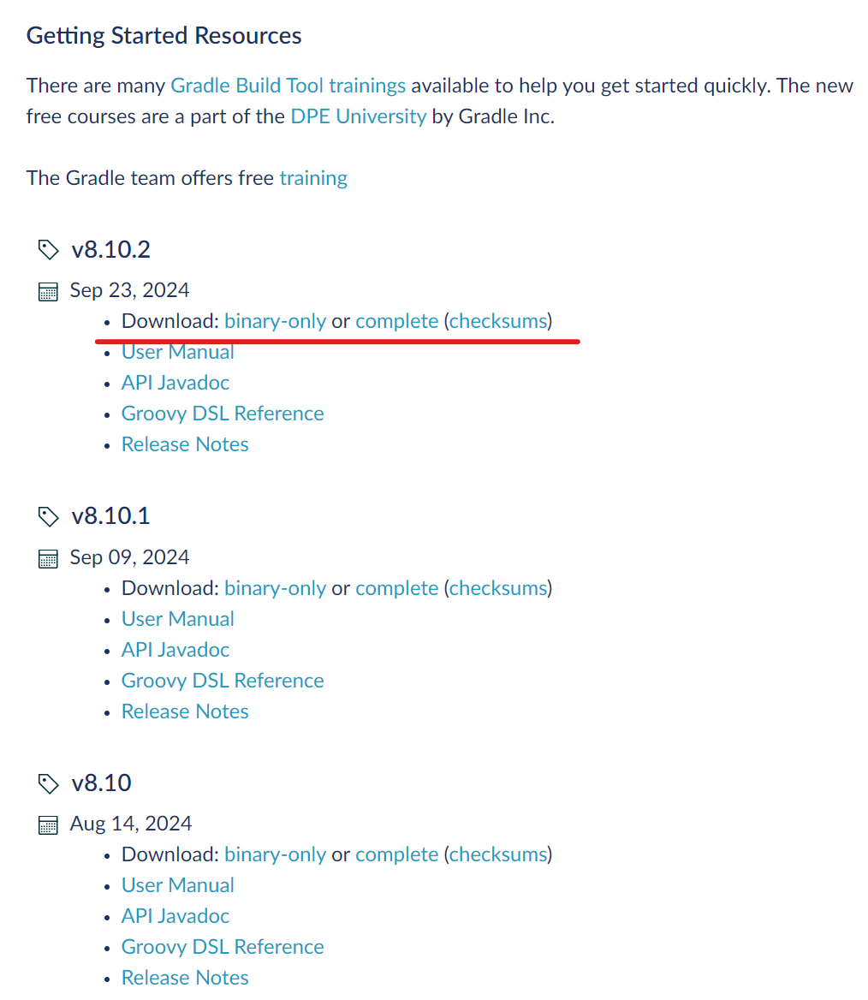
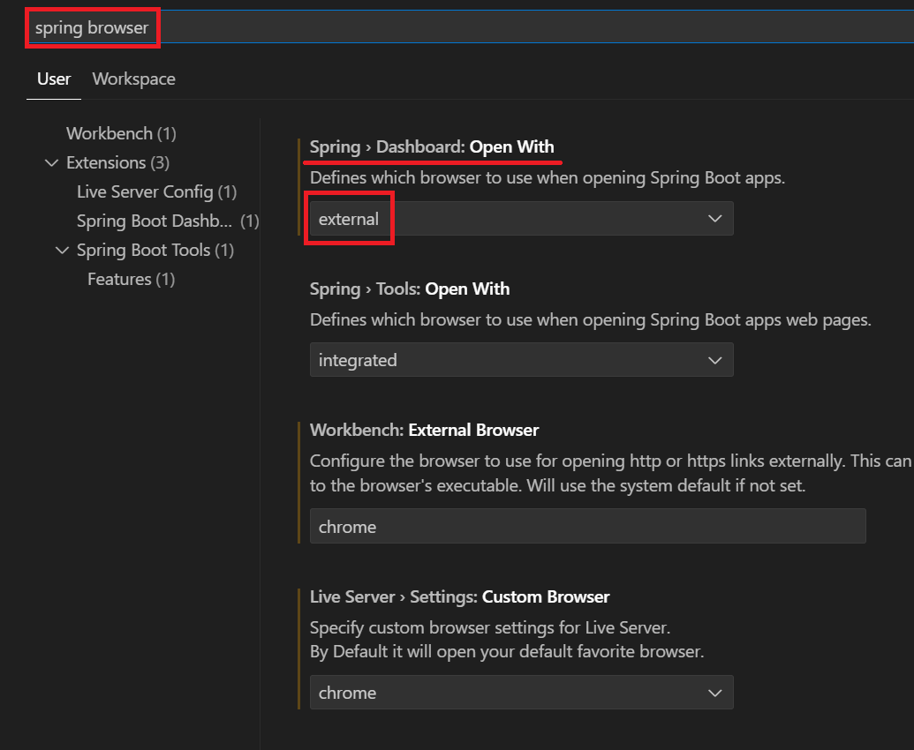

1. # JDK-17버전 설치
   JDK17버전 다운 받고 설치   
   ```
      https://www.oracle.com/java/technologies/javase/jdk17-archive-downloads.html
   ```

   환경 설정   
   cmd창에서 sysdm.cpl   

   JAVA_HOME : C:\Program Files\Java\jdk-17.0.11   
   path : %JAVA_HOME%bin   

   *다른 버전의 자바를 사용하다가 자바 버전을 바꾸기 위해서 JAVA_HOME에 경로를 지정했는데 적용되지 않는 경우   
   ```
      C:\Program Files\Common Files\Oracle\Java\javapath
   ```
   path에 다른 java경로가 있는 텍스트를 전부 지운 후 실행   

1. # Gradle 설치
   ```
      https://gradle.org/releases/
   ```   

   JAVA 17의 경우 gradle 7.3버전부터 지원   

      

   다운받은 압축파일의 압축을 푼 후 path설정   

   C:\gradle-8.7 에 압축을 품   
   ```
      path : C:\gradle-8.7\bin
   ```

   cmd창에서 gradle -v 으로 확인   
   *기존 cmd창은 닫고 새로 실행 후 확인   

1. # VSCode 확장팩 설치
   1.Spring Boot Extension Pack   
   -Debugger for Java   
   -Language Support for Java(TM) by Red hat   
   -Spring Initializr Java Support   
   -Spring Boot Tools   
   -Spring Boot Dashboard   

   2.Spring Boot Developer Extension Pack   
   -Extension Pack for Java   
   -Code Generator For Java   
   -Spring Boot Snippets   

   3.thymeleaf   

   4.Thunder Client   

1. # 프로젝트 생성
   프로젝트로 사용할 폴더 생성 후 열기   

   view -> Command Palette  -> Spring Initializr입력

   Spring Initializr:Create a Gradle Project   

   version : 3.2.10 선택   

   Java   

   com.aloha   

   Artifact Id : hello   
   *Artifact Id는 프로젝트 이름   

   pacakaging type : war   

   Java version : 17   

   Choose dependencies :   
   Spring Boot DevTools   
   Lombok   
   Spring Web   
   Thymeleaf   
   선택 후 상단에 "Selected 4 Dependencies"선택   

   작업 폴더 선택 : 현재 열려있는 폴더 그대로 이기 때문에 바로 Generate into this folder 선택

   오른쪽 하단에 "Successfully generated. Location: 경로" 가 나타나는데 Open을 클릭하면 바로 프로젝트를 경로로 새로 연다   

1. # 자동완성
   "g"만 치면 "GetMapping" 메소드가 자동완성으로 떠야하는데 뜨지 않는 경우 Prettier 확장팩을 지워준다   

1. # 외부 브라우저 실행
      