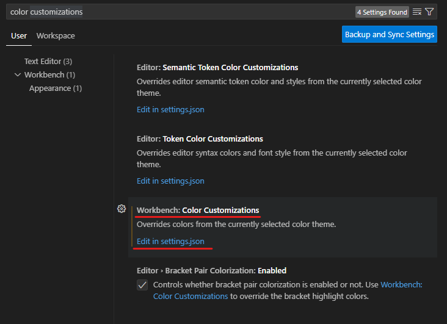

1. # color json 변경
   setting → color customizations 검색 → Edit in settings.json   

      

   json 설정에 밑에 colorCustomizations 설정 추가   
   ```cs
      "workbench.colorCustomizations": {
         "terminal.background": "#1D2021", 
         "terminal. foreground": "#ffffff", 
         "terminalCursor.background": "#A89984", 
         "terminalCursor. foreground": "#A89984",
         "terminal.ansiBlack":"#1D2021",
         "terminal.ans iBlue" : "#0D6678",
         "terminal.ans iBrightBlack":"#665C54", 
         "terminal.ansiBrightBlue" : "#0D6678",
         "terminal.ansiBrightCyan": "#8BA59B",
         "terminal.ansiBrightGreen": "#95C085",
         "terminal.ansiBrightMagenta":"#8F4673", 
         "terminal.ansiBrightRed":"#FB543F", 
         "terminal.ansiBrightWhite":"#FDF4C1",
         "terminal.ansiBright Yellow":"#FAC03B", 
         "terminal.ans iCyan": "#8BA59B",
         "terminal.ans iGreen": "# 95C085",
         "terminal.ansiMagenta": "#8F4673",
         "terminal.ansiRed": "#FB543F",
         "terminal.ansiWhite" : "#A89984",
         "terminal.ansiYellow":"#FAC03B",
      }
   ```   

   application.properties에 밑에 파일 추가   
   ```
      spring.output.ansi.enabled=always
   ```