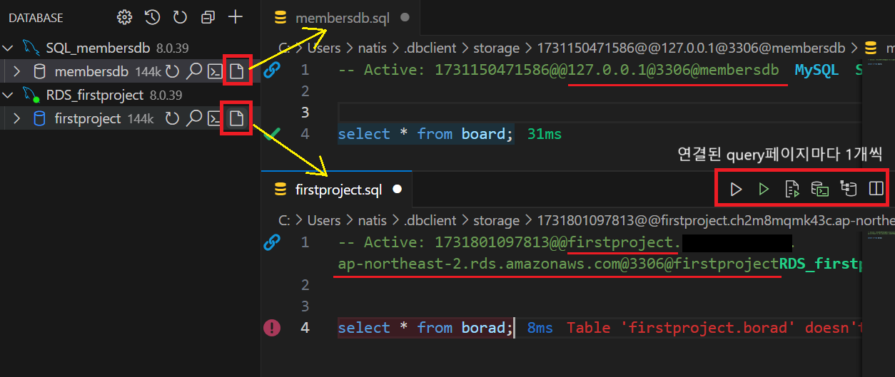

1. # 접속 변경

   VS code 전체에 걸쳐 하나의 DB가 연결되는 것이 아니라 3개의 DB까지 연결한 상태에서 어떤 open query 페이지에서 실행 시키는지에 따라 명령이 실행되는 DB가 결정

     

   위에 SQL페이지는 VS code와 DB의 연결이고,   

   스프링부트의 DB의 연결은 application.properties의 연결 설정에 따라 결정